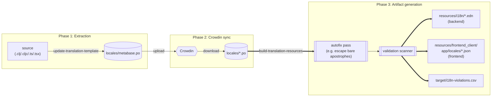

# i18n info

Metabase's internationalization pipeline has two halves that the scripts in this directory
orchestrate:

1. **[Extraction](#extraction)** — scan Clojure/TypeScript source for `trs` / `tru` / ttag `t`
   tagged-template call sites, emit a gettext source template at `locales/metabase.po`.
2. **[Artifact generation](#artifact-generation)** — read back translated `locales/*.po` files,
   apply [autofixes](#autofix-pass) for unambiguously repairable translator mistakes, validate
   the rest, and emit the runtime artifacts at `resources/i18n/*.edn` (backend) and
   `resources/frontend_client/app/locales/*.json` (frontend). Translations the scanner still
   flags as fatal are dropped; the full triage queue lands in the [violations report](#violations-report).

Between the two, [Crowdin](https://crowdin.com/project/metabase-i18n) is where translators fill in
the `msgstr` values. The [`.github/workflows/translation-update.yml`](../../.github/workflows/translation-update.yml)
workflow runs weekly to pull translations down and open a PR.



## Extraction

_Source code → `locales/metabase.po`_

### Building the backend pot file

Building the backend pot file can be done from the command line (from the project root directory):

```shell
❯ clojure -X:build:build/i18n
Created pot file at  cli.pot
Found 1393 forms for translations
Grouped into 1313 distinct pot entries
```

This is called from `update-translation-template` which builds frontend, backend, and automagic dashboard pot files and then merges them into one artifact with `msgcat`.

#### Developer information

We use a custom script to build up our backend pot (po template) file. Start a repl from this folder and the work is done in the `src/i18n/enumerate.clj` file.

It uses the very helpful library [Grasp](https://github.com/borkdude/grasp) to use a spec and a list of sources to find all uses of `trs`, `tru`, etc. It returns the forms found from the source, along with metadata that includes the filenames and line numbers.

```clojure
enumerate=> (def single-file (str u/project-root-directory "/src/metabase/util.clj"))
#'i18n.enumerate/single-file
enumerate=> (map (juxt meta identity)
                 (g/grasp single-file ::translate))
([{:line 81,
   :column 13,
   :uri "file:/Users/dan/projects/work/metabase/src/metabase/util.clj"}
  (trs
   "Maximum memory available to JVM: {0}"
   (format-bytes (.maxMemory (Runtime/getRuntime))))]
 [{:line 313,
   :column 33,
   :uri "file:/Users/dan/projects/work/metabase/src/metabase/util.clj"}
  (tru "Timed out after {0}" (format-milliseconds timeout-ms))]
 [{:line 504,
   :column 26,
   :uri "file:/Users/dan/projects/work/metabase/src/metabase/util.clj"}
  (tru "Not something with an ID: {0}" (pr-str object-or-id))])
```

Pot files can only have a single entry for each string, so these are grouped by the message and then we use the [org.fedorahosted.tennera.jgettext](https://github.com/zanata/jgettext) library to emit the pot file.

You can build quick pot files with the helpful function `create-pot-file!`

```clojure
enumerate=> (create-pot-file! single-file "pot.pot")
Created pot file at  pot.pot
{:valid-usages 3, :entry-count 4, :bad-forms ()}
```

which will output

```
# Copyright (C) 2022 Metabase <docs@metabase.com>
# This file is distributed under the same license as the Metabase package
#, fuzzy
msgid ""
msgstr ""
"Project-Id-Version: 1.0\n"
"Report-Msgid-Bugs-To: docs@metabase.com\n"
"POT-Creation-Date: 2022-07-22 14:03-0500\n"
"MIME-Version: 1.0\n"
"Content-Type: text/plain; charset=UTF-8\n"
"Content-Transfer-Encoding: 8bit\n"

#: /Users/dan/projects/work/metabase/src/metabase/sync/analyze/fingerprint/fingerprinters.clj
msgid "Error generating fingerprint for {0}"
msgstr ""

#: metabase/util.clj:81
msgid "Maximum memory available to JVM: {0}"
msgstr ""

#: metabase/util.clj:313
msgid "Timed out after {0}"
msgstr ""

#: metabase/util.clj:504
msgid "Not something with an ID: {0}"
msgstr ""
```

##### Overrides

You'll note that we defined a single file `"/src/metabase/util.clj"` but ended up with an entry from `fingerprinters.clj`. This is because that usage of `trs` is inside of a macro which emits a defrecord. The quoting means that the form doesn't actually match our spec since it has more sequence stuff:

```clojure
user=> '`(trs "foobar")
(clojure.core/seq (clojure.core/concat (clojure.core/list (quote user/trs)) (clojure.core/list "foobar")))
```

More information in the [grasp issue](https://github.com/borkdude/grasp/issues/28). A quick workaround is just including this manual override.

## Artifact generation

_`locales/*.po` → `resources/i18n/*.edn` + `resources/frontend_client/app/locales/*.json`_

Once translators have filled in `locales/<locale>.po` through Crowdin, the build pipeline turns
those into the runtime artifacts that Metabase actually ships:

- **Backend**: `resources/i18n/<locale>.edn` — consumed by `metabase.util.i18n.impl/translate` via
  `java.text.MessageFormat`.
- **Frontend**: `resources/frontend_client/app/locales/<locale>.json` — consumed by
  [ttag](https://ttag.js.org/) in the browser.

Run the whole pipeline locally with:

```shell
❯ ./bin/i18n/build-translation-resources
```

This calls `clojure -X:build:build/i18n`, which invokes
`i18n.create-artifacts/create-all-artifacts!`. For each locale:

1. Parse the `.po` file via `i18n.common/po-contents` (jgettext).
2. Run the [autofix pass](#autofix-pass) via `i18n.autofix/autofix-po-contents` to silently correct
   translator mistakes that can be unambiguously repaired (currently: unescaped apostrophes for
   backend strings).
3. Run the scanner `i18n.validation/invalid-messages-in-po` on the post-autofix contents to produce
   a seq of violation maps for every `msgstr` that *still* fails validation — see
   [violations report](#violations-report) below.
4. Derive a drop-set of msgids using `i18n.validation/drop-from-build?` (see
   [drop policy](#drop-policy)) and pass it, along with the post-autofix `po-contents`, to both
   backend and frontend artifact writers. The writers skip any message in the drop-set — the
   runtime falls back to English for those msgids.
5. After all locales finish, aggregate violations across every locale and write
   `target/i18n-violations.csv` and `target/i18n-violations.edn`.

The source of truth for this pipeline lives in `bin/build/src/i18n/`:

- `autofix.clj` — pre-validation fixes (e.g. apostrophe escaping).
- `validation.clj` — the scanner + drop policy.
- `create_artifacts.clj` — orchestrator + report writer.
- `create_artifacts/backend.clj` — backend `.edn` writer.
- `create_artifacts/frontend.clj` — frontend `.json` writer.
- `common.clj` — `.po` parser and shared helpers (`backend-message?`, `po-contents`).

### Autofix pass

Runs once per locale, *before* validation, on the parsed `po-contents`. Its job is to silently
correct translator mistakes that can be unambiguously repaired — making translations that would
otherwise fail the scanner ship correctly. Both the scanner and the artifact writers consume the
post-autofix contents, so they agree on what's being shipped.

Current autofixes (all backend-only — frontend `msgstr` values pass through unchanged because
ttag has different escaping rules):

- **Apostrophe escaping.** Word-adjacent single apostrophes (e.g. Catalan `d'aquí`, English
  `It's`) are doubled to `''` so `java.text.MessageFormat` treats them as literal characters
  instead of escape delimiters. Apostrophes that are already doubled, or that sit next to `{` /
  `}` (i.e. intentional MessageFormat escapes like `'{0}'`), pass through untouched.

This is handled *before* the scanner, so translations that only had apostrophe typos never reach
the violations report. If you ever see `d'aquí`-style entries in the report, it means autofix
couldn't reach them (likely a non-backend context) and you'd need to fix them in Crowdin.

Extending the autofix layer: add additional transformations to `i18n.autofix/autofix-po-contents`
only when the fix is (a) deterministic, (b) semantically neutral (rendered output unchanged), and
(c) covers a common translator mistake. Everything else should surface in the violations report
instead.

### Drop policy

`drop-from-build?` only returns `true` for violations whose translations would throw at runtime
and trigger English fallback anyway — i.e. `:invalid-message-format`. `:skipped-arg-index` and
`:arg-count-mismatch` render imperfectly but don't throw; we keep them so users see mostly-
localized text rather than regress to full English fallback.

## Violations report

_`target/i18n-violations.csv`_

Every artifact-generation run emits a report of violations found, in two forms:

- `target/i18n-violations.csv` — one row per violation, RFC 4180-compliant, openable in any
  spreadsheet app. This is the file that gets uploaded as the `i18n-violations` artifact in CI.
- `target/i18n-violations.edn` — same data as a vector of Clojure maps, for programmatic use.

In CI, [`.github/workflows/i18n.yml`](../../.github/workflows/i18n.yml) and
[`.github/workflows/translation-update.yml`](../../.github/workflows/translation-update.yml)
upload the artifact. The auto-generated translation-update PR gets a summary comment with
per-type counts and a direct link to the artifact.

### Columns

| Column          | Meaning |
|-----------------|---------|
| `locale`        | The locale the violation was found in (e.g. `fr`, `de`, `pt-BR`, `ar-SA`). |
| `types`         | The set of violation types for this row, joined with `+` (e.g. `skipped-arg-index+arg-count-mismatch`). See [violation types](#violation-types) below. |
| `dropped`       | `true` if this translation was **excluded** from the built `.edn`/`.json` artifact (runtime will fall back to English). `false` if it was kept in the artifact despite imperfection (runtime renders with the issue visible). |
| `backend`       | `true` if the msgid originates from Clojure source (`.clj` / `.cljc`), `false` if from frontend source (`.ts` / `.tsx` / `.js` / `.jsx`). This determines which format-system rules were applied. |
| `plural_index`  | For singular (non-plural) strings this is empty. For plural strings it's the index of the affected form (`0`, `1`, …) within the locale's `msgstr[N]` array. |
| `msgid`         | The English singular source string — the key translators see in Crowdin. |
| `msgid_plural`  | The English plural form, if the string has one. Empty for non-plural strings. |
| `msgstr`        | The translated string that failed validation — the actual text the translator produced. |
| `error`         | Populated only for `invalid-message-format` rows — the `java.text.MessageFormat` exception message (e.g. `Unmatched braces in the pattern.`). Empty for other types. |
| `expected_args` | For `arg-count-mismatch` rows: the acceptable placeholder count(s), derived from `msgid` and `msgid_plural`. Comma-separated (e.g. `0,1` for a plural where singular has 0 placeholders and plural has 1). |
| `actual_args`   | For `arg-count-mismatch` rows: the number of distinct placeholder indices actually used in `msgstr`. |
| `source_refs`   | Space-separated `path:line` pointers back to the source code where this msgid is used. |

### Violation types

Three types can appear in the `types` column. A single row may list multiple (separated by `+`)
when they fire together.

#### `invalid-message-format`

The `msgstr` isn't a valid `java.text.MessageFormat` pattern — the constructor throws
`IllegalArgumentException`. Typical causes:

- Unmatched braces (`{0` or `{{...}}` without proper escaping).
- Named placeholders like `{login}` that Java MessageFormat can't parse (it expects numeric indices).
- Unbalanced apostrophe escapes.

These rows always have `dropped=true`. At runtime, `MessageFormat`'s constructor would throw,
triggering the runtime's try/catch and falling back to English anyway — so the build pre-empts
it and guarantees a clean `.edn` artifact.

**Action for translators:** Fix the `msgstr` in Crowdin. Usually means matching the English
string's escaping conventions (double-apostrophes for literal `'`, matched braces, etc.).

#### `skipped-arg-index`

The translated string's `{N}` placeholders reference non-contiguous indices (e.g. `{0}` and
`{2}` but no `{1}`), or use the same index multiple times in a way that produces a gap. At
runtime, missing indices render literally (`{2}` appears as the four characters `{2}` in the
output).

These rows have `dropped=false` — the translation is kept in the artifact. The user sees mostly-
localized text with a literal `{N}` glitch, rather than full English fallback.

**Action for translators:** Fix the `msgstr` so all placeholders are contiguous (`{0}`, `{1}`,
`{2}`, …).

#### `arg-count-mismatch`

The translated string's placeholder count doesn't match any acceptable count from the English
source forms. `expected_args` is the set of acceptable counts (singular's count and plural's
count, if applicable); `actual_args` is what the translation has.

These rows have `dropped=false`. At runtime, missing placeholders render as literal text (`{0}`
shows up verbatim), or extra caller-supplied args get silently dropped.

Common cause: the translator added an extra `{0}` (e.g. for pluralization) when English didn't
have one, or omitted a `{0}` that English required.

> **Note:** Romance-language apostrophe mistakes (e.g. Catalan `d'aquí` swallowing a trailing
> `{0}` in MessageFormat's escape semantics) would have triggered this violation. The
> [autofix pass](#autofix-pass) handles them upstream, so they shouldn't appear in the
> report. The mistakes would still be present in Crowdin though.

**Action for translators:** Match the English source's placeholder count. If the source has
`{0}` and `{1}`, the translation must too — or the plural form of the source, which might have
a different count.

### How to use the report

1. **Sort by `locale`** to see per-language issues — often one translator has a systematic
   problem (e.g. Catalan translators consistently forget to double apostrophes).
2. **Filter `dropped=true`** to see what's silently falling back to English — these are the most
   user-visible regressions for locale users.
3. **Filter `types=invalid-message-format`** if you're triaging Crowdin bugs — these are always
   the highest-priority fixes.
4. **Use `source_refs`** to understand which UI the violation affects, and whether it's a high-
   traffic string or rare edge case.

Each row has enough info to find the string in Crowdin: the `msgid` is the source key, `locale`
tells you which language to open.

### Runtime behavior summary

| Violation type           | Build-time action      | Runtime behavior |
|--------------------------|------------------------|------------------|
| `invalid-message-format` | Dropped from artifact  | English fallback |
| `skipped-arg-index`      | Kept in artifact       | Localized text with literal `{N}` for missing indices |
| `arg-count-mismatch`     | Kept in artifact       | Localized text with literal `{N}` for missing placeholders, or extra args silently dropped |
