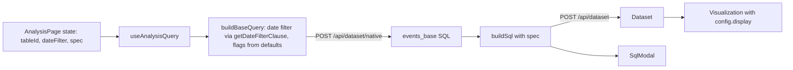

# Event analysis UI scaffold

There are three shippable chunks: the entry point and start page, the shared chrome, then wiring to real queries. The Setup panels, the Filter button and Save stay stubs for later chunks.

## Context

This sits on top of the committed query layer. Nearby notes:

- [product-analytics-context.md](product-analytics-context.md): prototype goal, the five analyses, data pipeline, identity, existing Metabase pieces.
- [pa_prototype_data_and_queries.plan.md](pa_prototype_data_and_queries.plan.md): ClickHouse data, the spec, `buildBaseQuery` / `buildSql` / `useAnalysisQuery`.
- [product-analytics.md](product-analytics.md): open questions (event tables, saved event definitions, identity).

Design screenshots (home folder, not in git):

- Start page, pick table and analysis: [`~/product-analytics/screenshots/1-select-table-and-analysis.png`](/Users/kevin/product-analytics/screenshots/1-select-table-and-analysis.png)
- Shared chrome (funnel): [`~/product-analytics/screenshots/2-shared-chrome.png`](/Users/kevin/product-analytics/screenshots/2-shared-chrome.png)

## Route names

Recommended:

- `/event-analysis/new`: pick a table and an analysis type.
- `/event-analysis/new/:kind?table=42`: the analysis page. `kind` is one of `funnel | paths | habit | lifecycle | cohorts`.
- Saved analyses later become `/event-analysis/:id`, mirroring `/question/new` and `/question/:id`.
- Move the debug page to `/event-analysis/debug`, so the feature has one root route.

`kind` goes in the path because it picks the page config. `table` is a query parameter so the table can change without changing route shape.

Alternatives considered:

- `/product-analytics/...` matches the module and today's debug route, but "product analytics" isn't the user-facing name.
- `/question/events/...` sits next to explorations (`/question/research`), but couples us to the question namespace.

## Chunk 1: New menu entry and start page

- Add [frontend/src/metabase/urls/product-analytics.ts](frontend/src/metabase/urls/product-analytics.ts) with `newEventAnalysis()` and `eventAnalysis(kind, tableId)`, and re-export it from [frontend/src/metabase/urls/index.ts](frontend/src/metabase/urls/index.ts). The nav then never imports from the feature module, which has `enforcePublicApi: true`.
- In [frontend/src/metabase/nav/components/NewItemMenu/NewItemMenuView.tsx](frontend/src/metabase/nav/components/NewItemMenu/NewItemMenuView.tsx), add a `Menu.Item` "Event analysis" right after the `nlq` item. Gate it on `hasDataAccess` alone, not on AI being enabled. Pick an icon such as `funnel`.
- In [frontend/src/metabase/product-analytics/routes.tsx](frontend/src/metabase/product-analytics/routes.tsx), use `<Route path="event-analysis">` with lazy children `new`, `new/:kind` and `debug`.
- Add `pages/NewAnalysisPage.tsx`, matching screenshot 1:
  - "Pick the event data to analyze", then `components/EventTablePicker.tsx`.
  - "Choose the type of analysis to do", then a grid of `components/AnalysisTypeCard.tsx`, one per entry in the analysis config.
  - Clicking a card navigates to `eventAnalysis(kind, tableId)`. The cards are disabled until a table is picked.
- `EventTablePicker` is a button showing a table icon and the table name. It opens a `MiniPicker` with `models={["table"]}` and `onBrowseAll` set. Browse all switches to `DataPickerModal` with `models={["table"]}`. Copy the `isOpened`/`isBrowsing` pattern from [NotebookDataPicker.tsx](frontend/src/metabase/querying/notebook/components/NotebookDataPicker/NotebookDataPicker.tsx), lines 204–291.
- Favoring Event-type Library tables: drop it. `MiniPickerTableItem` doesn't carry `entity_type`, and search has no `entity_type` parameter, so this isn't trivial. Instead:
  - Default the selection to the `config.ts` table (`pa_events_resolved`) using the same lookup `use-analysis-query.ts` does. Extract that lookup into a small `use-prototype-table.ts`.
  - Publishing that table to the Library gets most of the effect, because the mini picker opens on the Library first.

## Chunk 2: shared chrome and analysis config

Add `analyses/config.ts`, one entry per kind:

```ts
type AnalysisConfig = {
  kind: AnalysisKind;
  name: string; // "Funnel"
  question: string; // "Where do people fall out?"
  icon: IconName; // card art for now; mini illustrations later
  setupLabel: string; // "Steps"
  granularity?: {
    units: Granularity[];
    get: (spec: AnalysisSpec) => Granularity;
    set: (spec: AnalysisSpec, unit: Granularity) => AnalysisSpec;
  }; // absent hides the picker
  display: CardDisplayType; // used in chunk 3
  getVizSettings?: (spec: AnalysisSpec) => VisualizationSettings;
};
```

Seed values. The setup labels are placeholders, and only "Steps" comes from the design.

- Funnel: "Steps", granularity sets `bucket.granularity`, display `funnel`.
- Paths: "Path", no granularity, display `sankey`.
- Habit: "Activity", no granularity, display `bar`.
- Lifecycle: "Activity", granularity sets `lifecycle.period` (day, week, month), display `bar` (stacked).
- Cohorts: "Cohorts", granularity sets `bucket.granularity` (week, month), display `table`. Pivot needs a structured query, so it's out for now.

Add page state in `use-analysis-state.ts`, a `useReducer` seeded from `defaultSpec(kind)` in `defaults.ts`:

- `spec: AnalysisSpec`. Granularity and counting write into it.
- `dateFilter: DatePickerValue`. Per `spec/types.ts`, the date range belongs in the base query, not the spec. Default to the previous `PROTOTYPE_RANGE_DAYS` days.
- `panel: "setup" | "advanced"`.

Add `pages/AnalysisPage.tsx`, matching screenshot 2. It reads `kind` and `table` from the route and shows a "not found" state for an unknown kind.

- Title: "{config.name} analysis on {table display name}".
- `components/AnalysisToolbar.tsx`, left side:
  - A segmented pair: `config.setupLabel` and an advanced-settings icon button. Each sets `panel`.
  - **Counting**: a menu for People, Sessions or Events that sets `spec.grain`. The planners already use `grain` as the actor through `compileGrain`, so this is cheap and real.
  - **Filter**: a stub button for now. It becomes "who's included", meaning attribute filters on the base query.
- `AnalysisToolbar`, right side:
  - Date button: a `Popover` with `DatePicker` from `metabase/querying/common/components/DatePicker`. The label comes from `getDateFilterDisplayName` in `metabase/querying/filters/utils/dates`, the same way `TemporalFilterPickerButton` builds it.
  - Granularity, shown only if `config.granularity` exists: a `Popover` with `TemporalUnitPicker` (`metabase/querying/common/components/TemporalUnitPicker`). Items are `config.granularity.units` mapped through `Lib.describeTemporalUnit`. The button reads "by day".
  - SQL: `Icon name="sql"` opens `components/SqlModal.tsx`, a read-only `CodeEditor` like [RunInfo.tsx](frontend/src/metabase/transforms/components/RunInfo/RunInfo.tsx). It shows a placeholder until chunk 3.
  - Save: a stub, either disabled or a "coming soon" toast.
- Body: a two-column layout.
  - Left: `components/SettingsPanel.tsx`, a card that says "Setup" or "Advanced settings" depending on `panel`.
  - Right: `components/AnalysisResult.tsx`, a card headed with `config.question`. It holds a placeholder until chunk 3.

## Chunk 3: wiring to real queries

The chunk 3 data flow:



This doesn't need the Setup UI. The steps and events stay as the hardcoded flags in `defaults.ts` and `base-query.ts`, which match `pa_events_resolved`.

Changes to the committed query layer:

- `base-query.ts`: replace the `rangeDays: number` parameter with `dateFilter: DatePickerValue | undefined`. When it's set, apply `getDateFilterClause(createdAt, dateFilter)` from `metabase/querying/filters/utils/dates`.
- `use-analysis-query.ts`:
  - Change the signature to `useAnalysisQuery({ spec, tableId, dateFilter })`. The table lookup by name moves out to `use-prototype-table.ts`, from chunk 1.
  - Add `dateFilter` to the `useMemo` deps. Keep the stable-request memo, since its comment explains why it's load-bearing.
  - For a table that isn't `pa_events_resolved`, `findColumn` will throw on the flag columns. Surface that as the existing `baseError`; that's fine for now.
- `pages/DebugPage.tsx`: update the call. It passes the prototype table and a default date filter.

UI:

- `AnalysisResult` renders the default export of `metabase/visualizations/components/Visualization`:
  - `rawSeries = [{ card: { id: syntheticId, name, display: config.display, visualization_settings: config.getVizSettings?.(spec) ?? {}, dataset_query }, data: dataset.data }]`
  - Pass `isQueryBuilder={false}` and `onChangeCardAndRun={noop}`, following `buildSeries` in [metrics-viewer/utils/series.ts](frontend/src/metabase/metrics-viewer/utils/series.ts).
  - Show loading, error and warnings states using the hook's `isLoading`, `error` and `warnings`.
- `SqlModal` shows the hook's `sql`.
- Tune each kind's `getVizSettings` until the default spec renders sensibly. Funnel and Sankey need their dimension and metric settings to match the planner's output column names. Treat this as iterative and per-analysis.

## Later chunks (out of scope here)

- Setup panels per analysis. For example, funnel steps built with the standard filter picker, producing `ev_n` flags in the base query instead of hardcoded ones.
- Advanced settings per analysis, such as the funnel window, ordering and exclusions.
- The Filter button ("who's included").
- Save, and the `/event-analysis/:id` route.
- Custom charts like the funnel bars in the design, and drill-through.

## Checks

Keep tests light, since this code is likely to be thrown away:

- Type-check and lint. Run `bun lint-eslint-pure` on the touched files; it catches module-boundary issues.
- Smoke-test in the browser through New → Event analysis → Funnel.
- Unit tests only where logic is non-trivial, such as the `config.granularity` setters.
