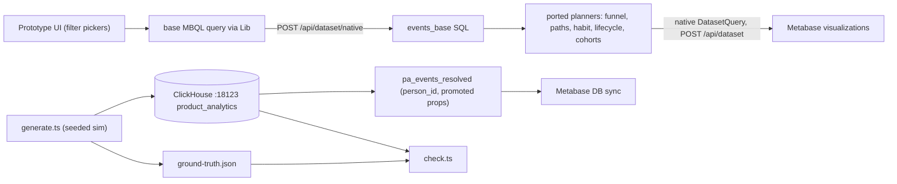

# Product analytics prototype: data and querying

## Overview

Design notes used to live in gitignored `/local`. They now live in this folder so they can be committed. Everything on the `product-analytics` branch goes in:
- [`dev/product-analytics/`](../): data tooling.
- [`dev/product-analytics/context/`](./): design notes and this plan.
- [`frontend/src/metabase/product-analytics/`](../../../frontend/src/metabase/product-analytics/): the query layer.

## Part 1: Local ClickHouse

- Add `dev/product-analytics/docker-compose.yml`:
  - Image `clickhouse/clickhouse-server:26.8-alpine`, the same as [`modules/drivers/clickhouse/docker-compose.yml`](../../../modules/drivers/clickhouse/docker-compose.yml).
  - Ports `127.0.0.1:18123:8123`, so it doesn't collide with the driver-test container on 8123.
  - A named volume for persistence.
- Add `dev/product-analytics/sql/01_pa_events.sql`. It creates database `product_analytics` and a `pa_events` table copied verbatim from `metabase/pa-lambdas` `sql/pa_events.sql`. Keeping the schema identical keeps a swap to real data possible.
- Add `dev/product-analytics/sql/02_pa_events_resolved.sql`. Run it after loading. It builds a plain table, not a view; the data is static, and this avoids any doubt about whether views sync:
  - `person_id = coalesce(distinct_id, identity_map.distinct_id, visitor_id)`. The identity map is the earliest `distinct_id` per `visitor_id` from rows that have both. This is warehouse-side stitching.
  - Promoted columns `plan String` and `amount Nullable(Float64)` from `event_data`. This sidesteps map access in MBQL (the demo's Project E).
  - `ORDER BY (person_id, created_at)`.
- Connect it as a Metabase database with `mb` (engine `clickhouse`, host `localhost`, port `18123`, db `product_analytics`, user `default`). Optionally set the Event entity type on `pa_events_resolved`.

## Part 2: Data generator

`dev/product-analytics/generate.ts`, run with Bun:
- Deterministic: seeded random numbers, adapted from `src/util/seeded.ts` in `metabase/event-analytics-ui`.
- Inserts `JSONEachRow` batches over ClickHouse HTTP.
- Writes `ground-truth.json` with the configured rates.

Scale and shape:
- About 25k people over 120 days, roughly 2–3M events.
- Weekly signup cohorts with mild growth, plus daily and weekday activity patterns.

Columns are filled with the meanings they **should** have. This is deliberate, and it's documented in the README:
- Real per-event `created_at`.
- `visitor_id` on every event. About 15% of people use two devices.
- `distinct_id` set from signup onward, NULL before. Missing values are NULL, not `''`.
- `session_id` (and `visit_id`) as a real 30-minute-inactivity session.
- Constant `website_id`.
- `event_type` 1 for pageviews, 2 for custom events.
- Referrer and UTM tags on the first event of each session.
- Browser, OS and device and country fixed per visitor.

Event catalog, matching the demo:
- Pageviews: `/`, `/pricing`, `/docs/*`, `/blog/*`, `/signup`, `/app/*`.
- Custom events: `signup`, `trial_started`, `report_created`, `invite_sent`, `checkout_completed` (with `event_data` `amount` and `plan`), `subscription_cancelled`, `error`.

Behaviors seeded so every analysis has a story:
- **Funnel:** `/pricing` to `trial_started` to `checkout_completed`, with set step rates and time-to-convert distributions.
- **Cohorts/retention:** weekly retention decay, higher for people who `invite_sent` in week 1. That gives breakdowns something to show.
- **Habit:** a days-active-per-week distribution.
- **Lifecycle:** dormancy and resurrection probabilities.
- **Paths:** next-page transition matrices for pageviews.
- **Drill-through:** one injected incident, an `error` spike on checkout during one week.

Add `dev/product-analytics/check.ts`. It runs each analysis's SQL directly against ClickHouse, using a hand-written plain-SQL base CTE in place of the MBQL piece, and checks results against `ground-truth.json` within tolerances. This validates the data and the templates independently of Metabase.

## Part 3: Query layer (frontend)

Port into `frontend/src/metabase/product-analytics/` from `metabase/event-analytics-ui`:
- `src/sql/compose.ts`
- `src/sql/analyses/*.ts`
- `src/sql/compile/{dialect,grain,timeRange}.ts`
- `src/spec/types.ts`

That's about 2k lines of plain TypeScript with no dependencies. Adapt it:
- Drop `schema/tables.ts`, `compile/joins.ts`, the `users`/`companies` tables, the `account` grain, and the `{websiteId:String}` parameter.
- Replace `MatchExpr` event definitions with references to named boolean flag columns (for example `{ flag: "ev_1" }`). Planners read `events_base.ev_1` instead of calling `compileMatch`. Behavioral conditions become `countIf(ev_n) >= k` over the flags.
- Change `scopedEvents` in `analyses/base.ts` to read from `events_base` rather than building its own `FROM`/`WHERE`.

New files:
- `base-query.ts`: builds the base query with `metabase-lib` on `pa_events_resolved`:
  - date range filter on `created_at`;
  - "who's included" attribute filters;
  - one boolean custom expression per event definition, named `ev_1..n` (each from a filter clause the user built with the standard filter picker);
  - explicit `fields` (`person_id`, `session_id`, `created_at`, split column, flags), so output names are predictable.
- `compile-base.ts`: sends that query to `getNativeDataset` (`POST /api/dataset/native`, in [`frontend/src/metabase/api/dataset.ts`](../../../frontend/src/metabase/api/dataset.ts)). It inlines parameters and disables the default row limit, and the returned SQL becomes `WITH events_base AS (...)`.
- `build-sql.ts`: (spec, base SQL) to the composed statement, via the ported planners and `compose`.
- `use-analysis-query.ts`: runs the statement as a native `DatasetQuery` through `useGetAdhocQueryQuery`. It returns `{ sql, dataset, warnings, isLoading, error }`, ready for Metabase visualizations (Funnel, Sankey, Pivot or Table, Line/Bar).
- `config.ts`: looks up the prototype database and table ids by name.
- Optional debug route (`/product-analytics/debug`): spec JSON, base SQL, final SQL and a results table per analysis. It's useful while building the real UI.

## Risks to spike first (day 1)

1. Can `Lib.expression` take a filter clause as a boolean custom expression? Fallback: `case(filter, 1, 0)` and `countIf(ev_n = 1)`.
2. What does the ClickHouse driver's compiled SQL look like? Check alias quoting and whether expression names survive as column aliases.
3. Do the ported planners produce valid SQL against the generated schema once the joins and `FINAL` are removed?

## Out of scope

- Correctness and edge cases.
- Timezones (UTC only).
- MBQL extensions (Projects A–H).
- Multiple websites.
- The analysis UI itself, beyond the optional debug route.
