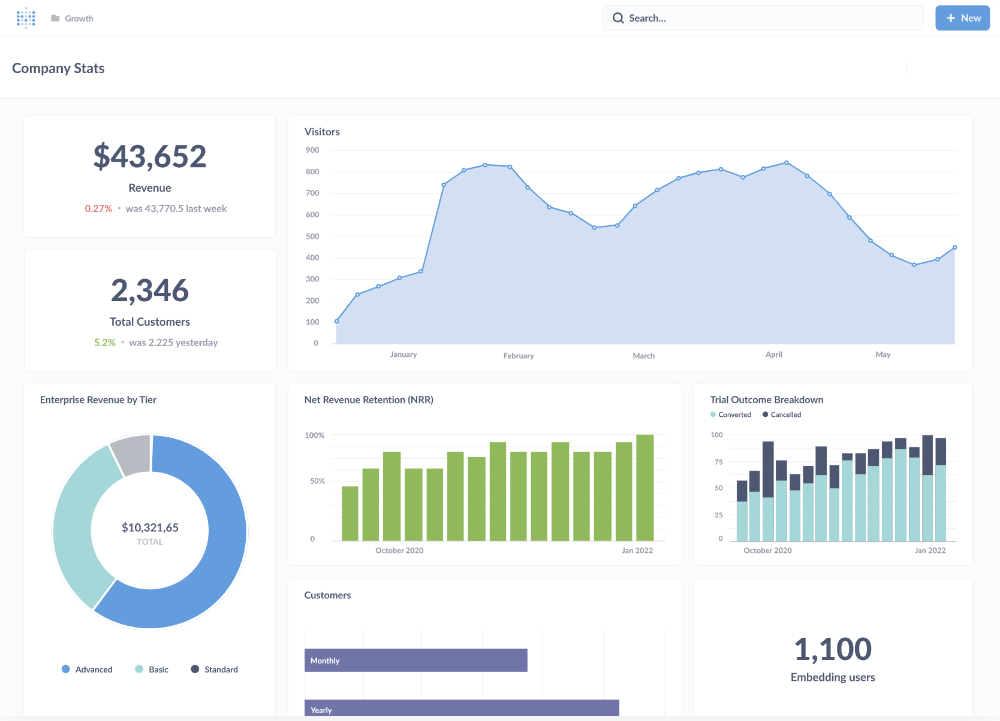

# Metabase documentation

Metabase is an open-source business intelligence platform. You can use Metabase to ask questions about your data, or embed Metabase in your app to let your customers explore their data on their own.

## First steps

### Metabase Cloud

The easiest way to get started with Metabase is to sign up for a free trial of [Metabase Cloud](https://store.metabase.com/checkout). You get support, backups, upgrades, an SMTP server, SSL certificate, SoC2 Type 2 security auditing, and more (plus your money goes toward improving Metabase). Check out our quick overview of [cloud vs self-hosting](https://www.metabase.com/docs/latest/cloud/cloud-vs-self-hosting). If you need to, you can always switch to [self-hosting](./installation-and-operation/installing-metabase.md) Metabase at any time (or vice versa).

### [Installing Metabase](./installation-and-operation/installing-metabase.md)

Run as a JAR, using Docker, or on [Metabase Cloud](https://store.metabase.com/checkout).

### [Setting up Metabase](./configuring-metabase/setting-up-metabase.md)

Once installed, set up your Metabase and connect to your data.

### [Getting started](https://www.metabase.com/learn/getting-started/getting-started)

With your data connected, get started asking questions, creating dashboards, and sharing your work.

### [A tour of Metabase](https://www.metabase.com/learn/getting-started/tour-of-metabase)

Metabase is a deep product with a lot of tools to simplify business intelligence, from embeddable charts and interactive dashboards, to GUI and SQL editors, to auditing and data sandboxing, and more.

## Documentation topics

Metabase's reference documentation.

### Installation

- [Installation overview](./installation-and-operation/start.md)
- [Installing Metabase](./installation-and-operation/installing-metabase.md)
- [Upgrading Metabase](./installation-and-operation/upgrading-metabase.md)
- [Configuring the Metabase application database](./installation-and-operation/configuring-application-database.md)
- [Backing up Metabase](./installation-and-operation/backing-up-metabase-application-data.md)
- [Migrating to a production application database](./installation-and-operation/migrating-from-h2.md)
- [Monitoring your Metabase](./installation-and-operation/monitoring-metabase.md)
- [Serialization](./installation-and-operation/serialization.md)
- [Commands](./installation-and-operation/commands.md)
- [Supported browsers](./installation-and-operation/supported-browsers.md)
- [Privacy](./installation-and-operation/privacy.md)
- [About the anonymous usage data we collect](./installation-and-operation/information-collection.md)

### Databases

- [Databases overview](./databases/start.md)
- [Adding and managing databases](./databases/connecting.md)
- [Database users, roles, and privileges](./databases/users-roles-privileges.md)
- [Syncing and scanning databases](./databases/sync-scan.md)
- [Encrypting your database connection](./databases/encrypting-details-at-rest.md)
- [SSH tunneling](./databases/ssh-tunnel.md)
- [SSL certificate](./databases/ssl-certificates.md)
- [Uploading data](./databases/uploads.md)

### Questions

- [Questions overview](./questions/start.md)

#### Query builder

- [Asking questions](./questions/query-builder/introduction.md)
- [Visualizing data](./questions/sharing/visualizing-results.md)
- [Custom expressions](./questions/query-builder/expressions.md)
- [List of expressions](./questions/query-builder/expressions-list.md)
- [Joining data](./questions/query-builder/join.md)

#### SQL and native queries

- [The SQL editor](./questions/native-editor/writing-sql.md)
- [SQL parameters](./questions/native-editor/sql-parameters.md)
- [Referencing models and saved questions](./questions/native-editor/referencing-saved-questions-in-queries.md)
- [SQL snippets](./questions/native-editor/sql-snippets.md)
- [SQL snippet folder permissions](./permissions/snippets.md)

#### Sharing

- [Sharing answers](./questions/sharing/answers.md)
- [Alerts](./questions/sharing/alerts.md)
- [Public sharing](./questions/sharing/public-links.md)
- [Exporting data](./questions/sharing/exporting-results.md)

### Dashboards

- [Dashboards overview](./dashboards/start.md)
- [Introduction to dashboards](./dashboards/introduction.md)
- [Dashboard filters](./dashboards/filters.md)
- [Interactive dashboards](./dashboards/interactive.md)
- [Charts with multiple series](./dashboards/multiple-series.md)
- [Dashboard subscriptions](./dashboards/subscriptions.md)
- [Actions on dashboards](./dashboards/actions.md)

### Data modeling

- [Data modeling overview](./data-modeling/start.md)
- [Models](./data-modeling/models.md)
- [Model persistence](./data-modeling/model-persistence.md)
- [Table metadata admin settings](./data-modeling/metadata-editing.md)
- [Field types](./data-modeling/field-types.md)
- [Formatting defaults](./data-modeling/formatting.md)
- [Working with JSON](./data-modeling/json-unfolding.md)
- [Segments and metrics](./data-modeling/segments-and-metrics.md)

### Actions

- [Actions overview](./actions/start.md)
- [Introduction to actions](./actions/introduction.md)
- [Basic actions](./actions/basic.md)
- [Custom actions](./actions/custom.md)

### Organization

- [Organization overview](./exploration-and-organization/start.md)
- [Basic exploration](./exploration-and-organization/exploration.md)
- [Collections](./exploration-and-organization/collections.md)
- [History](./exploration-and-organization/history.md)
- [Data reference](./exploration-and-organization/data-model-reference.md)
- [Events and timelines](./exploration-and-organization/events-and-timelines.md)
- [X-rays](./exploration-and-organization/x-rays.md)

### People

- [People overview](./people-and-groups/start.md)
- [Account settings](./people-and-groups/account-settings.md)
- [Managing people and groups](./people-and-groups/managing.md)
- [Password complexity](./people-and-groups/changing-password-complexity.md)
- [Session expiration](./people-and-groups/changing-session-expiration.md)
- [Google Sign-In or LDAP](./people-and-groups/google-and-ldap.md)
- [API keys](./people-and-groups/api-keys.md)

#### Paid SSO options

- [JWT-based authentication](./people-and-groups/authenticating-with-jwt.md)
- [SAML-based authentication](./people-and-groups/authenticating-with-saml.md)
  - [SAML with Auth0](./people-and-groups/saml-auth0.md)
  - [SAML with Azure AD](./people-and-groups/saml-azure.md)
  - [SAML with Google](./people-and-groups/saml-google.md)
  - [SAML with Keycloak](./people-and-groups/saml-keycloak.md)
  - [SAML with Okta](./people-and-groups/saml-okta.md)

### Permissions

- [Permissions overview](./permissions/start.md)
- [Permissions introduction](./permissions/introduction.md)
- [Data permissions](./permissions/data.md)
- [Collection permissions](./permissions/collections.md)
- [Application permissions](./permissions/application.md)
- [Data sandboxes](./permissions/data-sandboxes.md)
- [Data sandbox examples](./permissions/data-sandbox-examples.md)
- [SQL snippets folder permissions](./permissions/snippets.md)
- [Notification permissions](./permissions/notifications.md)

### Embedding

- [Embedding overview](./embedding/start.md)
- [Embedding introduction](./embedding/introduction.md)
- [Interactive embedding](./embedding/interactive-embedding.md)
- [Interactive embedding quick start](./embedding/interactive-embedding-quick-start-guide.md)
- [Static embedding](./embedding/static-embedding.md)
- [Parameters for static embeds](./embedding/static-embedding-parameters.md)

### Configuration

- [Configuration overview](./configuring-metabase/start.md)
- [Setting up Metabase](./configuring-metabase/setting-up-metabase.md)
- [General settings](./configuring-metabase/settings.md)
- [Email](./configuring-metabase/email.md)
- [Slack](./configuring-metabase/slack.md)
- [Environment variables](./configuring-metabase/environment-variables.md)
- [Configuration file](./configuring-metabase/config-file.md)
- [Metabase log configuration](./configuring-metabase/log-configuration.md)
- [Timezones](./configuring-metabase/timezones.md)
- [Languages and localization](./configuring-metabase/localization.md)
- [Appearance](./configuring-metabase/appearance.md)
- [Caching query results](./configuring-metabase/caching.md)
- [Custom maps](./configuring-metabase/custom-maps.md)
- [Customizing the Metabase Jetty webserver](./configuring-metabase/customizing-jetty-webserver.md)

### Tools

- [Tools overview](./usage-and-performance-tools/start.md)
- [Usage analytics](./usage-and-performance-tools/usage-analytics.md)
- [Admin tools](./usage-and-performance-tools/tools.md)

### Cloud

- [Documentation for Metabase Cloud and Store](https://www.metabase.com/docs/latest/cloud/start)

### Metabase API

- [Metabase API documentation](./api-documentation.md)
- [API tutorial](https://www.metabase.com/learn/administration/metabase-api)

### Troubleshooting

- [Troubleshooting guides](./troubleshooting-guide/index.md)

### Developer guide

- [Developer guide](./developers-guide/start.md)

### Paid features

Some Metabase plans offer [additional features](./paid-features/start.md).

## Getting help

### Troubleshooting

- [Troubleshooting guides](troubleshooting-guide/index.md)
- [Metabase forum](https://discourse.metabase.com/)
- [Configuring logging](./configuring-metabase/log-configuration.md)

### Tutorials and guides

[Learn Metabase](https://www.metabase.com/learn) has a ton of articles on how to use Metabase, data best practices, and more.

## More resources

### [Discussion](https://discourse.metabase.com)

Share and connect with other Metabasers.

### [Metabase Cloud](https://www.metabase.com/cloud/docs)

For docs specific to Metabase Cloud plans.

### [Community stories](https://www.metabase.com/community)

Practical advice from our community.

### [Metabase blog](https://www.metabase.com/blog)

News, updates, and ideas.

### [Customers](https://www.metabase.com/case_studies)

Real companies, real data, real stories.

### [Metabase Twitter](https://twitter.com/metabase)

We tweet stuff.

### [Source code repository on GitHub](https://github.com/metabase/metabase)

Follow us on GitHub.

### [List of releases](./releases.md)

A list of all Metabase releases, including both the Enterprise Edition and the Open Source Edition.

### [Developers guide](./developers-guide/start.md)

Contribute to the Metabase open source project!

### [Data and Business Intelligence Glossary](https://www.metabase.com/glossary)

Data jargon explained.

### [Metabase Experts](https://www.metabase.com/partners/)

If you’d like more technical resources to set up your data stack with Metabase, connect with a [Metabase Expert](https://www.metabase.com/partners/).
