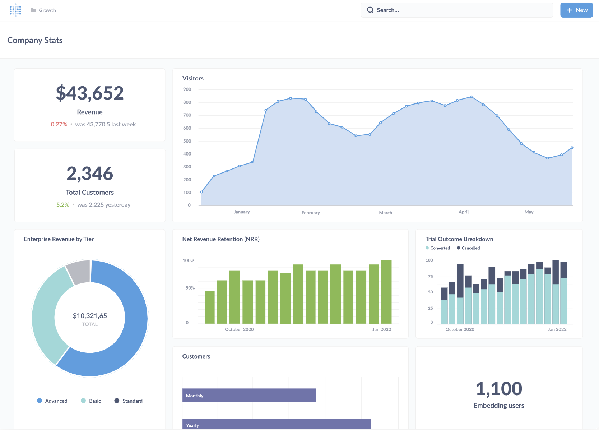

# Metabase documentation

Metabase is an open-source business intelligence platform. You can use Metabase to ask questions about your data, or embed Metabase in your app to let your customers explore their data on their own.

## First steps

### Metabase Cloud

The easiest way to get started with Metabase is to sign up for a free trial of [Metabase Cloud](https://store.metabase.com/checkout). You get support, backups, upgrades, an SMTP server, SSL certificate, SoC2 Type 2 security auditing, and more (plus your money goes toward improving Metabase). Check out our quick overview of [cloud vs self-hosting](/docs/latest/cloud/cloud-vs-self-hosting/). If you need to, you can always switch to [self-hosting](./installation-and-operation/installing-metabase/) Metabase at any time (or vice versa).

### [Installing Metabase](./installation-and-operation/installing-metabase/)

Run as a JAR, using Docker, or on [Metabase Cloud](https://store.metabase.com/checkout).

### [Setting up Metabase](./configuring-metabase/setting-up-metabase/)

Once installed, set up your Metabase and connect to your data.

### [Getting started](/learn/metabase-basics/getting-started/index/)

With your data connected, get started asking questions, creating dashboards, and sharing your work.

### [A tour of Metabase](/learn/metabase-basics/overview/tour-of-metabase/)

Metabase is a deep product with a lot of tools to simplify business intelligence, from embeddable charts and interactive dashboards, to GUI and SQL editors, to auditing and data sandboxing, and more.

## Documentation topics

Metabase's reference documentation.

### Installation

- [Installation overview](./installation-and-operation/start)
- [Installing Metabase](./installation-and-operation/installing-metabase/)
- [Upgrading Metabase](./installation-and-operation/upgrading-metabase/)
- [Configuring the Metabase application database](./installation-and-operation/configuring-application-database/)
- [Backing up Metabase](./installation-and-operation/backing-up-metabase-application-data/)
- [Migrating to a production application database](./installation-and-operation/migrating-from-h2/)
- [Monitoring your Metabase](./installation-and-operation/monitoring-metabase/)
- [Serialization](./installation-and-operation/serialization/)
- [Commands](./installation-and-operation/commands/)
- [Supported browsers](./installation-and-operation/supported-browsers/)
- [Privacy](./installation-and-operation/privacy/)
- [About the anonymous usage data we collect](./installation-and-operation/information-collection/)

### Databases

- [Databases overview](./databases/start/)
- [Adding and managing databases](./databases/connecting/)
- [Database users, roles, and privileges](./databases/users-roles-privileges/)
- [Syncing and scanning databases](./databases/sync-scan/)
- [Encrypting your database connection](./databases/encrypting-details-at-rest/)
- [SSH tunneling](./databases/ssh-tunnel/)
- [SSL certificate](./databases/ssl-certificates/)
- [Uploading data](./databases/uploads/)

### Questions

- [Questions overview](./questions/start/)

#### Query builder

- [Asking questions](./questions/query-builder/introduction/)
- [Visualizing data](./questions/sharing/visualizing-results/)
- [Custom expressions](./questions/query-builder/expressions/)
- [List of expressions](./questions/query-builder/expressions-list/)
- [Joining data](./questions/query-builder/join/)

#### SQL and native queries

- [The SQL editor](./questions/native-editor/writing-sql/)
- [SQL parameters](./questions/native-editor/sql-parameters/)
- [Referencing models and saved questions](./questions/native-editor/referencing-saved-questions-in-queries/)
- [SQL snippets](./questions/native-editor/sql-snippets/)
- [SQL snippet folder permissions](./permissions/snippets/)

#### Sharing

- [Sharing answers](./questions/sharing/answers/)
- [Alerts](./questions/sharing/alerts/)
- [Public sharing](./questions/sharing/public-links/)
- [Exporting data](./questions/sharing/exporting-results/)

### Dashboards

- [Dashboards overview](./dashboards/start/)
- [Introduction to dashboards](./dashboards/introduction/)
- [Dashboard filters](./dashboards/filters/)
- [Interactive dashboards](./dashboards/interactive/)
- [Charts with multiple series](./dashboards/multiple-series/)
- [Dashboard subscriptions](./dashboards/subscriptions/)
- [Actions on dashboards](./dashboards/actions/)

### Data modeling

- [Data modeling overview](./data-modeling/start/)
- [Models](./data-modeling/models/)
- [Model persistence](./data-modeling/model-persistence/)
- [Metrics](./data-modeling/metrics/)
- [Table metadata admin settings](./data-modeling/metadata-editing/)
- [Field types](./data-modeling/field-types/)
- [Formatting defaults](./data-modeling/formatting/)
- [Working with JSON](./data-modeling/json-unfolding/)
- [Segments](./data-modeling/segments/)

### Actions

- [Actions overview](./actions/start/)
- [Introduction to actions](./actions/introduction/)
- [Basic actions](./actions/basic/)
- [Custom actions](./actions/custom/)

### Organization

- [Organization overview](./exploration-and-organization/start/)
- [Basic exploration](./exploration-and-organization/exploration/)
- [Collections](./exploration-and-organization/collections/)
- [History](./exploration-and-organization/history/)
- [Trash](./exploration-and-organization/delete-and-restore/)
- [Data reference](./exploration-and-organization/data-model-reference/)
- [Events and timelines](./exploration-and-organization/events-and-timelines/)
- [X-rays](./exploration-and-organization/x-rays/)
- [Content verification](./exploration-and-organization/content-verification/)

### People

- [People overview](./people-and-groups/start/)
- [Account settings](./people-and-groups/account-settings/)
- [Managing people and groups](./people-and-groups/managing/)
- [Password complexity](./people-and-groups/changing-password-complexity/)
- [Session expiration](./people-and-groups/changing-session-expiration/)
- [Google Sign-In](./people-and-groups/google-sign-in/)
- [LDAP](./people-and-groups/ldap/)
- [API keys](./people-and-groups/api-keys/)

#### Paid SSO options

- [JWT-based authentication](./people-and-groups/authenticating-with-jwt/)
- [SAML-based authentication](./people-and-groups/authenticating-with-saml/)
  - [SAML with Auth0](./people-and-groups/saml-auth0/)
  - [SAML with Microsoft Entra ID](./people-and-groups/saml-azure/)
  - [SAML with Google](./people-and-groups/saml-google/)
  - [SAML with Keycloak](./people-and-groups/saml-keycloak/)
  - [SAML with Okta](./people-and-groups/saml-okta/)
- [User provisioning with SCIM](./people-and-groups/user-provisioning/)

### Permissions

- [Permissions overview](./permissions/start/)
- [Permissions introduction](./permissions/introduction/)
- [Data permissions](./permissions/data/)
- [Collection permissions](./permissions/collections/)
- [Application permissions](./permissions/application/)
- [Data sandboxes](./permissions/data-sandboxes/)
- [Data sandbox examples](./permissions/data-sandbox-examples/)
- [SQL snippets folder permissions](./permissions/snippets/)
- [Notification permissions](./permissions/notifications/)

### Embedding

- [Embedding overview](./embedding/start/)
- [Embedding introduction](./embedding/introduction/)
- [Interactive embedding](./embedding/interactive-embedding/)
- [Interactive embedding quick start](./embedding/interactive-embedding-quick-start-guide/)
- [Static embedding](./embedding/static-embedding/)
- [Parameters for static embeds](./embedding/static-embedding-parameters/)

### Configuration

- [Configuration overview](./configuring-metabase/start/)
- [Setting up Metabase](./configuring-metabase/setting-up-metabase/)
- [General settings](./configuring-metabase/settings/)
- [Email](./configuring-metabase/email/)
- [Slack](./configuring-metabase/slack/)
- [Webhooks](./configuring-metabase/webhooks/)
- [Environment variables](./configuring-metabase/environment-variables/)
- [Configuration file](./configuring-metabase/config-file/)
- [Metabase log configuration](./configuring-metabase/log-configuration/)
- [Timezones](./configuring-metabase/timezones/)
- [Languages and localization](./configuring-metabase/localization/)
- [Appearance](./configuring-metabase/appearance/)
- [Caching query results](./configuring-metabase/caching/)
- [Custom maps](./configuring-metabase/custom-maps/)
- [Customizing the Metabase Jetty webserver](./configuring-metabase/customizing-jetty-webserver/)

### Tools

- [Tools overview](./usage-and-performance-tools/start/)
- [Usage analytics](./usage-and-performance-tools/usage-analytics/)
- [Admin tools](./usage-and-performance-tools/tools/)

### Cloud

- [Documentation for Metabase Cloud and Store](/docs/latest/cloud/start/)

### Metabase API

- [Metabase API documentation](./api-documentation/)
- [API tutorial](/learn/metabase-basics/administration/administration-and-operation/metabase-api/)

### Troubleshooting

- [Troubleshooting guides](./troubleshooting-guide/index/)

### Developer guide

- [Developer guide](./developers-guide/start/)

## Getting help

### Troubleshooting

- [Troubleshooting guides](troubleshooting-guide/index/)
- [Metabase forum](https://discourse.metabase.com/)
- [Configuring logging](./configuring-metabase/log-configuration/)

### Tutorials and guides

[Learn Metabase](/learn) has a ton of articles on how to use Metabase, data best practices, and more.

## More resources

### [Discussion](https://discourse.metabase.com)

Share and connect with other Metabasers.

### [Metabase Cloud](/cloud/docs/)

For docs specific to Metabase Cloud plans.

### [Community stories](/community/)

Practical advice from our community.

### [Metabase blog](/blog/)

News, updates, and ideas.

### [Customers](/case_studies/)

Real companies, real data, real stories.

### [Metabase Twitter](https://twitter.com/metabase)

We tweet stuff.

### [Source code repository on GitHub](https://github.com/metabase/metabase)

Follow us on GitHub.

### [List of releases](https://github.com/metabase/metabase/releases)

A list of all Metabase releases, including both the Enterprise Edition and the Open Source Edition.

### [Developers guide](./developers-guide/start/)

Contribute to the Metabase open source project!

### [Data and Business Intelligence Glossary](/glossary/)

Data jargon explained.

### [Metabase Experts](/partners/)

If you’d like more technical resources to set up your data stack with Metabase, connect with a [Metabase Expert](/partners).
