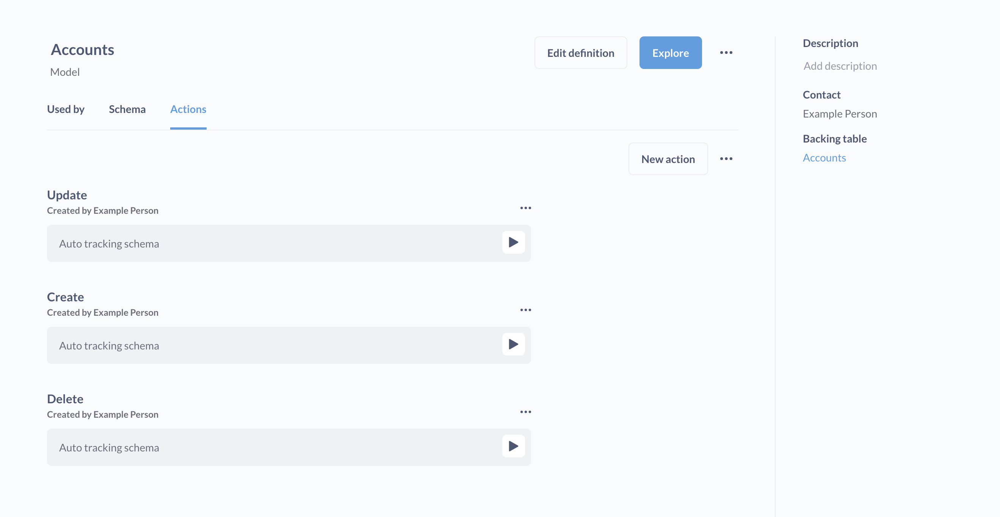
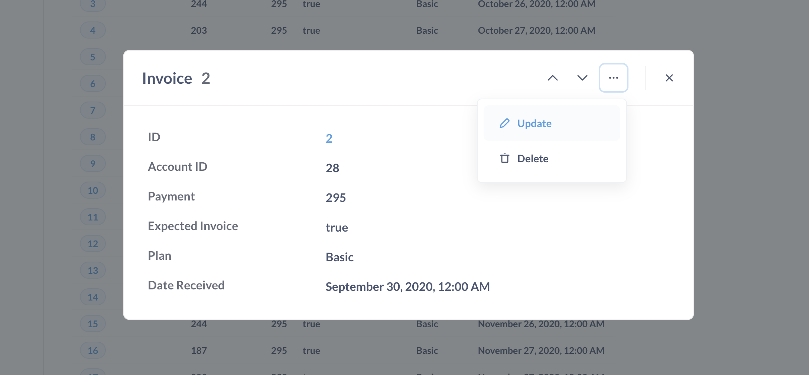

# Basic actions

Basic actions are "implicit" [actions](./introduction.md) that do things that people typically want to do when interacting with a database: Create, Update, Delete. Basic actions auto-track the schema of the source table backing the model. By auto-track the schema, we mean that Metabase will create action forms for people to fill out that include all of the fields from the primary source table that underlies that model.

If you only want to give people the option to update a subset of columns, or update columns in multiple tables, you can write a [custom action](./custom.md).

## Creating basic actions

Once actions are enabled, you can create basic actions on a new or existing [model](../data-modeling/models.md) that only wraps a single database table.

1. Select a model and click on the **info** button, then click on **Model detail**.
2. On the model detail page, click on the **Actions** tab.
3. Click on the **...** next to the **New Action** and select **Create basic actions**.

### Basic action limitations

Basic actions are only available for "basic" models:

- Models built using the graphical query builder. Basic actions are unavailable for models created with native queries (SQL).
- The model must "wrap" a single raw table in a database. The query should simply select that table in the data step of the notebook editor, and nothing more: no joins, no custom columns, no filters or summarization, no sorting.
- The underlying table can only have one primary (entity) key.

## Basic action types

Basic actions include:

- [Update](#update)
- [Delete](#delete)
- [Create](#create)

### Update

The update action will present people with a form with editable fields for each column in the primary source table.

When setting up an Update action on a dashboard, you must pass an entity key (like an ID) to the action from a dashboard filter. For other values, you can either prompt the person to fill in a value for each field, or have a field automatically filled in via parameters (such as values set in dashboard filters).

### Delete

The Delete action will create a form that prompts people for an entity key, and will delete the record (row) corresponding to that ID in the underlying table that backs the model.

### Create

The Create action is the `INSERT INTO` action. The Create action will present a form with editable fields for each column in the primary source table backing the model. Once filled out, the action will insert the record into the primary table that underlies the model.

## Basic actions on dashboards

When setting up actions on a dashboard, you can either prompt the person to fill in a value for each field, or have a field automatically filled in via parameters (such as values set in dashboard filters).

The Update basic action requires you to pass a value for the entity key.

See [Actions in dashboards](../dashboards/actions.md).

## Archiving basic actions

Because basic actions are made of magic, you cannot archive them. You can just toggle them on or off. From the model detail page, next to the **New action** button, click on the **...** menu and click **Disable basic actions**.

## Basic actions from object detail view

If you have basic actions enabled for a model, you can click on an individual record to view its object detail. From that object detail model, you can click on the ellipses (**...**) and select update or delete to modify that specific record.

## Further reading

- [Introduction to actions](./introduction.md)
- [Custom actions](./custom.md)
- [Actions in dashboards](../dashboards/actions.md)
