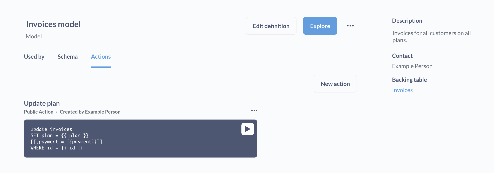

# Custom actions

Write SQL to update records in your databases.



## Creating a custom action

> You must be in a group with Native query editing access to create an action

There are two ways to create a custom action:

1. Click the **+ New** > **Action**. When you save your action, you'll be prompted to associate that action with a model. (NOTE: the **Action** option will only show up in the **+ New** menu if you've first created, or have access to, a [model](../data-modeling/models.md) in Metabase.)
2. Via the model detail page: from a model, click on the **info** button in the upper right. In the upper right of the sidebar, click **Model detail** > **Actions** > **New action**.

In the action editor, you can write your own code to create an action, like writing an action that would only update a subset of the columns in a table. See [Example actions](#example-custom-actions).

## Field types for action variables

For each {{ variable }} that you set in an action, you'll need to set the field type.

Each of these variable field types present different options. Click on the gear icon to change options.

If you don't require a variable, you can optionally specify a default value for Metabase to use in cases where people don't fill out the field. In the SQL code, remember to enclose any optional variables and commas in brackets, like `[[, column = {{ optional_variable }}]] `.

You can include placeholder text for all fields in the action form.

**Text**

- Text
- Long text
- Dropdown
- Inline select

**Number**

- Number
- Dropdown
- Inline select

**Date**

- Date
- Date + Time

For both **Dropdown** and **Inline select**, you can specify a list of options to present on the form, with each option on its own line.


## Appearance

The appearance tab in the action editor modal will display a preview of the variable's form element. In the image below, we've clicked on the variable's **gear** and set the variable to use a text > dropdown list. The appearance section gives a preview for what the form element would look like:


## Action settings

From the model detail page, click on the **three dot menu** (...) next to the action. Once in the action editor, click on the **gear** icon to bring up the action settings.

### Make public

Creates a publicly shareable link to the action form. Anyone with access to that link can fill out the form and run the action. Useful for creating surveys.


### Set a success message

Here you can edit the success message, which is the message Metabase will display in the toast that pops up after Metabase hears back from the database that everything went smoothly.

If something goes wrong, Metabase will display the error message it received from the database.

## Example custom actions

### Example `UPDATE` action

You could write an action that would update the `plan` column for a record in the `invoices` table in the Sample Database:

```

UPDATE invoices
SET plan = {{ plan }}
   [[, payment = {{ payment }}]]
WHERE
   id = {{ id }}

```

The above code will create a form that prompts people to input updated values for the (required) `plan` field and optionally the `payment` field for a given record specified by `ID`.

The code in brackets `[[ ]]` makes the statement optional: the bracket-enclosed statement will only run if someone inserts a value in the payment field. Note the comma that separates the statements is _inside_ the brackets.


### Example `INSERT` action

Insert statements are pretty straightforward:

```

INSERT INTO invoices (
  account_id
  ,payment
  ,expected_invoice
  ,plan
  ,date_received
)
VALUES (
  {{ account_id }}
  ,{{ payment }}
  ,CAST ({{expected_invoice}} AS boolean)
  ,{{plan}}
  ,({{date_received}}
);

```

### Casting field values in actions

If you get a type error when you submit a form, you may need to `CAST` the data type in the query so it matches the data type of the target field in the database. Here we're casting a value to a `boolean`:

```

UPDATE invoices
SET expected_invoice = CAST({{expected_invoice}} AS boolean)
WHERE id = {{id}};

```

### Referencing saved questions in actions

You can also reference saved questions in actions. Here we're taking the results of a `SELECT` statement on a saved question ("Potential customers") and inserting the results into a `people_to_write` table.

```

WITH prospects AS {{#6-potential-customers}}

INSERT INTO
  people_to_write (
  first_name
  ,last_name
  ,email
  )
SELECT
  first_name
  ,last_name
  ,email
FROM prospects;

```

## Further reading

- [Introduction to actions](./introduction.md)
- [Basic actions](./basic.md)
- [Actions in dashboards](../dashboards/actions.md)
