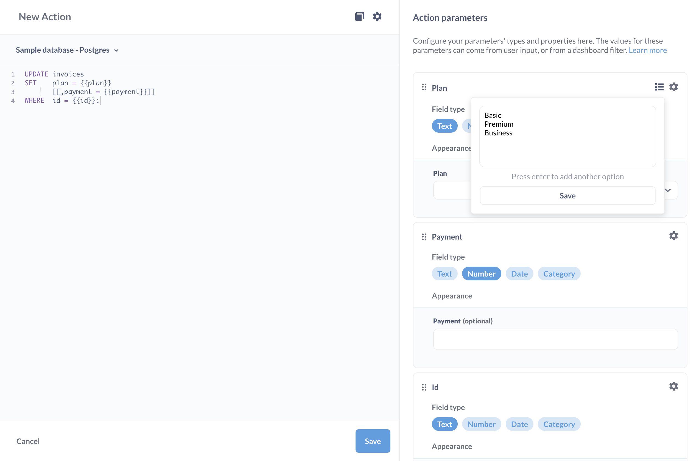

## Custom actions

Write SQL to update records in your databases.


## Creating a custom action

> You must be in a group with Native query editing access to create an action

There are two ways to create a custom action:

1. Click the **+ New** > **Action**. When you save your action, you'll be prompted to associate that action with a model. (NOTE: the **Action** option will only show up in the **+ New** menu if you've first created, or have access to, a model in Metabase.)
2. Via the model detail page: from a model, click on the **info** button in the upper right. In the upper right of the sidebar, click **Model detail** > **Actions** > **New action**.

## Custom action editor

Here you can write your own code to create an action, like writing an action that would only update a subset of the columns in a model.

For example, you could write an action that would update the `plan` column for a record in the `Invoices` table in the Sample Database:

```

UPDATE invoices
SET plan = {{ plan }}
[[, payment = {{ payment }}]]
WHERE id = {{ id }}

```

The above code will create a form that prompts people to input updated values for the (required) `plan` field and optionally the `payment` field for a given record specified by `ID`. The code in brackets `[[ ]]` makes it optional: the enclosed statement will only run if someone inserts a value in the payment field.

## Field types for action variables

For each {{ variable }} that you set in an action, you'll need to set the field type.

Each of these variable field types present different options.

If you don't require a variable, you can optionally specify a default value for Metabase to use in cases where people don't fill out the field.

You can include placeholder text for all fields in the action form.

**Text**

- Text
- Long text
- Dropdown
- Inline select

**Number**

- Number
- Dropdown
- Inline select

**Date**

- Date
- Date + Time

**Category**

- Dropdown
- Inline select

For both **Dropdown** and **Inline select**, you can specify a list of options to present on the form, with each option on its own line.



## Action settings

From the model detail page, click on the **...** next to the action. Once in the action editor, click on the **gear** icon to bring up the action settings.

### Make public

Creates a publicly shareable link to the action form.


### Set a success message

Here you can edit the success message, which is the message Metabase will display in the toast that pops up after Metabase hears back from the database that everything went smoothly.

If something goes wrong, Metabase will display the error message it received from the database.

## Further reading

- [Introduction to actions](./introduction.md)
- [Basic actions](./basic.md)
