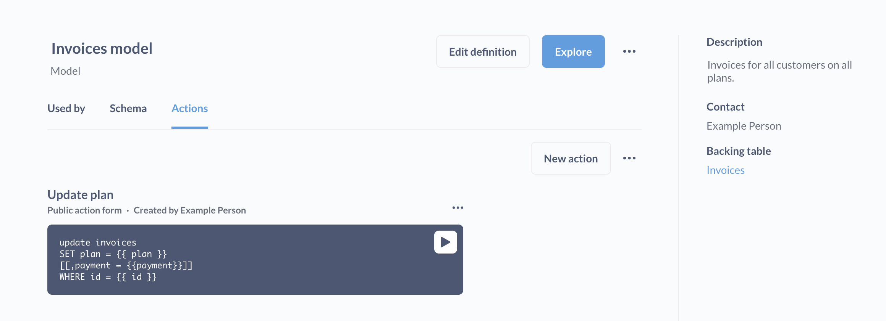

# Introduction to actions

> For now, actions are only available for PostgreSQL and MySQL.

## What are actions?

**Actions** are entities in Metabase that let you build custom forms and business logic.

Actions let you write parameterized SQL that writes back to your database. Actions can be attached to [buttons on dashboards](../dashboards/actions.md) to create custom workflows. You can even publicly share the parameterized forms that actions generate to collect data.

Here are a few ideas for what you can do with actions:

- Mark the customer you’re viewing in a dashboard as a VIP.
- Let team members remove redundant data.
- Create a customer feedback form and embed it on your website.

Actions must be added to a [model](../data-modeling/models.md), but actions only run on the raw tables that back those models (so actions will never edit your [model definition](../data-modeling/models.md#edit-a-models-query)).

## Enabling actions for a database

For actions to work, you'll first need to do the following two things:

1. **Enable model actions for the database connection**. To enable actions for a database connection, admins should click on the **gear** icon in the upper right and navigate to **Admin settings** > **Databases**, then click on the database you want to create actions for. On the right side of the connection settings form, toggle the **Model actions** option. For actions to work, the database user account (the account you're using to connect to the database) must have [write permissions](../databases/users-roles-privileges.md#privileges-to-enable-actions). And for now, actions are only supported on PostgreSQL and MySQL databases.
2. **Create at least one model from that database.** Actions are associated with models, so you'll need to have created (or have access to) at least one model before you can start creating actions.

## Who can use actions

- **To create or edit an action**, a person must be in a group with [Native query editing](../permissions/data.md) privileges for the relevant database.
- **To run an action**, all you need is view access to the action's model or dashboard (or a link to a public action).

## Types of actions

There are two types of actions:

- [Basic](./basic.md)
- [Custom](./custom.md)

## Running actions

There are multiple ways to run actions:

- [From the model details page](../data-modeling/models.md#model-detail-page) by clicking the **run** button.
- From a [public form](./custom.md#make-public) of an action.
- From a [button on dashboard](../dashboards/actions.md).

## Actions change data in tables, which affect models

Just something to clarify here: actions, even though they are added to models, make their changes to the underlying table that a model queries. Which means that anyone who has access to the underlying table, or to questions or other models based on that table, will be able to see the effects of an action. Tools other than Metabase that are connected to that database will also pick up these changes.

In this sense, models are containers for actions; models are a way to organize actions. In fact, you could (in theory) add a [custom action](./custom.md) to a model that performs some update unrelated to its model's data. For example, you could write a custom action that updates the `Accounts` table, and add that action to a model that only queries an unrelated table (e.g., the `Orders` table). But, you know, maybe don't do that (unless you have a really good reason). [Basic actions](./basic.md), however, are only be available for models that wrap a single raw table.

Before using actions in production, consider playing around with actions on some sample data (like the Sample Database included with Metabase) to get a feel for how they work.

## Action gotchas

- If caching is enabled for the relevant table or model, you may not see the effects of an action in Metabase until Metabase refreshes the data (though you can always manually refresh the data).
- When creating records on a table that lacks an automatically generated primary key, you'll need to input an available ID (i.e., an ID not already in use by another record).
- You can't "undo" actions. You can, however, create and run an action to recreate a deleted record, or change an updated record back to its original values (provided you know the original values).
- Actions are unavailable for public dashboards, and dashboards in [static embeds](../embedding/static-embedding.md).

## Further reading

- [Basic actions](./basic.md)
- [Custom actions](./custom.md)
- [Actions in dashboards](../dashboards/actions.md)
