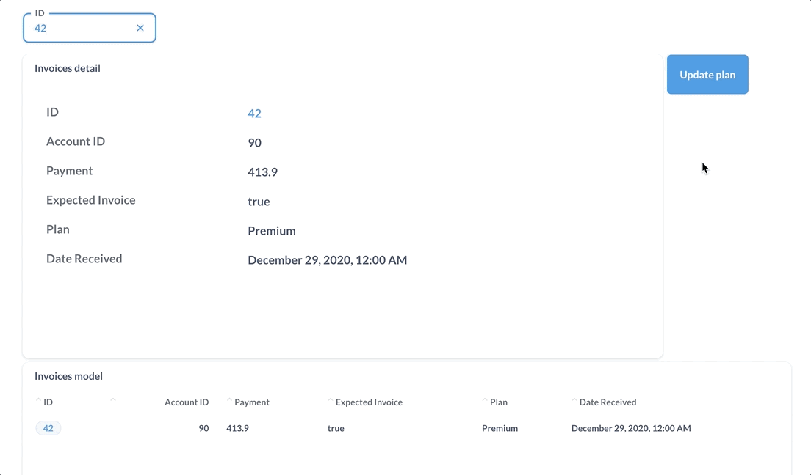

# Actions overview

Actions let you write parameterized SQL that can then be attached to buttons, clicks, or even added on the page as form elements.

## [Introduction to actions ](./introduction.md)

Use actions to update your data based on user input or values on the page.

## [Basic actions](./basic.md)

Metabase will create basic actions that auto-track a model's schema.

## [Custom actions](./custom.md)

Write SQL to create new actions.

## [Actions on dashboards](../dashboards/actions.md)

Add actions on dashboards as buttons that you can pass filter values to.