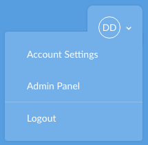
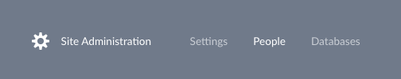
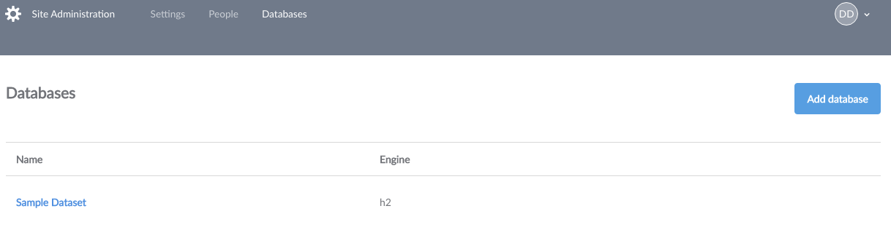
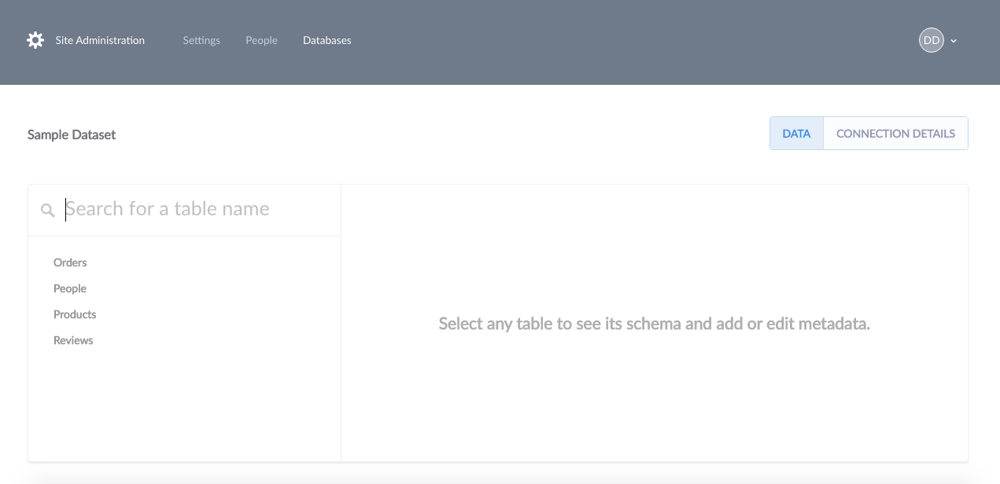
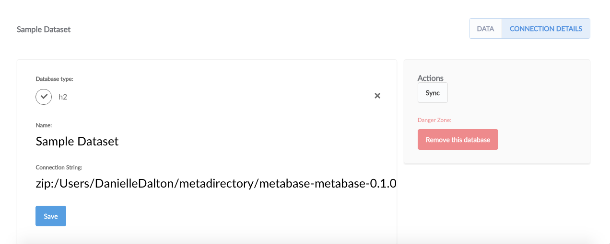
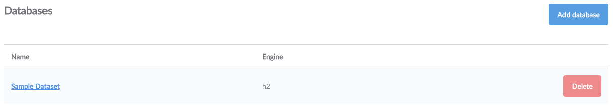
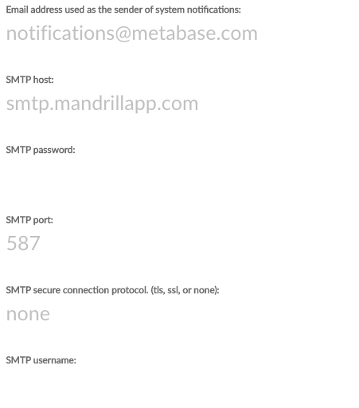
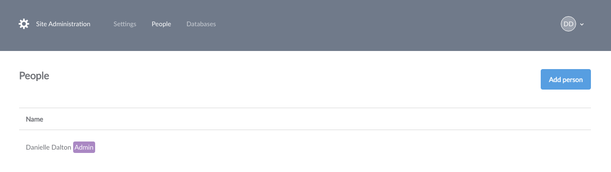
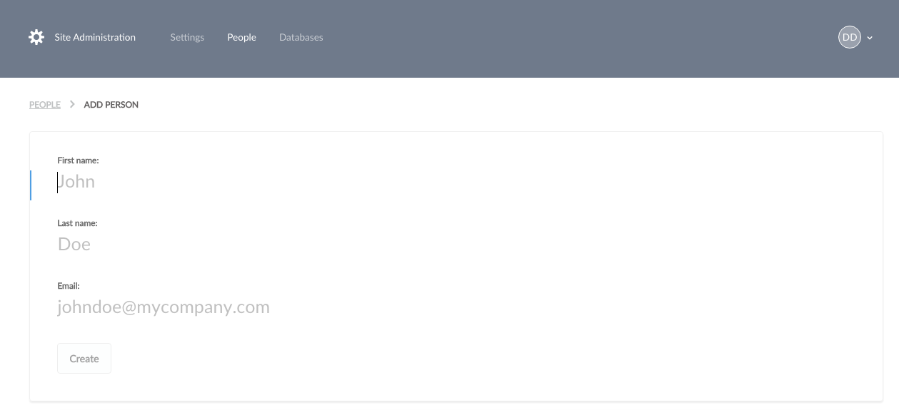

#Administration Guide

> **This guide will teach you:**
> How to connect Metabase to databases in your organization
> How to set up email 
> How to manage user accounts
> How to backup Metabase application data
> How to deal with common problems

---
In charge of managing Metabase for your organization?  Then, you're in the right spot.  This guide covers setting up database connections, configuring email settings, and managing user accounts.

First things first, you'll need to install a copy of Metabase.  Our [Installation Guide](installation-guide.md) will help you through the process.  

##Managing Databases
---
Once you have a Metabase account (made during the Installation process), you'll want to connect databases.  To see a list of all databases connected in your account, click **Admin Panel** from the dropdown menu in the upper right hand corner of the screen to access the admin menu bar.  

Next, select **Databases** from the admin menu bar to view all databases.  

##Adding a Database Connection

To add a database to your Metabase account, click **Add database**.  Metabase currently supports the following types of databases: 

* Amazon RDS
* H2
* MONGODB
* MySQL
* Postgres

To add each type of database, you'll need its connection information.  The [Installation Guide](installation-guide.md) explains where to find your database's connection information.  

##SSL

Metabase automatically tries to connect to databases with and without SSL.  If it is possible to connect to your database with a SSL connection, Metabase make that the default setting for your database.  You can always change this setting later if you prefer to connect without this layer of security.  

###Database Analysis

When connecting your database to Metabase, it tries to decipher the field types in your table based on each field's name.  Metabase also takes a sample of each table to look for URL's, json, encoded strings, etc. If a field is classified wrong, you can always manually edit it. 

###Metadata Syncing

Metabase automatically syncs its copy of your database with the original database source every night.  

If you'd like to sync your database manually at any time:

1. Click on **Account Settings** from the dropdown menu. 

2. Select **Databases** from the admin menu bar at the top of the screen.  

2. Click on the Database you would like to sync. 
 
3. Click **Connection Details** in the upper right hand corner of the screen. 

4. Select **Sync** to manually sync your database.  

###Deleting Databases

To delete a database from Metabase, Click **Remove this Database** under "Connection Details".  

Hovering over the database row in the list of databases connected to your account and clicking the red **Delete** button will also delete a database.  

**Caution: Deleting a database is irreversible!  All saved questions and dashboard cards based on the database will be deleted too.**

##Setting up Email

---
Once you connect your database to Metabase, you'll want to configure an email account to send system notifications to your organization's users.  Metabase uses email to reset passwords, onboard new users, and notify you when something happens.  

###Configuring your Email Account

For Metabase to send and receive messages to your organization's users, you'll need to set up an email account to send emails via SMTP (*SMTP* stands for simple mail transfer protocol and is an email standard used that secures emails with SSL security protection). 

**If you use Google Apps:**

* Enter the email address you would like to be used as the sender of system notifications in the 
* In the **SMTP host** field, enter [smtp.gmail.com](smtp.gmail.com)
* Enter your Google Apps password in the **SMTP password** field
* Fill in `465` for the **SMTP port** field
* For the **SMTP secure connection protocol** field, enter *TLS*
* In the **SMTP username** field, enter your Google Apps email address (e.g. hello@yourdomain.com)

**If you use SES:**

* Log onto [https://console.aws.amazon.com/ses](https://console.aws.amazon.com/ses). 
* Click **SMTP Settings** from the navigation pane.  
* Select **Create My SMTP Credentials** in the content pane. 
* Create a user in the **Create User for SMTP** dialogy box and then click **Create**.  
* Afterwards select **Show User SMTP Credentials** to view the user's SMTP credentials.  

**If you use Mandrill:**

* Locate your credentials from the **SMTP & API Info** page from your Mandrill account.  
* Your SMTP password is any active API key for your account-*not* your Mandrill password.  
* Although Mandrill lists **port 587**, [any port supported by Mandrill](https://mandrill.zendesk.com/hc/en-us/articles/205582167-What-SMTP-ports-can-I-use-) will work for SMTP email.  

**No matter what email provider you use,**

* SSL is preferred because it is more secure and gives your account exta security and protection from threats.
* If your email service has a whitelist of email addresses that are allowed to send email, be sure to add the "Sender of System Notifications" setting to a whitelisted email address to ensure you receive all messages from Metabase.  

##Metadata Editing

---
*Note: For an in-depth description of Metabase's understanding of metadata and how it uses it, check out our [Metadata Guide](metadata-guide.md)*

###What is metadata?
**Metadata** is data about other data.  It's data that tells you about the data found in your database.
###Tables 

* Add descriptions to tables to let people know type of data a table contains and how it can be used. 
* Descriptions are displayed in the data model reference.
* You can control visibility of metadata by hiding it. 
* If you hide a field, give Metabase a reason so it understands why a field is not being included.

###Fields 

* If Metabase misclassified the type of a field, you can update it here. 
* Add a description to a field, so users know what data it contains.
* Descriptions are extra helpful when fields have values that are abbreviated or coded in a particular format.
* Descriptions are displayed in the data model reference.

##Managing User Accounts
---

Click on your profile icon in the upper right hand corner and select **Account Settings** to access your administrative dashboard.  

Select **People** from the menu bar at the top of the screen to see a list of all user accounts in your organization.

* To add a new user account, click **Add person** in the upper right corner.   

* Enter a user's information to create an account for them.  

* New users will receive an email welcoming them to Metabase and a link to configure their password.
* To delete a user's account, click **Remove**.  Deleting an account will mark it as inactive and prevent it from being used in the future - but it won't delete the user's cards or dashboards.

* To make an existing user an administrator, click **Grant Admin**
* To remove administrator privileges from a user, select **Revoke Admin**

##Backing up Metabase Application Data 
---
###If you're using an Embedded Database
Find the file `metabase.db.h2.db`.  If your system is inactive, you can make a copy directly.  If your system is active, shut down the Metabase process and make a backup copy of the file.  Then, restart the server.

###If you're using Amazon RDS for the Database Application
Enable automated RDS Backups.  Instructions can be found [here](http://docs.aws.amazon.com/AmazonRDS/latest/UserGuide/USER_WorkingWithAutomatedBackups.html).  

###If you're using a self-managed PostgreSQL or MySQL database
Back up your database as you would to any other PostgreSQL or MySQL database. 

##Settings
---
###Base URL
The **base URL** is used in emails to allow users to click to their specific instance.  Include the protocol (http vs https) to make sure it is reachable. 

###Connection Timezone
The **connection timezone** sets the default time zone for displaying times.  The timezone is used when doing date breakouts.  

Setting the default timezone will not change the timezone of any data in your database.  If the underlying times in your database aren't assigned to a timezone, Metabase will use the connection timezone as the default timezone.  

###Name used for the Instance
If you want to name an instance, you can do so under settings.  Many teams use the name of their company, but the choice is yours!

## Common Problems

### Startup fails due to Migrations being locked

Sometimes Metabase will fail to startup due to a lingering lock. 

Solution:
Run  `java -cp metabase-master-2015-08-06-3da1178.jar org.h2.tools.Server -webPort 3000` in the commandline

open the web console (it prints a url)

connect to JDBC URL jdbc:h2:PATH/TO/metabase.db;IFEXISTS=TRUE  # note the .h2.db suffix is omitted
blank username, blank password

run `delete from databasechangeloglock;`

kill the h2 server and restart metabase.

