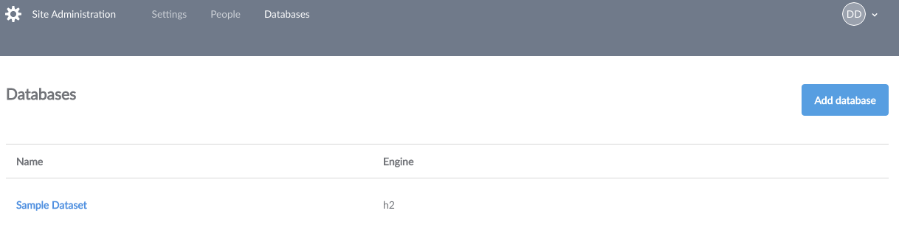
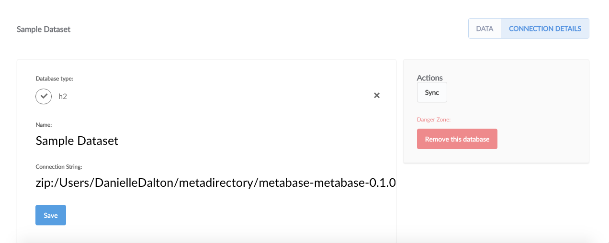

## Managing Databases
If you already connected your database during the installation, you’ve probably a covered a lot of this info. But if you need to add another database or manage the settings of the one you already have connected, just click the circle with your initials in the top right of Metabase and select the **Admin Panel**.

Cool, now you’re in the admin panel. Next, select **Databases** from the menu bar at the top of the screen to see your databases.

### Adding a Database Connection

Now you’ll see a list of your databases. To connect another database to Metabase, click **Add database**. Metabase currently supports the following types of databases:

* Amazon Redshift
* [Google BigQuery](databases/bigquery.md)
* H2
* MongoDB (version 3.0 or higher)
* MySQL
* Postgres
* SQLite
* SQL Server

To add a database, you'll need its connection information.

#### Getting connection information for Databases on Heroku:

1. Go to [https://postgres.heroku.com/databases](https://postgres.heroku.com/databases).
2. Click on the database you want to connect to Metabase.
3. Write down the following information based on your database:
    * Hostname
    * Port
    * Username
    * Database Name
    * Password

#### Getting connection information for Databases on Amazon's RDS:

1. Go to your AWS Management Console.
    * Need help finding that?  Visit [https://**My_AWS_Account_ID**.signin.aws.amazon.com/console](https://**My_AWS_Account_ID**.signin.aws.amazon.com/console).  Be sure to insert your own AWS Account ID, though!
2.  Under "Database" services, click "RDS".
3.  Then click "Instances".
4.  Select the database you want to connect to Metabase.
5.  Write down the following information based on your database:
    * Hostname - This is listed as the "Endpoint" parameter
    * Port - Find the port parameter under "Security and Network"
    * Username - Find this under "Configuration Details"
    * Database Name - Find this under "Configuration Details"
    * Password - Ask your database administrator for the password.

### Secure Socket Layer (SSL)

Metabase automatically tries to connect to databases with and without SSL. If it is possible to connect to your database with a SSL connection, Metabase will make that the default setting for your database. You can always change this setting later if you prefer to connect without this layer of security, but we highly recommend keeping SSL turned on to keep your data secure.

### Database Analysis

When Metabase connects to your database, it tries to decipher the field types in your tables based on each field's name. Metabase also takes a sample of each table to look for URL's, json, encoded strings, etc. If a field is classified wrong, you can always manually edit it from the **Metadata** tab in the Admin Panel.

### Metadata Syncing

Metabase maintains it's own information about the various tables and fields in each Database that is added to aid in querying.  This information is generally updated once each night to look for changes to the database such as new tables, but if you'd like to sync your database manually at any time:

NOTE: Metabase does NOT copy any data from your database, it only maintains lists of the tables and columns.

1. Go to the Admin Panel.

2. Select **Databases** from the navigation menu.

3. Click on the database you would like to sync.

4. Click on the **Sync** button on the right of the screen.

### Deleting Databases

To delete a database from Metabase, click on **Remove this database** from the database detail screen.

You can also delete a database from the database list: hover over the row with the database you want to remove and click the **Delete** button that appears.

**Caution: Deleting a database is irreversible!  All saved questions and dashboard cards based on the database will be deleted as well!**

---
## Next: enabling features that send email
Metabase can send emails for certain features, like email invites, but first you need to [set up an email account](02-setting-up-email.md).
