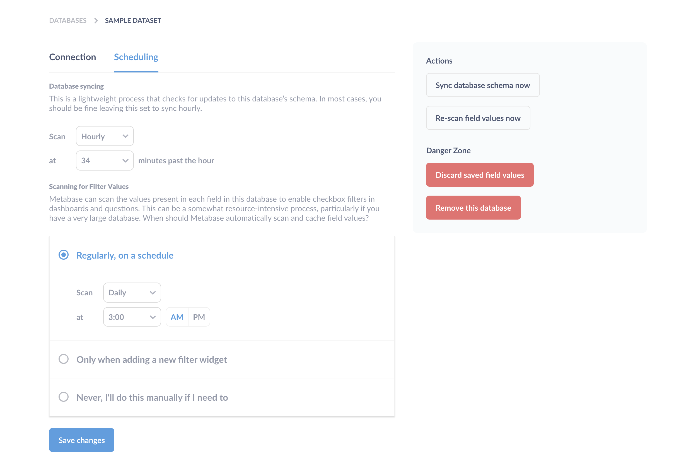

## Adding and managing databases

- [Adding a database connection](#adding-a-database-connection)
- [Officially supported databases](#officially-supported-databases)
- [Connecting to databases hosted by a cloud provider](#connecting-to-databases-hosted-by-a-cloud-provider)
- [Errors when connecting to your database](#errors-when-connecting-to-your-database)
- [Database connection options](#database-connection-options) 
- [Re-scanning a single table or field](#re-scanning-a-single-table-or-field)
- [Deleting databases](#deleting-databases)

## Adding a database connection

In the main navigation bar, click on the **gears** icon in the top right, and select **Admin**.

Once in the Admin section, select the **Databases** tab from the navigation bar at the top of the screen. You’ll see a list of your connected databases (if any). To connect a database to Metabase, click **Add database** and follow the connection instructions for your database.

Although connection details differ database to database, in general you'll need to get connection info from your database admin, usually some combination of hostname (sometimes called endpoint), port, database username and password, and the name of the database. 

### Officially supported databases

- [BigQuery](databases/bigquery.md) (Google Cloud Platform)
- Druid
- Google Analytics (version 3; if you're interested in support for version 4, let us know by adding your [+1 to this issue (#12905)](https://github.com/metabase/metabase/issues/12905))
- H2
- [MongoDB (version 3.6 or higher)](databases/mongodb.md) <!-- MongoDB supported version is from https://www.mongodb.com/support-policy -->
- [MySQL (version 5.7 or higher, as well as MariaDB version 10.2 or higher)](databases/mysql.md)
- [Oracle](databases/oracle.md)
- PostgreSQL
- Presto
- Redshift (Amazon Web Services)
- [Snowflake](databases/snowflake.md)
- SparkSQL
- SQL Server
- SQLite
- [Vertica](databases/vertica.md)

Don't see the database you need here? Take a look at our [Community Drivers](../developers-guide-drivers.md) page to see if someone's built one, or learn how to get started building your own. Note that our hosted offering, [Metabase Cloud](https://www.metabase.com/start/hosted/), doesn't support community drivers, meaning that (for now) you can only use Metabase Cloud with the [officially supported databases](#officially-supported-databases) listed above.

### Connecting to databases hosted by a cloud provider

For provider-specific connection details, like connecting to a PostgreSQL data warehouse on RDS:

- [AWS's Relational Database Service (RDS)](databases/aws-rds.md)

### Errors when connecting to your database

Check our [troubleshooting guide](../troubleshooting-guide/datawarehouse.md).

## Database connection options

Connection options differ depending on which database you're connecting to. Here's an overview:

- [Use a secure connection (SSL)](#use-a-secure-connection-ssl)
- [Use an SSH-tunnel for database connections](#use-an-ssh-tunnel-for-database-connections) 
- [Choose when Metabase syncs and scans his](#choose-when-metabase-syncs-and-scans)
- [Automatically run queries when doing simple filtering and summarizing](#automatically-run-queries-when-doing-simple-filtering-and-summarizing)

### Use a secure connection (SSL)

Metabase automatically tries to connect to databases with SSL first, then without if that doesn't work. If it's possible to connect to your database with an SSL connection, Metabase will make that the default setting for your database. If you prefer to connect without this layer of security, you can always change this setting later, but we highly recommend keeping SSL turned on to keep your data secure.

### Use an SSH tunnel for database connections

See our [guide to SSH tunneling](ssh-tunnel-for-database-connections.md).

### Choose when Metabase syncs and scans 

By default, Metabase does a lightweight hourly sync and an intensive daily scan of field values. If you have a large database, we recommend turning on the option "This is a large database, let me choose when Metabase syncs and scans". Once on, you can review when and how often the field value scans happen. (Note: this setting used to be called "Enable in-depth analysis.") 

If you enable this and save your changes, you'll see a new tab at the top of the form called "Scheduling." Click on that, and you'll see options to change when and how often Metabase syncs and scans.

#### Database syncing 

Metabase maintains its own information about the various tables and fields in each database to aid in querying. By default, Metabase performs this lightweight sync hourly to look for changes to the database such as new tables or fields. Metabase does _not_ copy any data from your database. It only maintains lists of the tables and columns.

Syncing can be set to hourly, or daily at a specific time. Syncing can't be turned off completely, otherwise Metabase wouldn't work.

If you'd like to sync your database manually at any time, click on it from the Databases list in the admin panel and click on the **Sync database schema now** button on the right side of the screen:

#### Scanning for field values

When Metabase first connects to your database, it takes a look at the metadata of the columns in your tables and automatically assigns them a type. Metabase also takes a sample of each table to look for URLs, JSON, encoded strings, etc. You can manually edit table and column metadata in Metabase at any time from the **Data Model** tab in the **Admin Panel**.

By default, Metabase also performs a more intensive daily sampling of each field's values and caches the distinct values in order to make checkbox and select filters work in dashboards and SQL/native questions. This process can slow down large databases, so if you have a particularly large database, you can turn on the option to choose when Metabase scans, and select one of three scan options in the Scheduling tab:

- **Regularly, on a schedule** lets you choose to scan daily, weekly, or monthly, and also lets you choose what time of day, or which day of the month to scan. This is the best option if you have a relatively small database, or if the distinct values in your tables change often.
- **Only when adding a new filter widget** is a great option if you have a relatively large database, but you still want to enable dashboard and SQL/native query filters. With this option enabled, Metabase will only scan and cache the values of the field or fields that are required whenever a new filter is added to a dashboard or SQL/native question. For example, if you were to add a dashboard category filter, mapped to one field called `Customer ID` and another one called `ID`, only those two fields would be scanned at the moment the filter is saved.
- **Never, I'll do this manually if I need to** is an option for databases that are either prohibitively large, or which never really have new values added. If you want to trigger a manual re-scan, click the button in the top-right of the database's page that says **Re-scan field values now.**

If for some reason you need to flush out the cached field values for your database, click the button that says **Discard saved field values** in the top-right of the database's page.

### Automatically run queries when doing simple filtering and summarizing 

By default, Metabase will auto-run queries when you use the Summarize and Filter buttons when viewing a table or chart. If your users are exploring data that is stored in a slow database, you may want to turn the auto-run off to avoid re-running the query every time your users change an option in the Summarize view. Turning this off presents the users with the option to re-run the query when they choose to.

### Periodically refingerprint tables

When syncing with this database, Metabase will scan a subset of values of fields to gather statistics that enable things like improved binning behavior in charts, and to generally make your Metabase instance smarter.

### Additional JDBC connection string options

Some databases allow you to append options to the connection string Metabase will use to connect to your database.

## Re-scanning a single table or field

To re-scan a specific table, go to the Data Model section of the Admin Panel, select the table from the list, and click the gear icon in the top right of the page. Similarly, to do this for just a specific field, on the same Data Model page, find the field you want and click the gear icon on the far right of the field's name and options.

On either the table settings or field settings page, you'll see these options:

- Re-scan this table/field
- Discard cached field values

For more on editing metadata, check out [the Data Model page: editing metadata](03-metadata-editing.md).

## Deleting databases

**Caution: Deleting a database is irreversible! All saved questions and dashboard cards based on the database will be deleted as well!**

To delete a database from Metabase, click on **Remove this database** from the database detail screen.

You can also delete a database from the database list: hover over the row with the database you want to remove and click the **Delete** button that appears.

---

## Next: enabling features that send email

Metabase can send emails for certain features, like email invites, but first you need to [set up an email account](02-setting-up-email.md).
