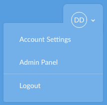
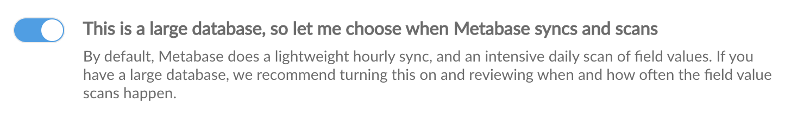
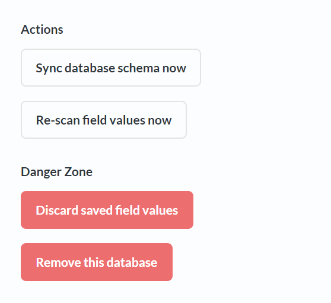
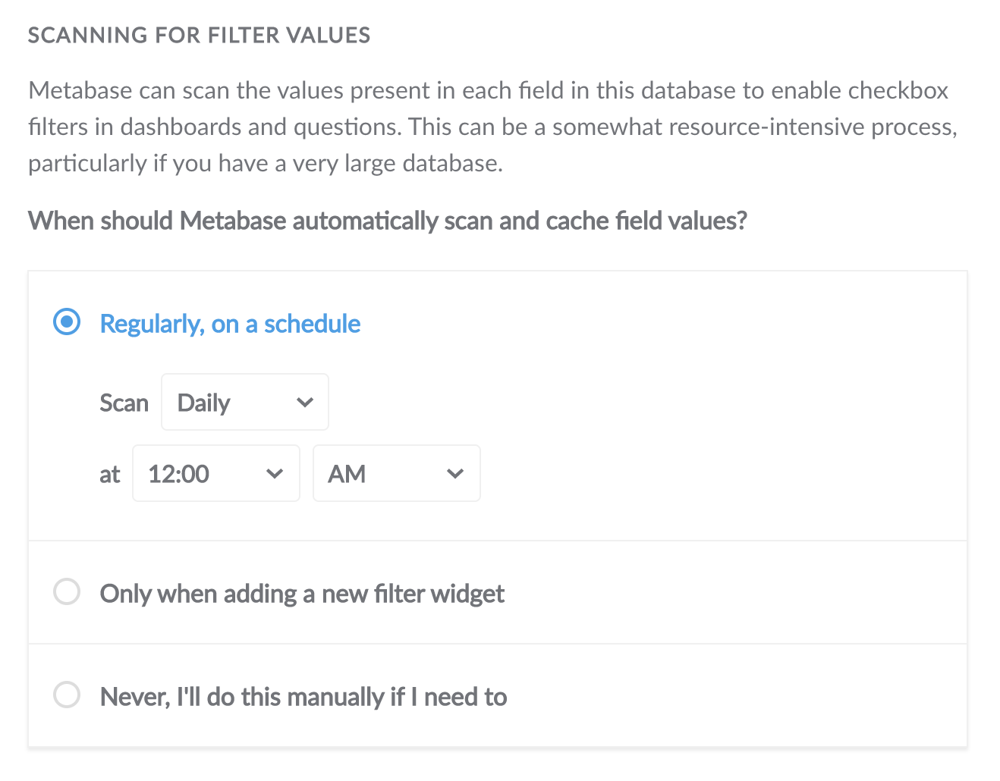
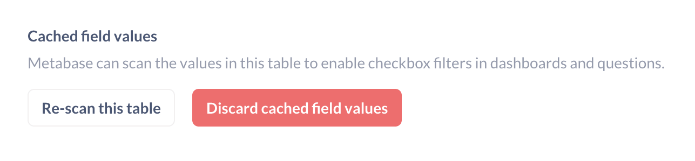
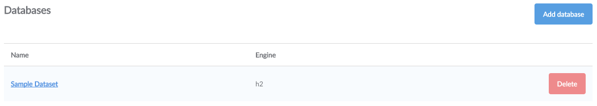

## Managing databases

If you already connected your database during the installation, you’ve probably covered a lot of this territory. But if you need to add another database or manage the settings of one you already have connected, just click the settings icon in the top right of Metabase and select **Admin**.

Cool, now you’re in the administration section of Metabase. Next, select **Databases** from the menu bar at the top of the screen to see your databases.

### Adding a database connection

Now you’ll see a list of your databases. To connect another database to Metabase, click **Add database**. Metabase currently supports the following types of databases:

- Amazon Redshift
- Druid
- Google Analytics
- [Google BigQuery](databases/bigquery.md)
- H2
- [MongoDB (version 3.4 or higher)](databases/mongodb.md)
- [MySQL (version 5.7 or higher, as well as MariaDB version 10.2 or higher)](databases/mysql.md)
- [Oracle](databases/oracle.md)
- PostgreSQL
- Presto
- [Snowflake](databases/snowflake.md)
- SparkSQL
- SQL Server
- SQLite
- [Vertica](databases/vertica.md)

Don't see the database you need here? Take a look at our [Community Drivers](../developers-guide-drivers.md) page to see if somebody else has built one or how to get started building your own.

To add a database, you'll need its connection information.

#### Getting connection information for databases on Heroku:

1. Go to [https://postgres.heroku.com/databases](https://postgres.heroku.com/databases).
2. Click on the database you want to connect to Metabase.
3. Write down the following information based on your database:
   - Hostname
   - Port
   - Username
   - Database Name
   - Password

#### Getting connection information for databases on Amazon's RDS:

1. Go to your AWS Management Console.
   - Need help finding that? Visit [https://**My_AWS_Account_ID**.signin.aws.amazon.com/console](https://**My_AWS_Account_ID**.signin.aws.amazon.com/console). Be sure to insert your own AWS Account ID, though!
2. Under "Database" services, click "RDS".
3. Then click "Instances".
4. Select the database you want to connect to Metabase.
5. Write down the following information based on your database:
   - Hostname - This is listed as the "Endpoint" parameter
   - Port - Find the port parameter under "Security and Network"
   - Username - Find this under "Configuration Details"
   - Database Name - Find this under "Configuration Details"
   - Password - Ask your database administrator for the password.

#### Errors When Connecting

If you're experiencing errors when connecting to your database, check our [troubleshooting guide](../troubleshooting-guide/datawarehouse.md) for help.

### Secure Socket Layer (SSL)

Metabase automatically tries to connect to databases with and without SSL. If it is possible to connect to your database with a SSL connection, Metabase will make that the default setting for your database. You can always change this setting later if you prefer to connect without this layer of security, but we highly recommend keeping SSL turned on to keep your data secure.

### Database sync and analysis

By default, Metabase performs a lightweight hourly sync of your database, and a nightly deeper analysis of the fields in your tables to power some of Metabase's features, like filter widgets.

If you'd like to change these default settings, find and click on your database in the Databases section of the Admin Panel, and turn on the toggle at the bottom of the form that says "This is a large database, so let me choose when Metabase syncs and scans." (This is an option that used to be called "Enable in-depth analysis.")

Save your changes, and you'll see a new tab at the top of the form called "Scheduling." Click on that, and you'll see options to change when and how often Metabase syncs and scans.

#### Database syncing

Metabase maintains its own information about the various tables and fields in each database that is added to aid in querying. By default, Metabase performs this lightweight sync hourly to look for changes to the database such as new tables or fields. Metabase does _not_ copy any data from your database. It only maintains lists of the tables and columns.

Syncing can be set to hourly, or daily at a specific time. Syncing can't be turned off completely, otherwise Metabase wouldn't work.

If you'd like to sync your database manually at any time, click on it from the Databases list in the admin panel and click on the Sync database schema now button on the right side of the screen:

#### Query auto-running settings

By default, Metabase will auto-run queries when you use the Summarize and Filter buttons when viewing a table or chart. If your users are exploring data that is stored in a slow database, you may want to turn the auto-run off to avoid re-running the query every time your users change an option in the Summarize view. Turning this off presents the users with the option to re-run the query when they choose to.

#### Scanning for field values

When Metabase first connects to your database, it takes a look at the metadata of the columns in your tables and automatically assigns them a type. Metabase also takes a sample of each table to look for URLs, JSON, encoded strings, etc. You can manually edit table and column metadata in Metabase at any time from the **Data Model** tab in the **Admin Panel**.

By default, Metabase also performs a more intensive daily sampling of each field's values and caches the distinct values in order to make checkbox and select filters work in dashboards and SQL/native questions. This process can slow down large databases, so if you have a particularly large database, you can turn on the option to choose when Metabase scans, and select one of three scan options in the Scheduling tab:

- **Regularly, on a schedule** lets you choose to scan daily, weekly, or monthly, and also lets you choose what time of day, or which day of the month to scan. This is the best option if you have a relatively small database, or if the distinct values in your tables change often.
- **Only when adding a new filter widget** is a great option if you have a relatively large database, but you still want to enable dashboard and SQL/native query filters. With this option enabled, Metabase will only scan and cache the values of the field or fields that are required whenever a new filter is added to a dashboard or SQL/native question. For example, if you were to add a dashboard category filter, mapped to one field called `Customer ID` and another one called `ID`, only those two fields would be scanned at the moment the filter is saved.
- **Never, I'll do this manually if I need to** is an option for databases that are either prohibitively large, or which never really have new values added. If you want to trigger a manual re-scan, click the button in the top-right of the database's page that says "Re-scan field values now."

If for some reason you need to flush out the cached field values for your database, click the button that says "Discard saved field values" in the top-right of the database's page.

##### Re-scanning a single table or field

To re-scan a specific table, go to the Data Model section of the Admin Panel, select the table from the list, and click the gear icon in the top right of the page. Similarly, to do this for just a specific field, on the same Data Model page, find the field you want and click the gear icon on the far right of the field's name and options.

On either the table settings or field settings page, you'll see these options:

### Deleting databases

To delete a database from Metabase, click on **Remove this database** from the database detail screen.

You can also delete a database from the database list: hover over the row with the database you want to remove and click the **Delete** button that appears.

**Caution: Deleting a database is irreversible! All saved questions and dashboard cards based on the database will be deleted as well!**

### SSH tunneling in Metabase

---

Metabase has the ability to connect to some databases by first establishing a connection to a server in between Metabase and a data warehouse, then connect to the data warehouse using that connection as a bridge. This makes connecting to some data warehouses possible in situations that would otherwise prevent the use of Metabase.

#### When to use this feature

There are two basic cases for using an SSH tunnel rather than connecting directly:

- A direct connection is impossible
- A direct connection is forbidden due to a security policy

Sometimes when a data warehouse is inside an enterprise environment, direct connections are blocked by security devices such as firewalls and intrusion prevention systems. To work around this many enterprises offer a VPN, a bastion host, or both. VPNs are the more convenient and reliable option though bastion hosts are used frequently, especially with cloud providers such as Amazon Web Services where VPC (Virtual Private Clouds) don't allow direct connections. Bastion hosts offer the option to first connect to a computer on the edge of the protected network, then from that computer establish a second connection to the data warehouse on the internal network and essentially patch these two connestions together. Using the SSH tunneling feature, Metabase is able to automate this process in many cases. If a VPN is available that should be used in preference to SSH tunneling.

#### How to use this feature

When connecting though a bastion host:

- Answer yes to the "Use an SSH-tunnel for database connections" parameter
- Enter the hostname for the data warehouse as it is seen from inside the network in the `Host` parameter.
- Enter the data warehouse port as seen from inside the network into the `Port` parameter.
- Enter the external name of the bastion host as seen from the outside of the network (or wherever you are) into the `SSH tunnel host` parameter.
- Enter the ssh port as seen from outside the network into the `SSH tunnel port` parameter. This is usually 22, regardless of which data warehouse you are connecting to.
- Enter the username and password you use to login to the bastion host into the `SSH tunnel username` and `SSH tunnel password` parameters.

If you are unable to connect test your ssh credentials by connecting to the SSH server/Bastion Host using ssh directly:

    ssh <SSH tunnel username>@<SSH tunnel host> -p <SSH tunnel port>

Another common case where direct connections are not possible is when connecting to a data warehouse that is only accessible locally and does not allow remote connections. In this case you will be opening an SSH connection to the data warehouse, then from there connecting back to the same computer.

- Answer yes to the "Use an SSH-tunnel for database connections" parameter
- Enter `localhost` in the `Host` parameter. This is the name the server
- Enter the same value in the `Port` parameter that you would use if you where sitting directly at the data warehouse host system.
- Enter the extenal name of the data warehouse, as seen from the outside of the network (or wherever you are) into the `SSH tunnel host` parameter.
- Enter the ssh port as seen from outside the network into the `SSH tunnel port` parameter. This is usually 22, regardless of which data warehouse you are connecting to.
- Enter the username and password you use to login to the bastion host into the `SSH tunnel username` and `SSH tunnel password` parameters.

If you have problems connecting verify the ssh host port and password by connecting manually using ssh or PuTTY on older windows systems.

#### Disadvantages to indirect connections

While using an ssh tunnel makes it possible to use a data warehouse that is otherwise not accessible it is almost always preferable to use a direct connection when possible:

There are several inherent limitations to connecting through a tunnel:

- If the enclosing SSH connection is closed because you put your computer to sleep or change networks, all established connections will be closed as well. This can cause delays resuming connections after suspending your laptop
- It's almost always slower. The connection has to go through an additional computer.
- Opening new connections takes longer. SSH connections are slower to establish then direct connections.
- Multiple operations over the same SSH tunnel can block each other. This can increase latency in some cases.
- The number of connections through a bastion host is often limited by organizational policy.
- Some organizations have IT security policies forbidding using SSH tunnels to bypass security perimeters.

#### What if the built-in SSH tunnels don't fit my needs?

This feature exists as a convenient wrapper around SSH and automates the common cases of connecting through a tunnel. It also makes connecting possible from systems that don't have or allow shell access. Metabase uses a built in SSH client that does not depend on the installed system's ssh client. This allows connecting from systems where it's not possible to run SSH manually, it also means that Metabase cannot take advantage of authentication services provided by the system such as Windows Domain Authentication or Kerberos Authentication.

If you need to connect using a method not enabled by Metabase, you can often accomplish this by running ssh directly:

    ssh -Nf -L input-port:internal-server-name:port-on-server username@bastion-host.domain.com

This allows you to use the full array of features included in ssh. If you find yourself doing this often, please let us know so we can see about making your process more convenient through Metabase.

---

## Next: enabling features that send email

Metabase can send emails for certain features, like email invites, but first you need to [set up an email account](02-setting-up-email.md).
