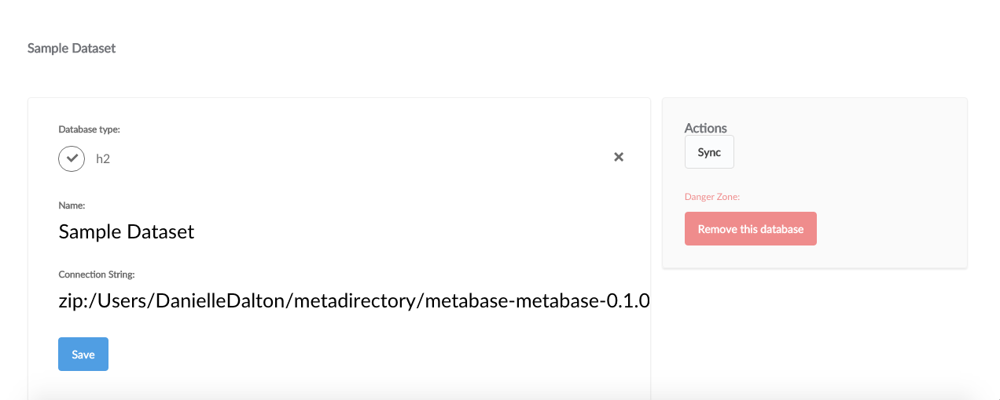

##Managing Databases
---
Once you have a Metabase account (made during the Installation process), you'll want to connect databases.  To see a list of all databases connected in your account, click **Admin Panel** from the dropdown menu in the upper right hand corner of the screen to access the admin menu bar.  

Next, select **Databases** from the admin menu bar to view all databases.  

##Adding a Database Connection

To add a database to your Metabase account, click **Add database**.  Metabase currently supports the following types of databases: 

* Amazon RDS
* H2
* MONGODB
* MySQL
* Postgres

To add each type of database, you'll need its connection information.  The [Installation Guide](installation-guide.md) explains where to find your database's connection information.  

##SSL

Metabase automatically tries to connect to databases with and without SSL.  If it is possible to connect to your database with a SSL connection, Metabase make that the default setting for your database.  You can always change this setting later if you prefer to connect without this layer of security.  

###Database Analysis

When connecting your database to Metabase, it tries to decipher the field types in your table based on each field's name.  Metabase also takes a sample of each table to look for URL's, json, encoded strings, etc. If a field is classified wrong, you can always manually edit it. 

###Metadata Syncing

Metabase automatically syncs its copy of your database with the original database source every night.  

If you'd like to sync your database manually at any time:

1. Click on **Account Settings** from the dropdown menu. 

2. Select **Databases** from the admin menu bar at the top of the screen.  

2. Click on the Database you would like to sync. 
 
3. Click **Connection Details** in the upper right hand corner of the screen. 

4. Select **Sync** to manually sync your database.  

###Deleting Databases

To delete a database from Metabase, Click **Remove this Database** under "Connection Details".  

Hovering over the database row in the list of databases connected to your account and clicking the red **Delete** button will also delete a database.  

**Caution: Deleting a database is irreversible!  All saved questions and dashboard cards based on the database will be deleted too.**
