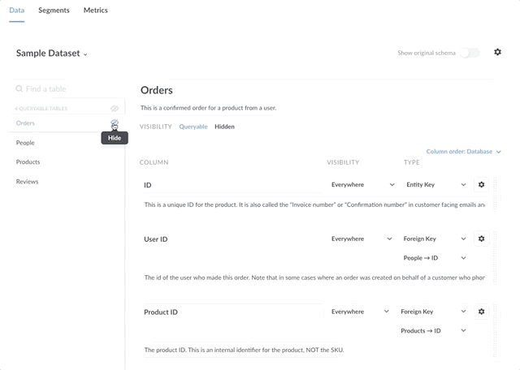

***

## título: La página del modelo de datos

# La página Modelo de datos

La metabase le permite anotar los datos de la base de datos. Las anotaciones pueden dar a Metabase una mejor comprensión de lo que realmente significan los datos, lo que permite a Metabase tomar decisiones más inteligentes al procesar y mostrar esos datos.

El **Modelo de datos** sección de la **Panel de administración** contiene la configuración para editar metadatos para:

*   **Mesas**
*   **Columnas**
*   **Segmentos**
*   **Métricas**

Esta página se centra en la edición de metadatos de tablas y columnas; otra página cubre [segmentos y métricas](07-segments-and-metrics.md).

¿O en su lugar está buscando documentos en [modelos](../users-guide/models.md)?

## Acceso a la página Modelo de datos

En la parte inferior de la barra lateral de navegación, haga clic en **engranaje** y seleccione **Admin** > **Modelo de datos**.

En la barra lateral de la izquierda, puede elegir qué base de datos configurar. A continuación, seleccione la tabla para ver y editar sus metadatos.

## Metadatos para tablas

Para los metadatos de tabla, puede:

*   Cambio [mesa **visibilidad**](#table-visibility).
*   Cambio [mesa **nombre** y **descripción**](#table-name-and-description).
*   Ver el [Texto original en **esquema**](#original-schema).

### Visibilidad de la tabla

Puede configurar tablas para que sean **Consultable** o **Escondido**. Establecer la visibilidad de la tabla puede ser especialmente útil si tiene muchas tablas en su base de datos, pero sus usuarios solo estarán interesados en un subconjunto de esas tablas. La visibilidad de la tabla puede ayudar a mantener ordenada la instancia de metabase al ocultar tablas innecesarias fuera de la interfaz de usuario.

La configuración de visibilidad es distinta de **Permisos**. Los usuarios aún pueden consultar tablas ocultas mediante el comando **Editor SQL**. Ver [**Permisos**](05-setting-permissions.md) para controlar el acceso a los datos.

**Tablas consultables** se puede seleccionar desde el **editor de blocs de notas**, y se pueden mostrar todos los datos de la tabla (a menos que se excluyan ciertas columnas, más sobre eso a continuación).

**Tablas ocultas** No se puede seleccionar de la carpeta **editor de blocs de notas**, y no se puede acceder a sus datos en ningún lugar de la metabase, excepto en el **Panel de administración** y el **SQL Editor**.

Aquí hay un gif que muestra cómo ocultar y mostrar tablas:

### Nombre y descripción de la tabla

Puede cambiar el **nombre** y **descripción** de sus mesas. Tenga en cuenta que la base de datos subyacente no se verá afectada; los cambios solo actualizarán el nombre de la tabla en la metabase.

Puede agregar descripciones a las tablas para que las personas sepan el tipo de datos que contiene una tabla. Las descripciones se muestran al examinar los datos (haga clic en el icono del libro), así como en el Panel de referencia del modelo de datos en el Editor SQL, que puede abrir haciendo clic en el icono del libro a la derecha del panel de edición.

### Esquema original

Si alguna vez desea ver el esquema subyacente original para una tabla determinada, simplemente haga clic en el botón **Mostrar esquema original** alterna en la parte superior derecha de la pantalla.

## Metadatos para columnas

La metabase intenta clasificar automáticamente las columnas y asignarles un tipo, pero también puede editar los metadatos usted mismo. Si la Metabase clasificó erróneamente alguna columna, puede corregir esas clasificaciones inexactas aquí.

Para cada columna, puede editar su:

*   Nombre
*   Descripción
*   Visibilidad
*   Tipo

### Nombre de la columna

Para cambiar la forma en que se muestra el nombre de la columna, haga clic en el nombre de la columna. Por ejemplo, si su ORM produce nombres de tabla como "auth.user", puede reemplazarlo por "User" para que la columna sea más legible. Este cambio de nombre sólo afecta a la forma en que la metabase muestra la columna; el cambio no afecta a la propia base de datos.

### Descripción de la columna

Puede incluir un resumen legible por humanos de una columna, su origen y casos de uso. Cualquier advertencia sobre la interpretación también puede ir aquí. Las descripciones son particularmente útiles cuando las columnas tienen valores que se abrevian o codifican en un formato determinado.

### Visibilidad de la columna

De forma predeterminada, los usuarios pueden ver todas las columnas de una tabla, pero puede seleccionar otras opciones de visibilidad:

*   **Solo vistas detalladas**. Establece la visibilidad para que se muestre solo cuando se ve una sola **columna** grabar. Útil si tiene datos realmente largos en ciertos **Columnas**, como descripciones o biografías. De forma predeterminada, a cualquier columna con una longitud media superior a 50 caracteres se le asigna esta configuración.

*   **No incluir**. Esta columna no será visible ni seleccionable en las preguntas creadas con el **editor de blocs de notas** (el editor de GUI). Útil si tiene columnas sensibles o irrelevantes.

Para el **Editor SQL**, **No incluir** la configuración solo afecta a la visibilidad en el cuadro de diálogo **referencia de datos** sección. Aunque las columnas no serán visibles en el **referencia de datos** los usuarios aún podrán consultar estas columnas.

### Tipo de campo

Puede utilizar la página Modelo de datos para editar los tipos de campo de los campos de la base de datos. Utilice el botón **Tipo** menú desplegable para seleccionar de este [lista de opciones](../users-guide/field-types.md).

En este mismo menú, también puede designar una columna como la de la tabla. **clave principal** o **clave externa**.

Ver el [guía del usuario](../users-guide/field-types.md#list-of-metabase-field-types) para obtener más información sobre los tipos y cómo funcionan en Metabase.

### Conversión a un tipo de datos específico

Puede convertir manualmente columnas de texto y números en campos de fecha. La conversión es útil si sus marcas de fecha / hora se almacenan como campos de texto o número en su base de datos, pero desea que Metabase los trate como valores de fecha (por lo que hará cosas como seleccionar calendarios actuales para filtros). La conversión es diferente de cambiar el tipo de campo en la metabase, que solo modifica la información semántica para dar a las personas más contexto sobre ese campo, como establecer un campo de fecha como "Fecha de cancelación". Por el contrario, la conversión cambia el tipo subyacente de modo que, por ejemplo, la metabase interpretará un campo de cadena como si fuera una fecha.

Puede transmitir texto en formato ISO8601 y números que representen la época de Unix a los tipos de fecha, hora u hora. Las opciones de casting exactas variarán según el tipo de base de datos a la que esté conectado, pero aquí hay algunos tipos que puede transmitir:

*   ISO8601->Fecha
*   ISO8601->Datetime
*   ISO8601->Tiempo
*   UNIXMicroSeconds->DateTime
*   UNIXMilliSeconds->DateTime
*   UNIXSeconds->DateTime

Para convertir un campo a un tipo diferente, haga clic en el icono de engranajes junto al campo que desea convertir. Si el campo es un número o un campo de texto, es posible que vea una opción para **Conversión a un tipo de datos específico**, con una opción predeterminada establecida en "No lanzar". Seleccione el tipo al que desea lanzar y listo. La conversión no afecta al tipo de datos original; así como Metabase interpreta ese campo.

## Reasignación de valores de columna

Una cosa que sucede comúnmente en las tablas es que tendrás un **columna de clave externa**gustar `Product ID`, con un montón de valores de ID en él, cuando lo que realmente desea ver la mayor parte del tiempo es el **nombre de la entidad**, como el `Product Title`. También es posible que tenga campos que contengan valores codificados que prefiera mostrar como valores traducidos o legibles en sus tablas y gráficos, como cambiar `0`, `1`y `2` Para `Female`, `Male`y `Other`.

Para reasignar los valores de la columna, haga clic en el icono de engranaje a la derecha del menú desplegable Tipo de un campo en la sección Modelo de datos del Panel de administración. Verás un formulario con estas opciones:

`Visibility` y `Type` son los mismos que en la página principal del modelo de datos, pero `Display values` le permite elegir intercambiar los valores de un campo con otra cosa.

**Reasignación de claves externas** permite intercambiar los valores de una clave externa con los valores de cualquier otro campo de la tabla conectada. En este ejemplo, estamos intercambiando el `Product ID` valores del campo con los valores de la carpeta `Title` en la tabla Producto:

Otra opción es **reasignación personalizada**, que actualmente solo es posible para campos numéricos. Esto le permite asignar cada número que se produce en este campo a un valor numérico diferente o incluso a un valor de texto, como en este ejemplo:

## Selección de la interfaz de usuario del filtro para una columna

Metabase intentará elegir automáticamente el mejor tipo de interfaz de filtro para cada columna en función del tipo de columna y el número de valores diferentes en ella. Columnas con solo unas pocas opciones posibles, como un `Gender` , mostrará una lista desplegable de forma predeterminada al filtrar en ellos. Las columnas con más de 100 selecciones posibles mostrarán un cuadro de búsqueda con autocompletar.

Puede cambiar manualmente la interfaz de usuario del filtro a:

*   Cuadro de búsqueda
*   Una lista de todos los valores
*   Caja de entrada simple

## Orden de las columnas

La metabase tendrá por defecto el orden de columnas nativo de la base de datos.

Puede reordenar la forma en que Metabase presenta las columnas en menús y otras interfaces (sin afectar a la base de datos) haciendo clic en la barra de agarre a la derecha de cada columna y arrastrando la columna a una nueva posición en el orden.

También puede seleccionar entre varias opciones:

*   **Base de datos.** (Valor predeterminado) El orden de las columnas tal como aparecen en la base de datos.
*   **Alfabético.** A, B, C... sin embargo, el alfabeto funciona.
*   **Costumbre.** Tú eliges el pedido. La metabase cambiará automáticamente a personalizada si reorganiza cualquiera de las columnas.
*   **Inteligente.** Metabase elige por ti.

***

## Siguiente: crear segmentos y métricas

Aprende a crear definiciones canónicas de tus definiciones de uso común [segmentos y métricas](07-segments-and-metrics.md).
