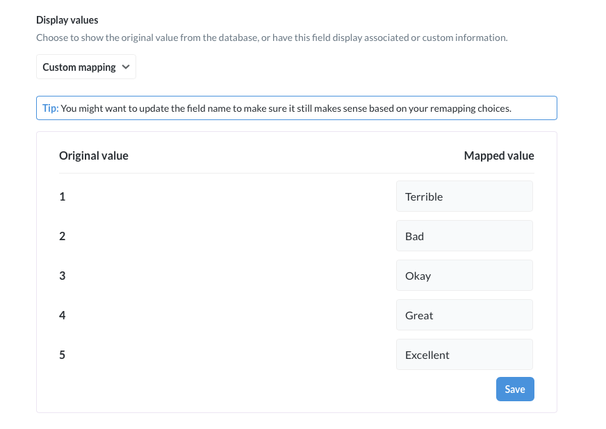
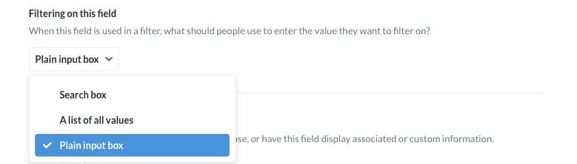

## Metadata Editing

### What is metadata?
Metadata is data about other data. It's information that tells you about the data found in your database. For example, we could label a field that looks like just a bunch of numbers with the label “latitude,” which would give that field additional meaning and context.

Metabase allows you to optionally annotate the data in your database, which provides Metabase with an understanding of what the data actually means and allows it to more intelligently process and display it for you.

### Editing your database’s metadata
All of these settings are editable via the **Metadata** page within the **Admin Panel**. To get there, click the dropdown in the top right of Metabase that shows your initials, and select **Admin Panel**. Then click on **Data Model** from the top menu.

In the column on the left, you can choose which database to view, and then select the table whose metadata you want to view and edit.

You can edit metadata for two things: tables and fields.

### Metadata for tables
Tables can either be set to **Queryable** or **Hidden**. Queryable tables can be selected from the question builder, and all of the data in the table can be displayed (unless certain fields are excluded — more on that below).

Hidden tables can’t be selected from the query builder, and their data can’t be accessed.

You can also change the name and description of your tables here. Note that the underlying database won’t be affected — this will only change the name of the table while you’re viewing it within Metabase. Add descriptions to tables to let people know type of data a table contains and how it can be used. Descriptions are displayed in the data model reference panel in Metabase, which you can view by clicking the book icon in the top right of a new or saved question page.

If you ever want to see the original underlying schema for a given table, just click the **Show original schema** toggle in the top-right of the screen.

### Metadata for fields

A field is a representation of either a column (when using a SQL based database, like PostgreSQL) or a field in a document (when using a document- or JSON-based database like MongoDB). Metabase automatically attempts to classify your fields and assign them a type. If Metabase misclassified any fields, you can correct that here.

There are several pieces of metadata you can edit per field: name, description, visibility, and type.

#### Name

Clicking on the name of the field allows you to change how the field name is displayed. For example, if your ORM produces table names like “auth.user", you can replace this with “User” to make it more readable. Again, this only changes how the field is displayed in Metabase.

#### Description

This is a human-readable description of what the field is and how it is meant to be used. Any caveats about interpretation can go here as well. Descriptions are extra helpful when fields have values that are abbreviated or coded in a particular format.

#### Visibility

Every field in a table shows up in Metabase by default. If you have really long data in certain fields, like descriptions or biographies, you can set the visibility to display the field **Only in Detail Views** when looking at a single record. By default, any column with an average length of longer than 50 characters is assigned this setting.

Similarly, if you have sensitive or irrelevant fields, you can set them to **Do Not Include**, preventing the field from being accessed by Metabase.

#### Types

A field’s "special type" is used to determine how to display it, and can also give certain types of fields special functionality. For example, by marking fields in a table as Latitude and Longitude, you allow the table to be used to create pin and heat maps. Similarly, marking a field as a URL allows users to click on it and go to that URL.

This is also where you can set a field to be a **primary key** or **foreign key** of a table.

Common detailed types include:

* Avatar Image URL
* Category
* City
* Country
* Description
* Foreign Key
* Entity Key
* Image URL
* Field containing JSON
* Latitude
* Longitude
* Entity Name
* Number
* Currency
* State
* URL
* Zip Code

This is also where you set special fields in a table:

* Entity Key — the field in this table that uniquely identifies each row. Could be a product ID, serial number, etc.
* Entity Name — different from the entity key, this is the field whose heading represents what each row in the table *is*. For example, in a Users table, the User column might be the entity name.
* Foreign Key — this is a field in this table that uniquely identifies a *row* in another table. In other words, this is a field that, almost always, points to the primary key of another table. For example, in a Products table, you might have a Customer ID field that points to a Customers table, where Customer ID is the primary key.

### Remapping field values
One thing that happens commonly in tables is that you'll have a foreign key field, like `Product ID`, with a bunch of ID values in it, when what you actually want to see most of the time is the entity name, like the `Product Title`. You might also have fields which contain coded values that you'd prefer to show up as translated or readable values in your tables and charts — like changing `0`, `1`, and `2` to `Female`, `Male`, and `Other` for example.

To do this in Metabase, click on the gear icon to the right of a field's Type dropdown in the Data Model section of the Admin Panel. You'll see a form with these options:

`Visibility` and `Type` are the same as on the main Data Model page, but `Display values` lets you choose to swap out a field's values with something else.

Foreign key remapping lets you swap out a foreign key's values with the values of any other field in the connected table. In this example, we're swapping out the `Product ID` field's values with the values in the `Title` field in the Product table:

Another option is custom remapping, which is currently only possible for numeric fields. This lets you map every number that occurs in this field to either a different numeric value or even to a text value, like in this example:

### Picking the filter UI for a field

Metabase will automatically try to pick the best kind of filter interface for each field based on that field's type and the number of different values in it. Fields with only a few possible choices, like a `Gender` field, will display a dropdown list by default when filtering on them; fields with more than 100 possible selections will show a search box with autocomplete.

If Metabase picked the wrong kind of filter UI for one of your fields, you can manually change it. You can choose from a drop down list, a search box, or just a plain input box:

---

## Next: creating segments and metrics
Learn how to create canonical definitions of your commonly used [segments and metrics](07-segments-and-metrics.md).
