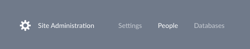
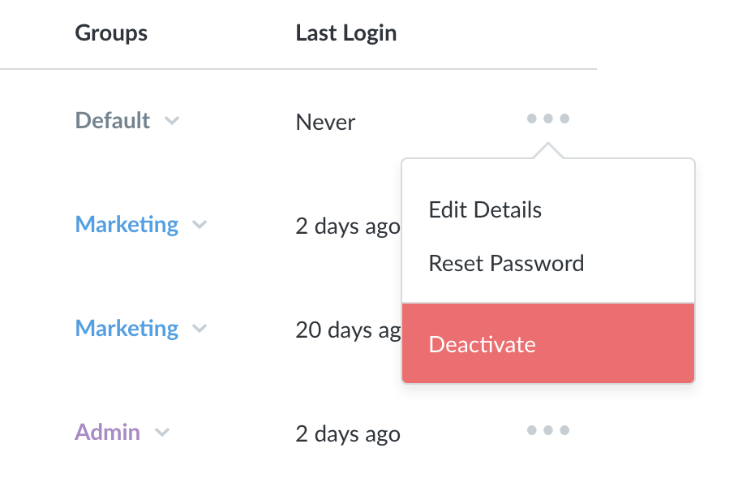

## Managing User Accounts

To start managing users, first go to the **Metabase Admin** section by clicking on the dropdown menu in the top right of Metabase and selecting Admin.

Select **People** from the menu bar at the top of the screen to see a list of all the user accounts in your organization.

### Adding a new user
To add a new user account, click **Add person** in the upper right corner. You’ll be prompted to enter their name and email address.

If you’ve already [configured Metabase to use email](02-setting-up-email.md), Metabase will send the new user an invite email. Otherwise, it’ll give you a temporary password that you’ll have to send to the person you’re inviting by hand.

### Deactivating a user
To deactivate a user's account, click on the three dots icon on the right of a user’s row and select **Deactivate** from the dropdown. Deactivating an account will mark it as inactive and prevent the user from logging in - but it *won’t* delete that user's saved questions or dashboards.

To reactivate a deactivated user, click on the Deactivated tab at the top of the list of your users to see the list of inactive users. Click on the icon on the far right to reactivate that user, allowing them to log in to Metabase again.

### Editing a user
You can edit a user’s name and email address by clicking the three dots icon and choosing **Edit Details**. Note: be careful when changing a user’s email address, because *this will change the address they’ll use to log in to Metabase*.

### Resetting a user’s password
If you've already [configured your email settings](02-setting-up-email.md), a user can reset their password using the forgot password link on the login screen. If you have not yet configured your email settings, they will see a message telling them to ask an admin to reset their password for them. 

To reset a password for a user, just click the three dots icon and choose Reset Password. If you haven’t [configured your email settings](02-setting-up-email.md) yet, you’ll be given a temporary password that you’ll have to share with that user. Otherwise, they’ll receive a password reset email.

### Changing a user’s role
Right now, the only special role a user can have is Admin. The only difference is that Admins can access the Admin Panel and make changes there, and can set [permissions on collections](06-collections.md).

To make a user an admin, click on the Groups dropdown and click the check mark next to the Administrators group.

### Adding users to Groups
Adding users to groups allow you to assign [data access](05-setting-permissions.md) and [collection permissions](06-collections.md) to them. The next two articles in this guide will teach you how to set those permissions, but to add users to one or more groups, just click the Groups dropdown and click the checkboxes next to the group(s) you want to add the user to.

Check out this article for more on [creating and managing user groups](05-setting-permissions.md).

---

## Next: Single Sign-On
Learn how to [configure Single Sign-On](10-single-sign-on.md) to let users sign in or sign up with just a click.
