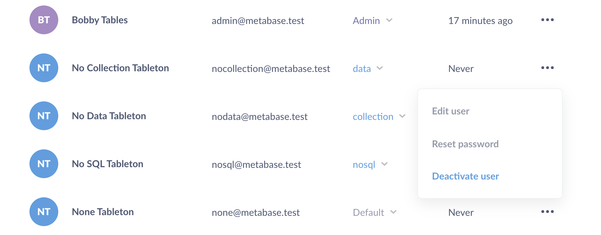

## Managing User Accounts

To start managing users, first go to the **Admin Panel** by clicking on the dropdown menu in the top right of Metabase and selecting Admin Panel.  

Select **People** from the menu bar at the top of the screen to see a list of all the user accounts in your organization.

### Adding a new user
To add a new user account, click **Add person** in the upper right corner. You’ll be prompted to enter their name and email address.

If you’ve already [configured Metabase to use email](02-setting-up-email.md), Metabase will send the new user an invite email. Otherwise, it’ll give you a temporary password that you’ll have to send to the person you’re inviting by hand.

### Removing a user
To delete a user's account, click on the three dots icon on the right of a user’s row and select **Remove** from the dropdown. Deleting an account will mark it as inactive and prevent it from being used in the future - but it *won’t* delete that user's saved questions or dashboards.

### Editing a user
You can edit a user’s name and email address by clicking the three dots icon and choosing **Edit Details**. Note: be careful when changing a user’s email address, because *this will change the address they’ll use to log in to Metabase*.

### Resetting a user’s password
A user can always reset their password using the forgot password link on the login screen, but if you want to do this for them, just click the three dots icon and choose Reset Password. If you haven’t configured your email settings yet, you’ll be given a temporary password that you’ll have to share with that user. Otherwise, they’ll receive a password reset email.

### Changing a user’s role
Right now, the only role a user can have is either User or Admin. The only difference is that Admins can access the Admin Panel and make changes there.

To change a user’s role, just click on it to open a dropdown and make your selection.

---

## Next: setting data permissions
Find out how to create user groups and define what data they can access in the [next section](05-setting-permissions.md).
