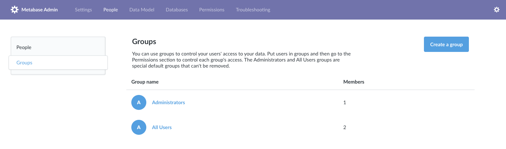

# Managing people and groups

To start managing people, click on the **gear** icon > **Admin settings** > **People**. You'll see a list f all the people in your organization.


## Managing people

### Creating accounts for your team

To add a new person, click **Add person** in the upper right corner. You’ll be prompted to enter their name and email address.

If you’ve already [configured Metabase to use email](02-setting-up-email.md), Metabase will send the new user an invite email. Otherwise, it’ll give you a temporary password that you’ll have to send to the person you’re inviting by hand.

### Deactivating an account

To deactivate someone's account, click on the three dots icon on the right of a person’s row and select **Deactivate** from the dropdown. Deactivating an account will mark it as inactive and prevent the user from logging in - but it _won’t_ delete that person's saved questions or dashboards.


### Reactivating an account

To reactivate a deactivated account, click the **Deactivated** radio button at the top of the people list to see the list of deactivated accounts. Click on the icon on the far right to reactivate that account, allowing them to log in to Metabase again.

### Deleting an account

Metabase doesn't explicitly support account deletion. Instead, Metabase deactivates accounts so people can't log in to them, while it preserves any questions, models, dashboards, and other items created by those accounts.

If you want to delete an account because the account information was set up incorrectly, you can deactivate the old account and create a new one instead.

1. Change the name and email associated with the old account.
2. [Deactivate](#deactivating-an-account) the old account.
3. [Create a new account](#creating-accounts-for-your-team) with the person's correct information.

### Editing an account

You can edit someone's name and email address by clicking the three dots icon and choosing **Edit Details**. Note: be careful when changing someone's email address, because _this will change the address they’ll use to log in to Metabase_.

### Checking someone's auth method

Search for a person and look for an icon beside their name.

- If they log in using Google credentials, Metabase displays a Google icon.
- If they log in using an email address and password stored in Metabase, no icon is shown.

Note that the type of user is set when the account is first created: if you create a user in Metabase, but that person then logs in via Google or some other form of [SSO](sso.md), the latter's icon will _not_ show up next to their name.

### Resetting someone’s password

If you've already [configured your email settings](02-setting-up-email.md), people can reset their passwords using the "forgot password" link on the login screen. If you haven't yet configured your email settings, they will see a message telling them to ask an admin to reset their password for them.

To reset a password for someone, just click the three dots icon next to their account and choose **Reset Password**. If you haven’t [configured your email settings](02-setting-up-email.md) yet, you’ll be given a temporary password that you’ll have to share with that person. Otherwise, they’ll receive a password reset email.

### Resetting the admin password

If you're using Metabase Cloud, [contact support](https://www.metabase.com/help-premium/) to reset your admin password.

If you're a Metabase admin and have access to the server console, you can get Metabase to send you a password reset token:

1.  Stop the running Metabase application.
2.  Restart Metabase with `reset-password email@example.com`, where "email@example.com" is the email associated with the admin account:
    ```
    java -jar metabase.jar reset-password email@example.com
    ```
3.  Metabase will print out a random token like this:

    ```
    ...
    Resetting password for email@example.com...

    OK [[[1_7db2b600-d538-4aeb-b4f7-0cf5b1970d89]]]
    ```

4.  Start Metabase normally again (_without_ the `reset-password` option).
5.  Navigate to it in your browser using the path `/auth/reset_password/:token`, where ":token" is the token that was generated from the step above. The full URL should look something like this:
    ```
    https://metabase.example.com/auth/reset_password/1_7db2b600-d538-4aeb-b4f7-0cf5b1970d89
    ```
6.  You should now see a page where you can input a new password for the admin account.

### Unsubscribe from all subscriptions / alerts

This action will delete any dashboard subscriptions or alerts the person has created, and remove them as a recipient from any other subscriptions or alerts.

This action doesn't affect email distribution lists that are managed outside of Metabase.

## Groups

To determine [who has access to what](05-setting-permissions.md), you’ll need to

- Create one or more groups.
- Choose which level of access that group has to different databases, collections, and so on.
- Then add people to those groups.
- (Optional) promote people to [group managers](#group-managers).

To view and manage your groups, go to the **Admin Panel** > **People** tab, and then click on **Groups** from the side menu.



### Special default groups

Every Metabase has two default groups: Administrators and All Users. These are special groups that can’t be removed.

#### Administrators

To make someone an admin of Metabase, you just need to add them to the Administrators group. Metabase admins can log into the Admin Panel and make changes there, and they always have unrestricted access to all data that you have in your Metabase instance. So be careful who you add to the Administrator group!

#### All users

The **All Users** group is another special one. Every Metabase user is always a member of this group, though they can also be a member of as many other groups as you want. We recommend using the All Users group as a way to set default access levels for new Metabase users. If you have [Google single sign-on](10-single-sign-on.md) enabled, new users who join that way will be automatically added to the All Users group.

It's important that your All Users group should never have _greater_ access for an item than a group for which you're trying to restrict access — otherwise the more permissive setting will win out. See [Setting permissions](05-setting-permissions.md).

### Managing groups

#### Creating a group and adding people to it

To create a group, go to **Admin settings** > **People** > **Groups**, and click the **Add a group** button.

We recommend creating groups that correspond to the teams your company or organization has, such as Human Resources, Engineering, Finance, and so on. By default, newly created groups don’t have access to anything.

Click into a group and then click `Add members` to add people to that group. Click on the X on the right side of a group member to remove them from that group. You can also add or remove people from groups from the People list using the dropdown in the Groups column.

#### Removing a group

To remove a group, click the X icon to the right of a group in the list to remove it (remember, you can’t remove the special default groups).

#### Adding people to groups

Adding people to groups allows you to assign

- [Data access](05-setting-permissions.md),
- [Collection permissions](06-collections.md),
- [Application permissions](application-permissions.md).

To add someone to one or more groups, just click the Groups dropdown and click the checkboxes next to the group(s) you want to add the person to. You can also add people from the group's page.

### Group managers



**Group managers** can manage other people within their group.

Group managers can:

- Add or remove people from their group (that is, people who already have accounts in your Metabase).
- View all people in the **Admin settings** > **People** tab.
- Promote other people to group manager, or demote them from group manager to member.
- Rename their group.

Group managers are not admins, so their powers are limited. They cannot create new groups or invite new people to your Metabase.

#### Promoting/demoting group managers

To promote someone to become a group manager:

1. At the top right of the screen, click the **gear** icon > **Admin settings** > **People** > **Groups**.
2. Select the group you want the person to manage. If the person isn't already in the group, you'll need to add that person to the group.
3. Find the person you want to promote, hover over their member type, and click the up arrow to promote them to group manager. If you want to demote them, click on the down arrow.

### Grouping strategies

For guidance on which groups you should create for your Metabase, check out [Permissions strategies](https://www.metabase.com/learn/permissions/strategy).

## Further reading

- [Configure Single Sign-On](10-single-sign-on.md).
- [Permissions overview](05-setting-permissions.md)
- [Learn permissions](https://www.metabase.com/learn/permissions/)