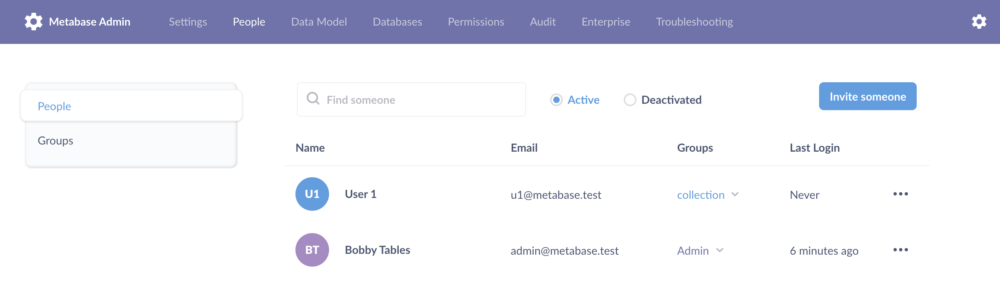

##Managing User Accounts
---

Click on your profile icon in the upper right hand corner and select **Account Settings** to access your administrative dashboard.  

Select **People** from the menu bar at the top of the screen to see a list of all user accounts in your organization.

* To add a new user account, click **Add person** in the upper right corner.   

* Enter a user's information to create an account for them.  

* New users will receive an email welcoming them to Metabase and a link to configure their password.
* To delete a user's account, click **Remove**.  Deleting an account will mark it as inactive and prevent it from being used in the future - but it won't delete the user's cards or dashboards.

* To make an existing user an administrator, click **Grant Admin**
* To remove administrator privileges from a user, select **Revoke Admin**
