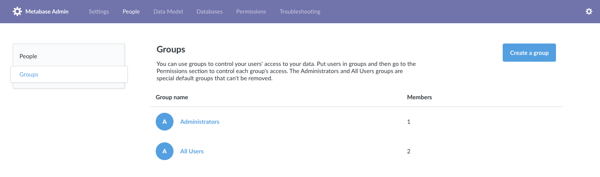
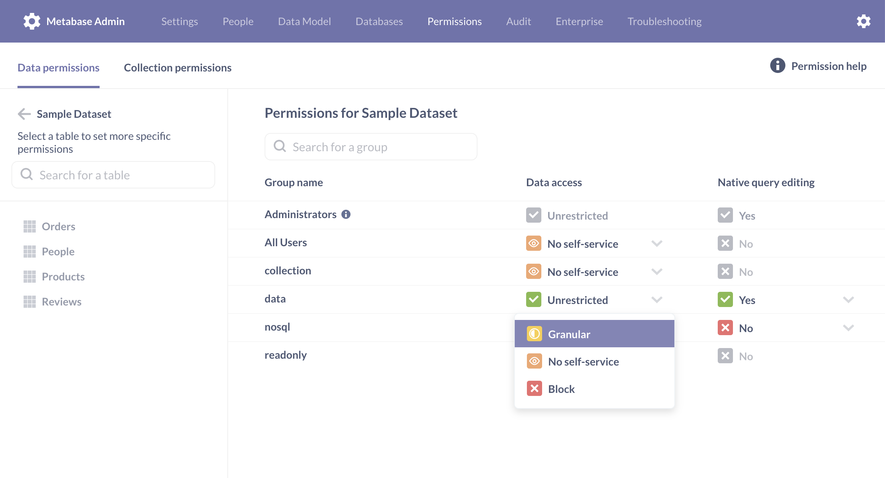
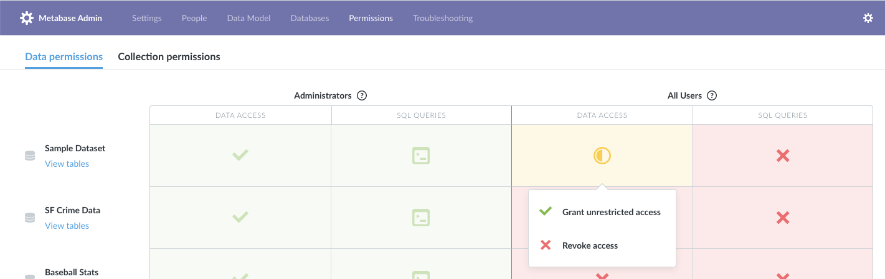
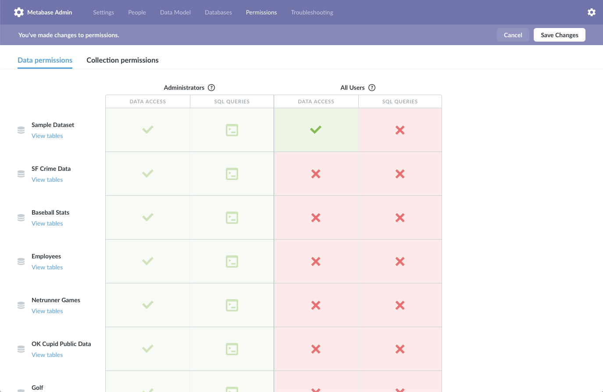

## Setting Data Access Permissions

There are always going to be sensitive bits of information in your databases and tables, and thankfully Metabase provides a simple way to ensure that people on your team only see the data they’re supposed to.

### How permissions work in Metabase

Metabase uses a group-based approach to set permissions and restrictions on your databases and tables. At a high level, to set up permissions in your Metabase instance you’ll need to create one or more groups, add members to those groups, and then choose what level of database and SQL access those groups should have.

A user can be a member of multiple groups, and if one of the groups they’re in has access to a particular database or table, but another group they’re a member of does not, then they **will** have access to that database.

In addition to setting permissions on your databases and tables, you can also [set access permissions on the collections](06-collections.md) where your dashboards, questions, and pulses are saved. Collection permissions can be set and edited from the collection itself, or the Admin Panel.

### Groups

To view and manage your groups, go to the Admin Panel, click on the People section, and then click on Groups from the side menu.

#### Special default groups

You’ll notice that you already have two default groups: Administrators and All Users. These are special groups that can’t be removed.

You’ll also see that you’re a member of the **Administrators** group — that’s why you were able to go to the Admin Panel in the first place. So, to make someone an admin of Metabase you just need to add them to this group. Metabase admins can log into the Admin Panel and make changes there, and they always have unrestricted access to all data that you have in your Metabase instance. So be careful who you add to the Administrator group!

The **All Users** group is another special one. Every Metabase user is always a member of this group, though they can also be a member of as many other groups as you want. We recommend using the All Users group as a way to set default access levels for new Metabase users. If you have [Google single sign-on](10-single-sign-on.md) enabled, new users who join that way will be automatically added to the All Users group.

#### An important note on the All Users group

As we mentioned above, a user is given the _most permissive_ setting she has for a given database/schema/table across _all_ groups she is in. Because of that, it is important that your All Users group should never have _greater_ access for an item than a group for which you're trying to restrict access — otherwise the more permissive setting will win out. This goes for both data access as well as [collection permission](06-collections.md) settings.

If you’ve set up the [Slack integration](09-setting-up-slack.md) and enabled [Metabot](../users-guide/11-metabot.md), you’ll also see a special **Metabot** group, which will allow you to restrict which questions your users will be able to access in Slack via Metabot.

#### Managing groups

From the Groups section, click the `Add a group` button to create a new group. We recommend creating groups that correspond to the teams your company or organization has, such as Human Resources, Engineering, Finance, etc. Click the X icon to the right of a group in the list to remove it (remember, you can’t remove the special default groups). By default, newly created groups don’t have access to anything.

Click into a group and then click `Add members` to add users to that group. Click on the X on the right side of a group member to remove them from that group. You can also add and remove users from groups from the People list using the dropdown in the Groups column.

### Permissions view

Now that you have some groups, you’ll want to control their data access by going to the `Permissions` section of the Admin Panel. You’ll see an interactive table that displays all of your databases and all of your groups, and the level of access your groups have for each database.

You can click on any cell in the table to change a group’s access level. When you’re done making your changes, just click the `save changes` button in the top-right, and you’ll see a confirmation dialog summarizing the changes.

At the database level, there are two different kinds of access you can set: data access, and SQL (or native query) access.

#### Data access

- **Unrestricted access:** can access data from all tables (within all namespaces/schemas, if your database uses those), including any tables that might get added to this database in the future.
- **Limited access:** can only access the tables that you explicitly select within namespaces/schemas you explicitly select. If a new table gets added to this database in the future, access to it will not automatically be given. Saved questions based on tables the user doesn’t have access to won’t show up in the list of saved questions, dashboard cards based on those questions won’t appear, and they won’t be able to ask new questions about those tables. If every card on a dashboard is hidden for a user, then that dashboard won’t be shown to them in the dashboard list.
- **No access:** can’t see anything based on data contained in this database. Won’t see saved questions based on tables contained in this database, and won’t be able to ask new questions about those tables.

#### SQL (or native query) access

- **Write raw queries:** can write new SQL/native queries using the SQL editor. This access level requires the group to additionally have Unrestricted data access for the database in question, since SQL queries can circumvent table-level permissions.
- **No access**: can't write or edit SQL/native queries using the SQL editor. Users with this level of access will still be able to view questions created from SQL/native queries.

If you select `Limit access` for one of your databases, your view will change to show the contents of that database. If the database utilizes namespaces or schemas, you’ll see a list of all the schemas in the database, and the level of data access each group has for them. Similarly, if you select `Limit access` on one of your schemas, you’ll drill down a level and see all the tables within it. From these views, you can navigate back by using the breadcrumb links in the top-left, and you can always drill down into a database or schema using the link under its name in the left column.

Data access levels for schemas follows the same pattern as for databases:

- **Unrestricted access:** can all tables in this schema, including any tables that might get added in the future.
- **Limited access:** can only access the tables that you explicitly select.
- **No access:** can’t access any tables in this schema.

Lastly, data access levels for tables are almost exactly the same as well:

- **Unrestricted access:** can ask questions about this table and see saved questions and dashboard cards using this table.
- **No access:** can’t ask questions about this table or see saved questions or dashboard cards using this table.

_Note: you’ll notice that tables don’t have the option for limited access. If need to set column-level or row-level data permissions, check out the [data sandboxing](https://www.metabase.com/docs/latest/enterprise-guide/data-sandboxes.html) feature of the [Enterprise Edition](https://www.metabase.com/enterprise/)._

### A note about Pulses

Pulses act a bit differently with regard to permissions. When a user creates a new Pulse, they will only have the option to include saved questions that they have permission to view. Note, however, that they are not prevented from emailing that Pulse to anyone, or posting that Pulse to a Slack channel (if you have Slack integration set up), regardless of the recipients’ permissions. Unlike dashboards, where individual cards are blocked based on a user’s permissions, a Pulse will always render all of its cards.

---

## Next: collections

Metabase lets you create and set permissions on collections of dashboards and questions. [Learn how](06-collections.md).
