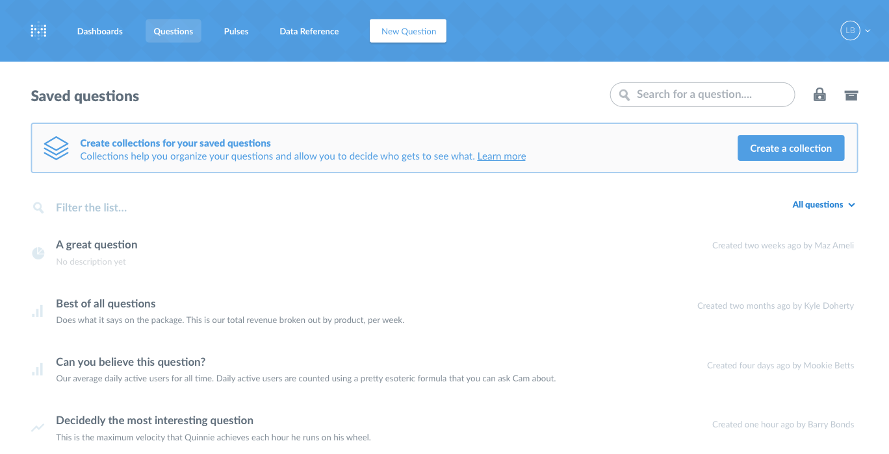

## Creating Collections for Your Saved Questions
---

Collections are a great way to organize your saved questions and decide who gets to see and edit things. Collections could be things like, "Important Metrics," "Marketing KPIs," or "Questions about users." Multiple [user groups](05-setting-permissions.md) can be given access to the same collections, so we don't necessarily recommend naming collections after user groups.

This page will teach you how to create and manage your collections. For more information on organizing saved questions and using collections, [check out this section of the User's Guide](../users-guide/05-sharing-answers.md).

### Creating and editing collections
Only administrators of Metabase can create and edit collections. From the Questions section of Metabase, click on the `Create a collection` button. Give your collection a name, choose a color for it, and give it a description if you'd like.

### Setting permissions for collections
Collection permissions are similar to data permissions. Rather than going to the Admin Panel, you set permissions on collections by clicking on the lock icon in the top-right of the Questions screen or the top-right of a collection screen.

You'll see a table with your user groups along the top and all your collections down along the left. A user group can have View access, Curate access, or no access to a given collection.

- View access: can see all the questions in the collection, **even if the user doesn't have access to the underlying data used to create the question.**
- Curate access: can additionally move questions in or out of the collection, and edit the questions in the collection.
- No access: won't see the collection listed on the Questions page, and can't see questions from this collection in dashboards or when creating a Pulse.

Just like with data access permissions, collection permissions are *additive*, meaning that if a user belongs to more than one group, if one of their groups has a more restrictive setting for a collection than another one of their groups, they'll be given the *more permissive* setting. This is especially important to remember when dealing with the All Users group: since all users are members of this group, if you give the All Users group Curate access to a collection, then *all* users will be given that access for that collection, even if they also belong to a group with *less* access than that.

### The "Everything Else" section
If a question isn't saved within a collection, it will be placed in the Everything Else section of the main Questions page. **All your Metabase users can see questions in this section**, provided they have data access permission.

### Archiving collections
You can archive collections similarly to how you can archive questions. Click the archive icon in the top-right of the collection screen to archive it. This will also archive all questions in the collection, and importantly it will also remove all of those questions from all dashboards and Pulses that use those questions. So be careful!

To restore a collection and its contents, click the `View Archive` icon in the top-right of the main Questions screen to see the archive, then hover over an item to reveal the `Unarchive` icon on the far right of the item. Questions within archived collections are not individually listed in the archive, so if you want to unarchive a specific question from an archived collection, you have to unarchive that whole collection.

### What about labels?
Older versions of Metabase provided labels as a way to organize and filter saved questions. If you were already using labels, you'll still be able to edit and use them for now from the Labels dropdown on lists of saved questions. However, **labels will be removed from Metabase in an upcoming version.** If your instance of Metabase was not using labels previously, you won't see the label tools at all anymore.

What should you do if you want to prepare for the impending removal of labels? We recommend creating collections that match your most important labels, and moving the matching labeled questions into those collections.

If you don't want to remove all the labels from your questions yet, we recommend at least ensuring that none of your questions have more than a single label. That way, if in the future we provide a migration tool that converts labels to collections automatically, there won't be any ambiguity with your labels.

---

## Next: custom segments and metrics
Learn how to define custom segments and commonly referenced metrics in the [next section](07-segments-and-metrics.md).
