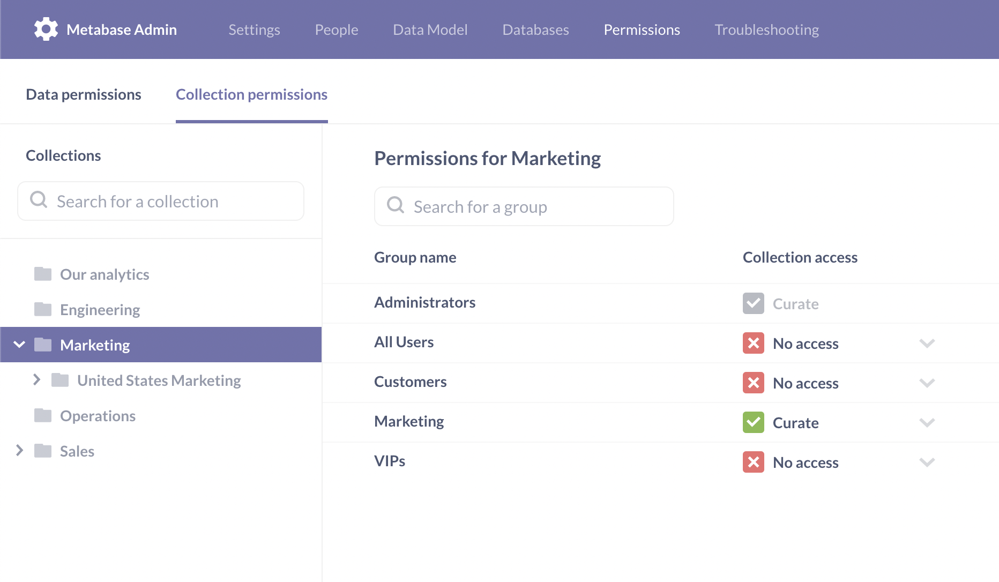

# Collection permissions

You can use [collections](../users-guide/collections) to organize questions, dashboards, models, timelines, and other collections. You can set permissions on those collections to determine which groups of people can view and curate collections' items.

Metabase starts out with a default top-level collection which is called **Our analytics**, which every other collection is saved inside of.

## Collection permission levels

- **Curate access**: the user can edit, move, archive, and pin items saved in this collection, and can save or move new items into it. They can also create new sub-collections within this collection. In order to archive a sub-collection within this collection, they'll need to have Curate access for it and any and all collections within it.
- **View access**: people in the group can see all the questions, dashboards, and models in the collection. If a person lacks permission to view some or all of the questions included in a given dashboard, then those questions will be invisible to them; but any questions that are saved in this collection _will_ be visible to them, _even if the person lacks access to the underlying data used in the question._
- **No access**: the people in the group won't see this collection listed, and they'll lack access to any of the items saved within it.

### Setting permissions for collections

You can set permissions on collections by clicking on the lock icon in the top-right of the screen while viewing the collection and clicking on **Edit permissions**. Only Administrators can edit collection permissions. Each [user group](05-setting-permissions.md) can have either View, Curate, or No access to a collection:

If you want to see the bigger picture of what permissions your user groups have for all your collections, just click the link that says **See all collection permissions**, which takes you to the Admin Panel. You'll see a list of your collections down along the left, and clicking on any of those will bring up a list of each group's permission settings for that collection.

Just like with data access permissions, collection permissions are _additive_, meaning that if a user belongs to more than one group, if one of their groups has a more restrictive setting for a collection than another one of their groups, they'll be given the _more permissive_ setting. This is especially important to remember when dealing with the All Users group: since all users are members of this group, if you give the All Users group Curate access to a collection, then _all_ users will be given Curate access for that collection, even if they also belong to a group with _less_ access than that.

### Permissions and sub-collections

A group can be given access to a collection located somewhere within one or more sub-collections _without_ having to have access to every collection "above" it. For example, if a group had access to the "Super Secret Collection" that's saved several layers deep within a "Marketing" collection that the group lacks access to, the "Super Secret Collection" would show up at the top-most level that the group _does_ have access to.

### Archiving collections

Users with curate permission for a collection can archive collections. Click the edit icon in the top-right of the collection screen and select **Archive this collection** to archive it. This will also archive all questions, dashboards, models, and all other sub-collections and their contents. Importantly, this will also remove any archived questions from all dashboards that use them.

You can _unarchive_ items. In the Collections list sidebar, at the bottom, click on **View archive**. Search for the item you'd like to unarchive (you'll either need to scroll down the page, or use the browser's find in page functionality, as archived items won't appear in Metabase's search results). Select the open box with an up arrow icon to "Unarchive this".

## Pinning items in collections

People in groups with Curate access to a collection can pin items in the collection. Pinning an item in a collection turns the item into a handsome card at the top of the collection.

To pin an item, select the **pin icon** next to the item's name.

Note that collections themselves can't be pinned. If you're running on a [paid plan](https://www.metabase.com/pricing), admins can designate [Offical Collections][offical-collections].

## Special collections

The "Our analytics" collection and individual personal collections are invincible; they cannot be archived, injured, or slain. They are eternal.

### Personal collections

Each person has a personal collection where they're always allowed to save things, even if they don't have Curate permissions for any other collections. 

Administrators can see and edit the contents of every user's personal collection (even those belonging to other Administrators) by clicking on the **Other users' personal collections** link at the bottom of the sidebar when viewing "Our analytics".

A personal collection works just like any other collection except that its permissions are fixed and cannot be changed. If a sub-collection within a personal collection is moved to a different collection, the sub-collection will inherit the permissions of its new parent collection.

## Further reading

- [Working with collection permissions][collection-permissions].

[collections]: 06-collections.md
[collection-permissions]: /learn/permissions/collection-permissions.html
[dashboard-subscriptions]: ../dashboards/subscriptions.md
[data-permissions]: data-permissions.md
[pulses]: ../users-guide/10-pulses.md
[data-sandboxing]: ../enterprise-guide/data-sandboxes.md
[offical-collections]: ../users-guide/collections.html#official-collections
[permissions]: /learn/permissions/
[sandbox-columns]: /learn/permissions/data-sandboxing-column-permissions.html
[sandbox-rows]: /learn/permissions/data-sandboxing-row-permissions.html
[slack-integration]: 09-setting-up-slack.md
[sql-snippet-folders]: ../enterprise-guide/sql-snippets.md
[table-permissions]: data-permissions.md#table-permissions
