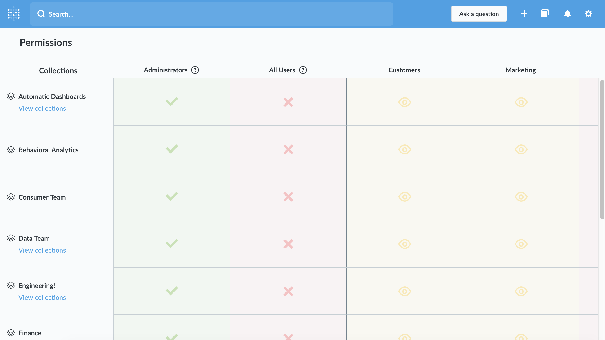

## Creating Collections for Your Saved Questions
---

Collections are a great way to organize your dashboards, saved questions, and pulses, and to decide who gets to see and edit things. Collections could be things like, "Important Metrics," "Product Team," "Marketing KPIs," or "Questions about users." Collections can even contain other collections, allowing you to create an organizational structure that fits your team. You can also choose which user groups should have what level of access to your collections (more on that below).

Metabase starts out with a default top-level collection which is called "Our analytics," which every other collection is saved inside of.

This page will teach you how to create and manage your collections. For more information on organizing saved questions and using collections, [check out this section of the User's Guide](../users-guide/06-sharing-answers.md).

### Creating and editing collections
If a user has Curate access for a collection, they can create new sub-collections inside it and edit the contents of the collection. From the detail view of any collection, click on the `Create a collection` button to make a new one. Give your collection a name, choose where it should live, and give it a description if you'd like.

By default, new collections will have the same permissions settings as the collection it was created in (its "parent" collection), but you can change those settings from the Edit menu.

### Pinning things in collections

One great feature in Metabase is that you can pin the most important couple of items in each of your collections to the top. Pinning an item in a collection turns it into a big, eye-catching card that will help make sure that folks who are browsing your Metabase instance will always know what's most important.

Any user with curate permissions for a collection can pin items in it, making it easy to delegate curation responsibilities to other members of your team. To pin something, you can either click and drag it to the top of the page, or click on its menu and choose the pin action. (Note that collections themselves can't be pinned.)

### Setting permissions for collections
Collection permissions are similar to [data access permissions](05-setting-permissions.md). Rather than going to the Admin Panel, you set permissions on collections by clicking on the sharing icon in the top-right of the screen while viewing the collection and clicking on `Edit permissions`. Only Administrators can edit collection permissions. Each [user group](05-setting-permissions.md) can have either View, Curate, or No access to a collection:

- **View access:** the user can see all the questions, dashboards, and pulses in the collection. If the user does not have permission to view some or all of the questions included in a given dashboard or pulse then those questions will not be visible to them; but any questions that are saved in this collection *will* be visible to them, *even if the user doesn't have access to the underlying data used to in the question.**
- **Curate access:** the user can edit, move, and archive items saved in this collection, and can save or move new items into it. They can also create new sub-collections within this collection. In order to archive a sub-collection within this collection, they'll need to have Curate access for it and any and all collections within it.
- **No access:** the user won't see this collection listed, and doesn't have access to any of the items saved within it.

If you want to see the bigger picture of what permissions your user groups have for all your collections, just click the link that says `See all collection permissions`. You'll see a table with your user groups along the top and all your collections down along the left. Click the `View collections` link under any collection that contains more collections to zoom in and see its contents:

Just like with data access permissions, collection permissions are *additive*, meaning that if a user belongs to more than one group, if one of their groups has a more restrictive setting for a collection than another one of their groups, they'll be given the *more permissive* setting. This is especially important to remember when dealing with the All Users group: since all users are members of this group, if you give the All Users group Curate access to a collection, then *all* users will be given Curate access for that collection, even if they also belong to a group with *less* access than that.

### Permissions and sub-collections
One nuance with how collections permissions work has to do with sub-collections. A user group can be given access to a collection located somewhere within one more more sub-collections *without* having to have access to every collection "above" it. E.g., if a user group had access to the "Super Secret Collection" that's saved several layers deep within a "Marketing" collection that the group does *not* have access to, the "Super Secret Collection" would show up at the top-most level that the group *does* have access to.

### Personal collections

Each user has a personal collection where they're always allowed to save things, even if they don't have Curate permissions for any other collections. Administrators can see and edit the contents of every user's personal collection (even those belonging to other Administrators) by clicking on the "All personal collections" link from the "Our analytics" collection.

A personal collection works just like any other collection except that its permissions can't be changed. If a sub-collection within a personal collection is moved to a different collection, it will inherit the permissions of that collection.

### Archiving collections
Users with curate permission for a collection can archive collections. Click the edit icon in the top-right of the collection screen and select `Archive this collection` to archive it. This will also archive all questions, dashboards, pulses, and all other sub-collections and their contents. Importantly, this will also remove any archived questions from all dashboards and Pulses that use them.

**Note:** the "Our analytics" collection and personal collections can't be archived.

You can always *unarchive* things by clicking on the More menu from a collection and selecting `View the archive`, then clicking the un-archive button next to an archived item. Questions within archived collections are not individually listed in the archive, so if you want to unarchive a specific question from an archived collection, you have to unarchive that whole collection.

## Next: custom segments and metrics
Learn how to define custom segments and commonly referenced metrics in the [next section](07-segments-and-metrics.md).
