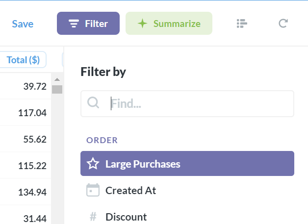
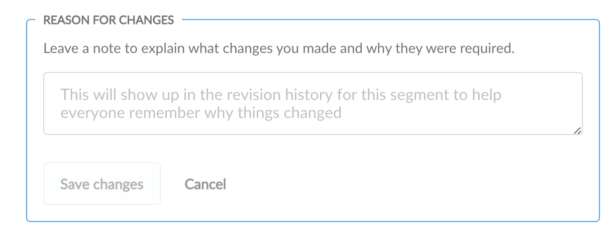

***

## title: Creación de segmentos y métricas personalizados

# Creación de segmentos y métricas personalizados

Metabase le permite crear sus propios segmentos y métricas para que pueda hacer referencia a ellos rápida y fácilmente en el generador de consultas. Simplemente dirígete al **Panel de administración** y selecciona **Modelo de datos** desde el menú superior.

## Creación de un segmento

Un segmento es solo un filtro con nombre especial o un conjunto de filtros. Puede crearlos para asegurarse de que haya una definición oficial de un subconjunto de clientes, usuarios o productos a los que todos los miembros de su equipo puedan hacer referencia de manera coherente. Por ejemplo, puede crear un segmento denominado "Usuarios activos" que contenga todos los filtros necesarios para seleccionar correctamente los usuarios activos.

Para comenzar, seleccione el botón **Segmentos** , seguido de la ficha **Nuevo segmento** en el lado derecho de la pantalla. Elija la tabla y los filtros adecuados para su nuevo segmento y agregue un título y una descripción. Cuando haya terminado, se podrá acceder a este segmento desde la lista de filtros del generador de consultas al ver esta tabla (el segmento no se aplicará automáticamente a la tabla).

Ahora verá el generador de segmentos, que es una versión limitada del generador de consultas, con solo la opción de agregar filtros. Agregue los filtros como lo haría en el generador de consultas y, a continuación, asigne a su segmento un nombre y una descripción (estos serán visibles en el menú desplegable del filtro del generador de consultas después de haber guardado). Si desea probar su segmento en el generador de consultas antes de guardarlo, simplemente haga clic en el botón Vista previa, que abrirá una nueva ventana del generador de consultas con su segmento aplicado.

Una vez que haya terminado, haga clic en **Guardar cambios**. Ahora su nuevo segmento aparecerá en la lista de segmentos de su tabla.

Si sale del Panel de administración e intenta hacer una nueva pregunta, luego haga clic en el botón para agregar un filtro, verá su segmento en la parte superior de la lista.

## Creación de una métrica

Una métrica personalizada es una forma fácil de hacer referencia a un número calculado al que se hace referencia con frecuencia. Esto podría ser algo así como **ingresos**, a lo que puede llegar viendo la suma de la columna Subtotal de su pedido y aplicando los filtros necesarios, pero es un dolor tener que hacer esto cada vez que desee hacer algo con los ingresos.

Cree una métrica personalizada de una manera muy similar a cómo crea segmentos: comience haciendo clic en el botón **Métricas** en la sección Modelo de datos del Panel de administración y seleccione **Nueva métrica**.

Aquí se le presenta una versión ligeramente diferente del generador de consultas, que solo le permite seleccionar filtros y agregaciones. Los filtros son opcionales: una métrica solo requiere una agregación en un campo. Tenga en cuenta que puede usar segmentos en la definición de métricas, bastante genial, ¿verdad? Continúe y seleccione sus filtros, si los hay, y elija su agregación. Asigne a su métrica un nombre y una descripción, y haga clic en **Guardar cambios** cuando hayas terminado. Al igual que con los segmentos, puede usar el **Vista previa** para ver cómo se ve la métrica en el generador de consultas antes de guardarla.

La nueva métrica ahora estará disponible en el menú desplegable Ver del generador de consultas, en **Métricas comunes**.

## Edición y retirada de segmentos y métricas

Puede editar y retirar segmentos y métricas desde la pantalla Modelo de datos del Panel de administración. Seleccione la tabla con el segmento o la métrica que está buscando y haga clic en el icono de puntos suspensivos (...) a la derecha de ese segmento o métrica.

Al editar un segmento o métrica, se le pedirá que deje una nota sobre por qué lo está cambiando, solo para que todos puedan entender por qué las cosas son diferentes. Si algún usuario es el creador de una pregunta o panel guardado que utilizó el segmento o la métrica que ha editado, recibirá un correo electrónico informándole que las cosas han cambiado, junto con la explicación que escribe en este cuadro.

La retirada de un segmento o métrica hará que ya no se pueda seleccionar desde el generador de consultas. Sin embargo **No romperá las preguntas guardadas existentes que dependen de esa métrica o segmento**.

Por último, también puede ver el historial de revisiones de cada segmento y métrica desde la lista de acciones.

***

## Siguiente: administrar cuentas de usuario

Aprendamos a [crear y administrar cuentas para sus usuarios](04-managing-users.md).
