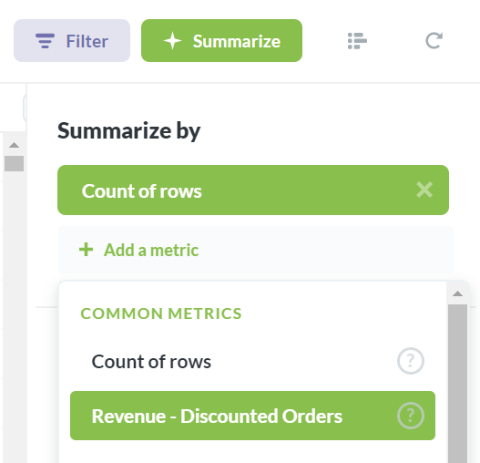

## Creating Custom Segments and Metrics

Metabase allows you to create your own segments and metrics so you can quickly and easily reference them in the query builder. Just head over to the **Admin Panel** and select **Data Model** from the top menu.

### Creating a Segment

A segment is just a special named filter or set of filters. You can create these to make sure that there is an official definition of a subset of customers, users, or products that everyone on your team can refer to consistently. For example, you might create a segment called “Active Users” that contains all the filters that are needed to correctly select active users.

To start, select a table that you want to add a segment to. When you’re done, this segment will be accessible from the filter list in the query builder when viewing this table (the segment will not be automatically applied to the table).

Click on the **Add a Segment** link on the right side of the screen.

Now you’ll be looking at the segment builder, which is a limited version of the query builder, with only the option to add filters. Add your filter(s) as you would in the query builder, and then give your segment a name and a description (these will be visible in the query builder filter dropdown after you’ve saved). If you want to test out your segment in the query builder before you save it, just click the Preview button, which will open a new query builder window with your segment applied.

Once you’re done, click **Save changes**. Now your new segment will appear in the segments list of your table.

If you exit the Admin Panel and try asking a new question, then click on the button to add a filter, you’ll see your segment at the top of the list.

### Creating a Metric

A custom metric is an easy way to refer to a computed number that you reference often. This could be something like **revenue**, which you could arrive at by viewing the Sum of your Order’s Subtotal column, and applying any required filters — but it’s a pain to have to do this every time you want to do something with revenue.

So, you create a custom metric in a very similar way to how you create segments: start by clicking on the **Add a Metric** link from a table’s detail view in the Admin Panel.

Here you're presented with a slightly different version of the query builder, which only lets you select filters and aggregations. Filters are optional: a metric only requires an aggregation on a field. Note that you can use segments in the definition of metrics — pretty cool, right? Go ahead and select your filters, if any, and choose your aggregation. Give your metric a name and a description, and click **Save changes** when you’re done. Just like with segments, you can use the **Preview** button to see how your metric looks in the query builder before you save it.

Your new metric will now be available from the View dropdown in the query builder, under **Common Metrics**.

### Editing and Retiring Segments and Metrics
You can edit and retire segments and metrics from the Data Model screen in the Admin Panel. Select the table with the segment or metric you’re looking for, and click the ellipsis (…) icon to the right of that segment or metric.

When editing a segment or metric, you’ll be required to leave a note about why you’re changing it, just so everyone can understand why things are different. If any user is the creator of a saved question or dashboard that utilized the segment or metric you’ve edited, they’ll receive an email letting them know that things have changed, along with the explanation that you write in this box.

Retiring a segment or metric will make it no longer selectable from the query builder. However, **it won’t break existing saved questions that depend on that metric or segment**.

Lastly, you can also view the revision history for each segment and metric from the actions list.

---

## Next: managing user accounts
Let's learn how to [create and manage accounts for your users](04-managing-users.md).
