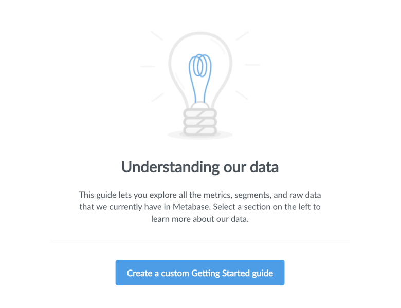
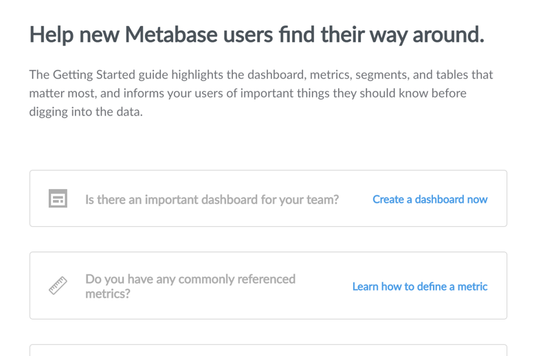
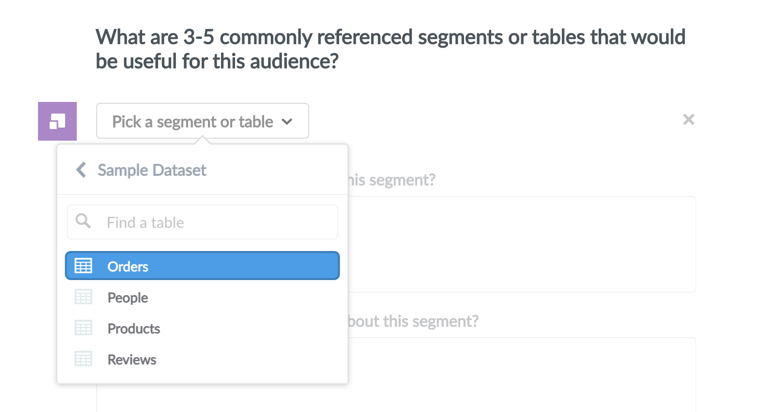
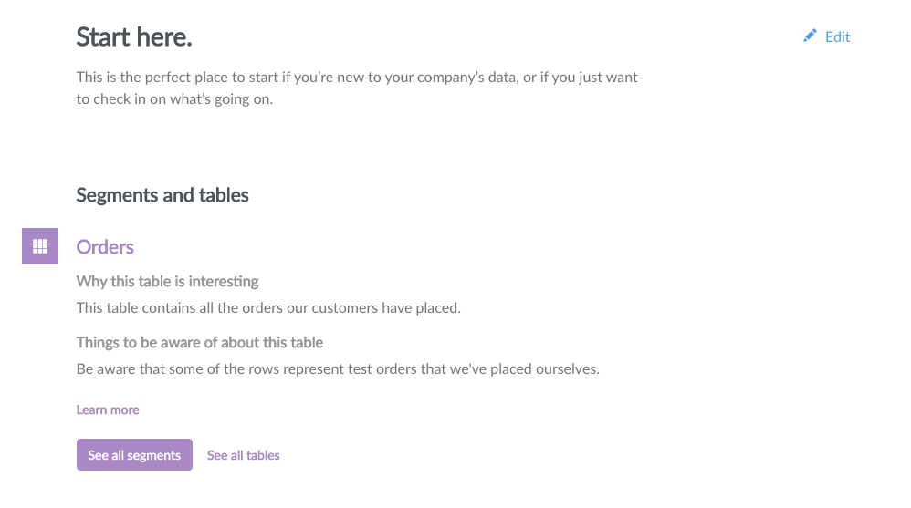

## Creating a Getting Started Guide

In most places we’ve worked, there’s typically an email or a Google doc that that gets forwarded around to new hires that describes how to use the analytics systems available. Some more sophisticated setups use an internal wiki or other website that has an inventory of what’s available. But we believe that the best way to keep information like this current is to have it be documented in the application itself. Metabase now lets you create a cheatsheet to help new users know which dashboards, metrics, and reports are the most important. It also provides a place to document caveats for use, advice on who to contact for help, and more.

To get started, click on the `Guide` link in the main nav. You'll see a screen like this:

Before you've even created your guide, this page gives you some links that you can use to explore the data you have in Metabase. But for now, click the button to begin making your guide. Now you'll see a list of sections that you can include in your guide:

You can highlight your company's most important dashboard, [metrics](06-segments-and-metrics.md) that you commonly refer to (and the dimensions by which they're most often grouped), and tables and [segments](06-segments-and-metrics.md) that are useful or interesting. There's also a place to write a little bit more about "gotchas" or caveats with your data that your users should know about before they start exploring things and drawing conclusions. Lastly, you can optionally include an email address for your users to contact in case they're still confused about things.

If you click on a section, it'll expand and let you select the items that you want to include in that section:

To remove an item you've added, just click the X icon in the top-right of the item. When you're all done adding things to your guide, click the `Save` button in the blue bar at the top of the screen. To make edits to your guide, simply click the `Edit` link in the top-right of the guide. Once you click `Save`, you'll see your brand new Getting Started Guide!

Clicking on the title of an item you've included in your guide will take you to the item itself. Clicking on `Learn more` will take you to a more detailed entry about that item so you can explore it and related items in more detail.
