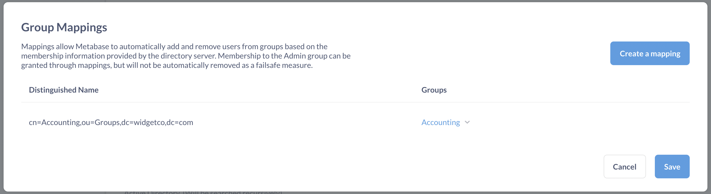

# Authenticating with Google Sign-In or LDAP

Enabling [Google Sign-In](#enabling-google-sign-in) or [LDAP](#enabling-ldap-authentication) for [single sign-on (SSO)][sso-docs] lets your team log in with a click instead of using email and password. It can also be used to let people sign up for Metabase accounts without an admin having to create them first. You can find these options in the **Settings** section of the **Admin Panel**, under **Authentication**.

If you'd like to have people authenticate with [SAML][saml-docs] or [JWT][jwt-docs], Metabase's [paid plans](https://www.metabase.com/pricing) let you do just that.

As time goes on we may add other auth providers. If you have a service you’d like to see work with Metabase, please let us know by [filing an issue](http://github.com/metabase/metabase/issues/new).

- [Enabling Google Sign-In](#enabling-google-sign-in)
  - [Working in the Google developer console](#working-in-the-google-developer-console)
  - [Creating Metabase accounts with Google Sign-in](#creating-metabase-accounts-with-google-sign-in)
- [Enabling LDAP authentication](#enabling-ldap-authentication)
  - [LDAP user schema](#ldap-user-schema)
  - [LDAP group mapping](#ldap-group-mapping)
  - [LDAP group membership filter](#ldap-group-membership-filter)
- [Syncing user attributes at login](#syncing-user-attributes-at-login)
  - [Syncing user attributes with Google](#syncing-user-attributes-with-google)
  - [Syncing user attributes with LDAP](#syncing-user-attributes-with-ldap)
- [Changing an account's login method from email to SSO](#changing-an-accounts-login-method-from-email-to-sso)
- [Troubleshooting login issues](#troubleshooting-login-issues)

## Enabling Google Sign-In

### Working in the Google developer console

To let your team start signing in with Google you’ll first need to create an application through Google’s [developer console](https://console.developers.google.com/projectselector2/apis/library).

Next, you'll have to create authorization credentials for your application by following [the instructions from Google here](https://developers.google.com/identity/gsi/web/guides/get-google-api-clientid). Specify the URI of your Metabase instance in the “Authorized JavaScript origins” section. You should leave the “Authorized Redirect URIs” section blank.

Once you have your `Client ID` (ending in `.apps.googleusercontent.com`), click `Configure` on the "Sign in with Google" section of the Authentication page in the Metabase Admin Panel. Paste your `client_id` into the first box.

Now existing Metabase users signed into a Google account that matches their Metabase account email can sign in with just a click.

### Creating Metabase accounts with Google Sign-in

If you’ve added your Google client ID to your Metabase settings, you can also let users sign up on their own without creating accounts for them.

To enable this, go to the Google Sign-In configuration page, and specify the email domain you want to allow. For example, if you work at WidgetCo you could enter "widgetco.com" in the field to let anyone with a company email sign up on their own.

Note that Metabase accounts created with Google Sign-In do not have passwords and must use Google to sign in to Metabase.

## Enabling LDAP authentication

In the **Admin** > **Authentication** tab, go to the LDAP section and click **Configure**. Click the toggle at the top of the form to enable LDAP, then fill out the form with the following information about your LDAP server:

- hostname
- port
- security settings
- LDAP admin username
- LDAP admin password

Then save your changes.

Metabase will pull out three main attributes from your LDAP directory:

- email (defaulting to the `mail` attribute)
- first name (defaulting to the `givenName` attribute)
- last name (defaulting to the `sn` attribute).

If your LDAP setup uses other attributes for these, you can edit this under the "Attributes" portion of the form.


Your LDAP directory must have the email field populated for each entry that will become a Metabase user, otherwise Metabase won't be able to create the account, nor will that person be able to log in. If either name field is missing, Metabase will use a default of "Unknown," and the person can change their name in their [account settings](../users-guide/account-settings.html).

### LDAP user schema

The **User Schema** section on this same page is where you can adjust settings related to where and how Metabase connects to your LDAP server to authenticate users.

The **User search base** field should be completed with the _distinguished name_ (DN) of the entry in your LDAP server that is the starting point when searching for users.

For example, let's say you're configuring LDAP for your company, WidgetCo, where your base DN is `dc=widgetco,dc=com`. If entries for employees are all stored within an organizational unit in your LDAP server named `People`, you'll want to supply the user search base field with the DN `ou=People,dc=widgetco,dc=com`. This tells Metabase to begin searching for matching entries at that location within the LDAP server.

You'll see the following grayed-out default value in the **User filter** field:

```
(&(objectClass=inetOrgPerson)(|(uid={login})(mail={login})))
```

When a person logs into Metabase, this command confirms that the login they supplied matches either a UID _or_ email field in your LDAP server, _and_ that the matching entry has an objectClass of `inetOrgPerson`.

This default command will work for most LDAP servers, since `inetOrgPerson` is a widely-adopted objectClass. But if your company for example uses a different objectClass to categorize employees, this field is where you can set a different command for how Metabase finds and authenticates an LDAP entry upon a person logging in.

### LDAP group mapping

Manually assigning people to [groups](04-managing-users.html#groups) in Metabase after they've logged in via SSO can get tedious. Instead, you can take advantage of the groups that already exist in your LDAP directory by enabling [group mappings](/learn/permissions/ldap-auth-access-control.html#group-management).

Scroll to **Group Schema** on the same LDAP settings page, and click the toggle to enable group mapping. Selecting **Edit Mapping** will bring up a modal where you can create and edit mappings, specifying which LDAP group corresponds to which Metabase group.

As you can see below, if you have an **Accounting** group in both your LDAP server and Metabase instance, you'll just need to supply the Distinguished Name from your LDAP server (in the example, it's `cn=Accounting,ou=Groups,dc=widgetco,dc=com`) and select its match from the dropdown of your existing Metabase groups.



#### Notes on group mapping

- The Administrator group works like any other group.
- Updates to a person's group membership based on LDAP mappings are not instantaneous; the changes will take effect only after people log back in.
- People are only ever added to or removed from mapped groups; the sync has no effect on groups in your Metabase that don't have an LDAP mapping.

### LDAP group membership filter



Group membership lookup filter. The placeholders {dn} and {uid} will be replaced by the user's Distinguished Name and UID, respectively.

## Further reading

- [Using LDAP for authentication and access control](/learn/permissions/ldap-auth-access-control.html)
- [LDAP troubleshooting guide](../troubleshooting-guide/ldap.html)
- [Permissions overview](05-setting-permissions.html)

## Syncing user attributes at login



### Syncing user attributes with LDAP

You can manage [user attributes][user-attributes-def] such as names, emails, and roles from your LDAP directory. When you set up [data sandboxing][data-sandboxing-docs], your LDAP directory will be able to [pass these attributes][user-attributes-docs] to Metabase.

### Syncing user attributes with Google

User attributes can't be synced with regular Google Sign-In. You'll need to set up [Google SAML][google-saml-docs] or [JWT][jwt-docs] instead.

## Changing an account's login method from email to SSO

Once a person creates an account, you cannot change the authentication method for that account. However, you can:

- Deactivate password authentication for all users from **Admin settings** > **Authentication**. You'll need to ask people to sign in with Google (if they haven't already).
- Manually update the account's login method in the Metabase application database. This option is not recommended unless you're familiar with making changes to the application database.

Note that you must have at least one account with email and password login. This account safeguards you from getting locked out of your Metabase if there are any problems with your SSO provider.

## Troubleshooting login issues

See [Troubleshooting logins](../troubleshooting-guide/cant-log-in.md).

[data-sandboxing-docs]: ../enterprise-guide/data-sandboxes.html
[google-saml-docs]: ../enterprise-guide/saml-google.html
[jwt-docs]: ../enterprise-guide/authenticating-with-jwt.html
[saml-docs]: ../enterprise-guide/authenticating-with-saml.html
[sso-docs]: ../administration-guide/sso.html
[user-attributes-docs]: ../enterprise-guide/data-sandboxes.html#getting-user-attributes
[user-attributes-def]: /glossary/attribute#user-attributes-in-metabase