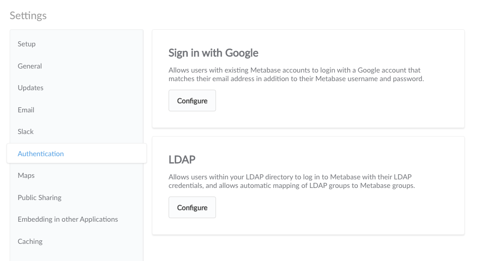
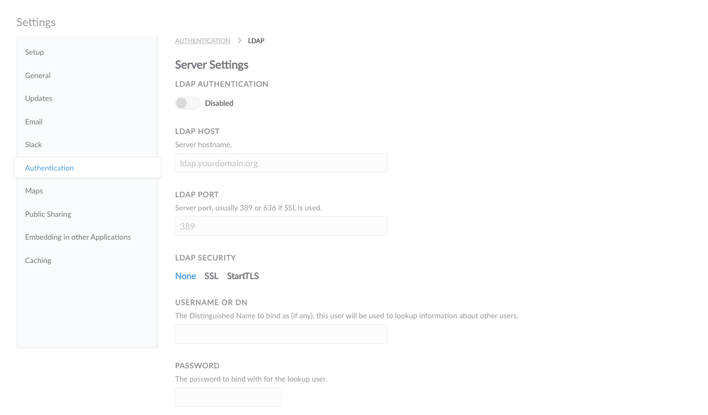
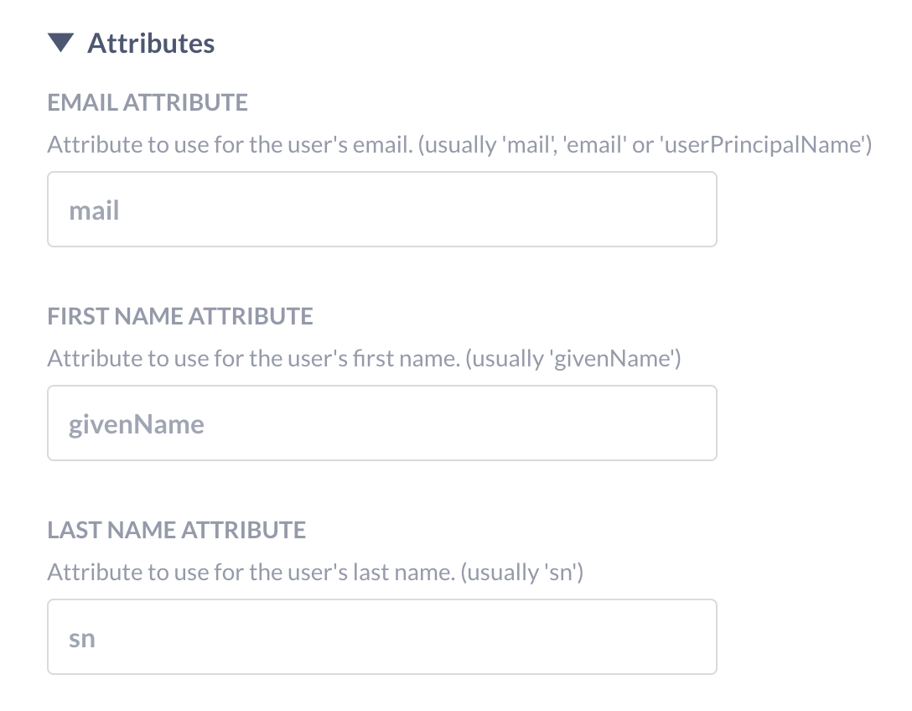

## Authenticating with Google Sign-In or LDAP

Enabling Google Sign-In or LDAP lets your team log in with a click instead of using email and password, and can optionally let them sign up for Metabase accounts without an admin having to create them first. You can find these options in the Settings section of the Admin Panel, under Authentication.

If you'd like to have your users authenticate with SAML, we offer a paid feature that lets you do just that. [Learn more about authenticating with SAML](../enterprise-guide/authenticating-with-saml.md)

As time goes on we may add other auth providers. If you have a service you’d like to see work with Metabase please let us know by [filing an issue](http://github.com/metabase/metabase/issues/new).

### Enabling Google Sign-In

To let your team start signing in with Google you’ll first need to create an application through Google’s [developer console](https://console.developers.google.com/projectselector2/apis/library).

Next, you'll have to create authorization credentials for your application by following [the instructions from Google here](https://developers.google.com/identity/sign-in/web/sign-in#create_authorization_credentials). Specify the URI of your Metabase instance in the “Authorized JavaScript origins” section. You should leave the “Authorized Redirect URIs” section blank.

Once you have your `client_id` (ending in `.apps.googleusercontent.com`), click `Configure` on the "Sign in with Google" section of the Authentication page in the Metabase Admin Panel. Paste your `client_id` into the first box.

Now existing Metabase users signed into a Google account that matches their Metabase account email can sign in with just a click.

###  Enabling account creation with Google Sign-In

If you’ve added your Google client ID to your Metabase settings you can also let users sign up on their own without creating accounts for them.

To enable this, go to the Google Sign-In configuration page, and specify the email domain you want to allow. For example, if you work at WidgetCo you could enter `widgetco.com` in the field to let anyone with a company email sign up on their own.

Note: Metabase accounts created with Google Sign-In do not have passwords and must use Google to sign in to Metabase.

### Enabling LDAP authentication

If your organization uses LDAP, and you want to allow your users to log in via their LDAP credentials, you can do so as follows.

Click the `Configure` button in the LDAP section of the Authentication page, and you'll see this form:

Click the toggle at the top of the form to enable LDAP, then fill in the form with the information about your LDAP server.

Metabase will pull out three main attributes from your LDAP directory - email (defaulting to the `mail` attribute), first name (defaulting to the `givenName` attribute) and last name (defaulting to the `sn` attribute). If your LDAP setup uses other attributes for these, you can edit this under the "Attributes" portion of the form.

Your LDAP directory must have the email field populated or Metabase won't be able to create or log in the user. If
either name field is missing, Metabase will use a default of "Unknown", and the name can be changed manually in the
user's account settings.

If you have user groups in Metabase you are using to control access, it is often tedious to have to manually assign a user to a group after they're logged in via SSO. You can take advantage of the groups your LDAP directory uses by enabling Group Mappings, and specifying which LDAP group corresponds to which user group on your Metabase server.

If you run into an issue, check out our [LDAP troubleshooting guide](../troubleshooting-guide/ldap.md)

---

## Next: setting data permissions
Find out how to create user groups and define what data they can access with [permissions](05-setting-permissions.md).
