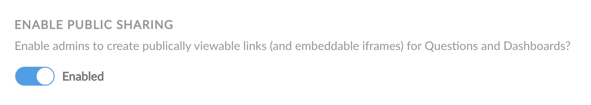
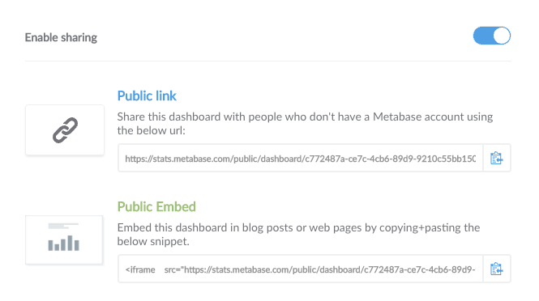

## Sharing and embedding dashboards or questions

Sometimes you'll want to share a dashboard or question you've saved with someone that isn't a part of your organization or company, or someone who doesn't need access to your full Metabase instance. Metabase lets administrators create public links and simple embeds to let you do just that.

### Turning public links on


First things first, you'll need to go to the Admin Panel and enable public sharing. In the future, you'll see dashboards and questions you've shared listed here, and you'll be able to revoke any public links that you no longer want to be used.

### Enable sharing on your dashboard or saved question


Next, exit the Admin Panel and go to the dashboard or question that you want to share, then click on the `Sharing and Embedding` icon in the top-right of the screen (it looks like a box with an arrow pointing up). Then click on the toggle to enable public sharing for this dashboard or question.

### Copy, paste, and share!

Now just copy and share the public link URL with whomever you please. If you want to embed your dashboard or question in a simple web page or blog post, then copy and paste the iframe snippet to your destination of choice.

### Assigning values to filters or hiding them via the URL

This is a bit more advanced, but if you're embedding a dashboard or question in an iframe and it has one or more filter widgets on it, you can give those filters values and even hide one or more filters by adding some options to the end of the URL. (You could also do this when just sharing a link, but note that if you do that, the person you're sharing the link with could of course directly edit the URL to change the filters' values, or to change which filters are hidden or not.)

Here's an example where we have a dashboard that has a couple filters on it, one of which is called "ID." We can give this filter a value of 7 and simultaneously prevent the filter widget from showing up by constructing our URL like this:

```
/dashboard/42?id=7#hide_parameters=id
```

You don't _have_ to assign a filter a value, though — if you only want to hide it, so that it isn't usable in this context, you can do this:

```
/dashboard/42#hide_parameters=id
```

Note that the name of the filter in the URL should be specified in lower case, and with underscores instead of spaces. So if your filter was called "Filter for User ZIP Code," you'd write:

```
/dashboard/42#hide_parameters=filter_for_user_zip_code
```

You can specify multiple filters to hide by separating them with commas, like this:

```
/dashboard/42#hide_parameters=id,customer_name
```

To specify multiple values for filters, though, you'll need to separate them with ampersands (&), like this:

```
/dashboard/42?id=7&customer_name=janet
```

---

## Next: embedding dashboards and charts in other applications

If you're trying to do more complex, integrated embedding in your own web application, then you can check out the [documentation for that feature](13-embedding.md).
