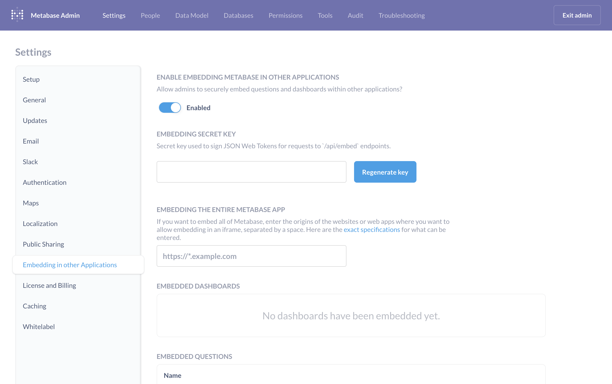
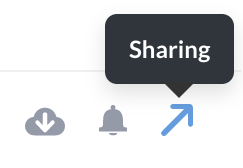
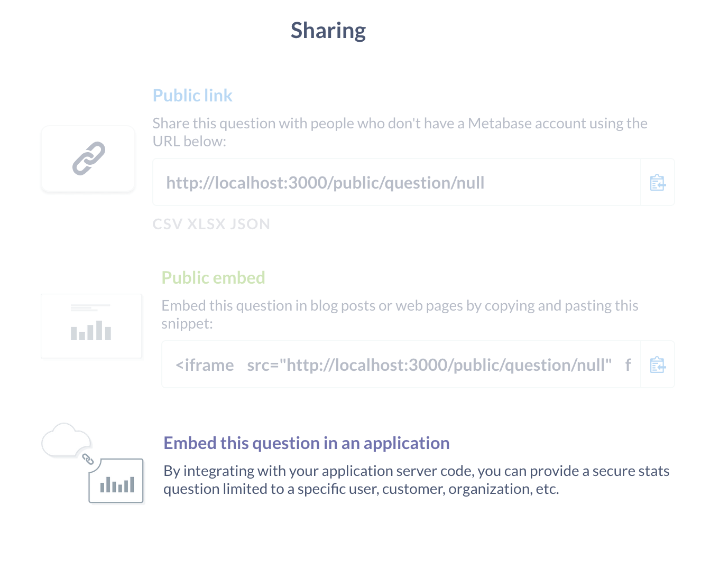
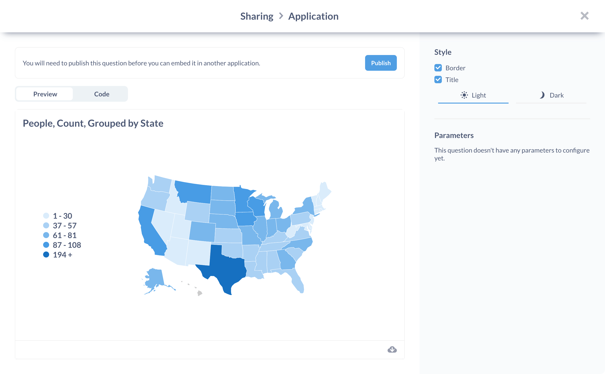
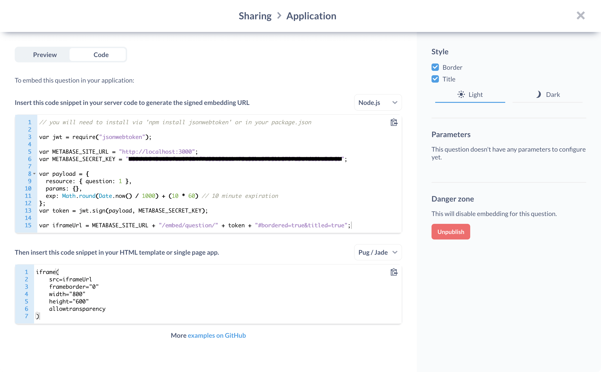
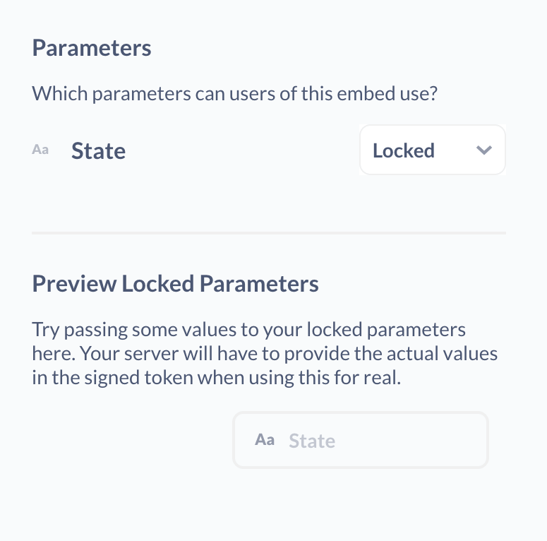

## Embedding Metabase in other applications

Metabase includes a powerful application embedding feature that allows you to embed your saved questions or dashboards in your own web applications. You can even pass parameters to these embeds to customize them for different users.
### Key Concepts

#### Applications
An important distinction to keep in mind is the difference between Metabase and the embedding application. The charts and dashboards you will be embedding live in the Metabase application, and will be embedded in your application (i.e. the embedding application).

#### Parameters
Some dashboards and questions have the ability to accept parameters. In dashboards, these are synonymous with dashboard filters. For example, if you have a dashboard with a filter on Publisher ID, this can be specified as a parameter when embedding, so that you could insert the dashboard filtered down to a specific Publisher ID.

SQL based questions with template variables can also accept parameters for each variable. So for a query like
```
SELECT count(*)
FROM orders
WHERE product_id = {{productID}}
```
you could specify a specific productID when embedding the question.

#### Signed parameters
In general, when embedding a chart or dashboard, the server of your embedding application will need to sign a request for that resource.

If you choose to sign a specific parameter value, that means the user can't modify that, nor is a filter widget displayed for that parameter. For example, if the "Publisher ID" is assigned a value and the request signed, that means the front-end client that renders that dashboard on behalf of a given logged-in user can only see information for that publisher ID.

### Enabling embedding
To enable embedding, go to the Admin Panel and under Settings, go to the "Embedding in other applications" tab. From there, click "Enable." Here you will see a secret signing key you can use later to sign requests. If you ever need to invalidate that key and generate a new one, just click on "Regenerate Key".


You can also see all questions and dashboards that have been marked as "Embeddable" here, as well as revoke any questions or dashboards that should no longer be embeddable in other applications.

Once you've enabled the embedding feature on your Metabase instance, you should then go to the individual questions and dashboards you wish to embed to set them up for embedding.

### Embedding charts and dashboards

To make a question or dashboard embeddable, click the sharing icon on it:



Then select "Embed this question in an application"



Here you will see a preview of the question or dashboard as it will appear in your application, as well as a panel that shows you the code you will need to insert in your application.



Importantly, you will need to hit "Publish" when you first set up a  chart or dashboard for embedding and each time you change your embedding settings. Also, any changes you make to the resource might require you to update the code in your own application to the latest code sample in the "Code Pane".



We provide code samples for common front end template languages as well as some common back-end web frameworks and languages. You may also use these as starting points for writing your own versions in other platforms.


### Embedding charts and dashboards with locked parameters
If you wish to have a parameter locked down to prevent your embedding application's end users from seeing other users' data, you can mark parameters as "Locked."Once a parameter is marked as Locked, it is not displayed as a filter widget, and must be set by the embedding application's server code.



### Resizing dashboards to fit their content
Dashboards are a fixed aspect ratio, so if you'd like to ensure they're automatically sized vertically to fit their contents you can use the [iFrame Resizer](https://github.com/davidjbradshaw/iframe-resizer) script. Metabase serves a copy for convenience:
```
<script src="http://metabase.example.com/app/iframeResizer.js"></script>
<iframe src="http://metabase.example.com/embed/dashboard/TOKEN" onload="iFrameResize({}, this)"></iframe>
```

### Reference applications
To see concrete examples of how to embed Metabase in applications under a number of common frameworks, check out our [reference implementations](https://github.com/metabase/embedding-reference-apps) on Github.


## Premium embedding
If you'd like to embed Metabase dashboards or charts in your application without the "Powered by Metabase" attribution, you can purchase premium embedding from the Metabase store. [Find out more here](https://store.metabase.com/product/embedding).
