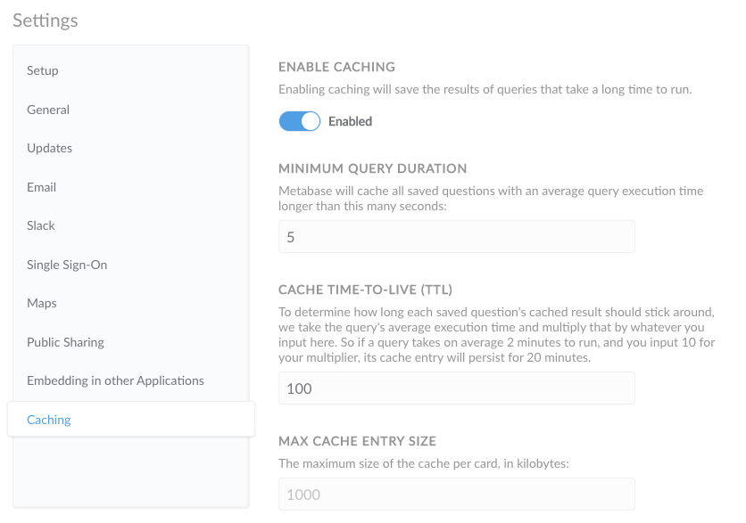

***

## título: Almacenamiento en caché de resultados de consultas

# Almacenamiento en caché de los resultados de la consulta

La metabase ahora le brinda la capacidad de almacenar automáticamente en caché los resultados de las consultas que tardan mucho tiempo en ejecutarse.

## Habilitación del almacenamiento en caché

Para comenzar a almacenar en caché sus consultas, diríjase a la sección Configuración del Panel de administración y haga clic en el botón `Caching` en la parte inferior de la navegación lateral. A continuación, gire el interruptor de almacenamiento en caché a `Enabled`.

Los usuarios finales verán una marca de tiempo en las preguntas almacenadas en caché en la parte superior derecha de la página de detalles de la pregunta que muestra la hora en que se actualizó por última vez esa pregunta (es decir, la hora en que se almacenó en caché el resultado actual). Haciendo clic en el botón `Refresh` en una página de preguntas, se volverá a ejecutar manualmente la consulta y se anulará el resultado almacenado en caché con el nuevo resultado.

## Configuración de almacenamiento en caché

En Metabase, en lugar de establecer la configuración de caché manualmente por consulta, le proporcionamos dos parámetros para establecer para almacenar automáticamente en caché los resultados de consultas largas: la duración media mínima de la consulta y el multiplicador TTL de caché.

### Duración mínima de la consulta

La instancia de metabase realiza un seguimiento de los tiempos medios de ejecución de consultas de las consultas y almacenará en caché los resultados de todas las preguntas guardadas con un tiempo medio de ejecución de consultas superior al número que coloque en este cuadro (en segundos).

### Tiempo de vida en caché (TTL)

En lugar de establecer un número absoluto de minutos o segundos para que un resultado almacenado en caché persista, Metabase le permite colocar un multiplicador para determinar el TTL de la caché. El TTL de caché de cada consulta se calcula multiplicando su tiempo medio de ejecución por el número que se coloca en este cuadro. Así que si pones `10`, una consulta que tarda 5 segundos en ejecutarse en promedio tendrá su caché durante 50 segundos; y una consulta que tarda 10 minutos tendrá un resultado almacenado en caché que durará 100 minutos. De esta manera, la caché de cada consulta es proporcional a su tiempo de ejecución.

### Tamaño máximo de entrada de caché

Por último, puede establecer el tamaño máximo de la caché de cada pregunta en kilobytes, para evitar que ocupen demasiado espacio en su servidor.

## Controles avanzados de almacenamiento en caché

Los planes de pago se envían con [opciones adicionales de almacenamiento en caché](../enterprise-guide/cache.md).

## Siguiente: personalización de mapas

Si necesita utilizar un servidor de mosaicos de mapas distinto del que proporciona la metabase, puede encontrar más información [en la página siguiente](20-custom-maps.md).
