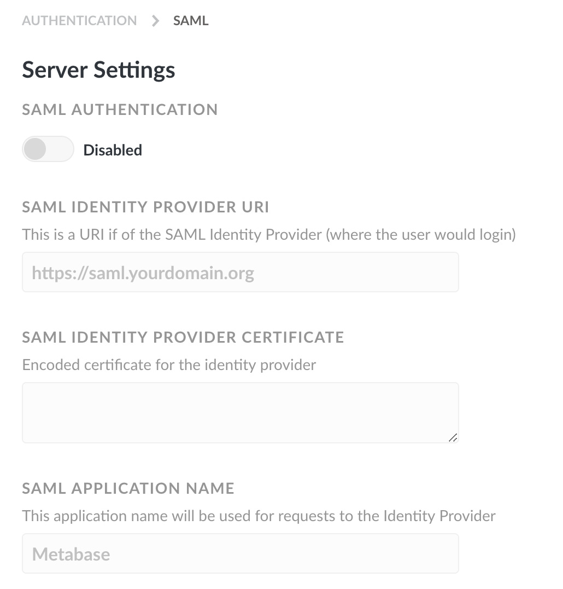

## Authenticating with SAML

**This feature is available in the Enterprise edition of Metabase**

Connecting Metabase to your SAML identity provider lets your team access Metabase with ease through SSO.

### Enabling SAML authentication
First, head over to the Settings section of the Admin Panel, then click on the Authentication tab. Click the `Configure` button in the SAML section of the Authentication page, and you'll see this form:

Click the toggle at the top of the form to enable SAML authentication, then fill in the form with the information about your identity provider. **Make sure to turn this on**, otherwise SAML-based authentication won't work, even if all of your settings are right.

Here's a breakdown of each of the settings:

**Identity Provider (IDP) URI:** This is where Metabase will redirect login requests. That is, it's where your users go to log in to your SSO.

**Identity Provider Certificate:** This is a an encoded certificate that we will use when connecting to the IDP provider URI. This will look like a big blob of text that you'll want to copy and paste carefully — the spacing is important!

#### Settings for signing SSO requests (optional)
These are additional settings you can fill in to sign SSO requests to ensure they don’t get tampered with.

**SAML keystore path:** the absolute path to the keystore file to use for signing SAML requests.

**SAML keystore password:** if it wasn't already self-evident, this is just the password for opening the keystore.

**SAML keystore alias:** the alias for the key that Metabase should use for signing SAML requests.

#### Settings for user attribute configuration (optional)
These settings allow Metabase to automatically get each user's email address and first and last name.

The settings that Metabase defaults to here might work for you out of the box, but you can override them if you know that your settings are different.

Each of these input boxes needs a URI that points to the location of a SAML attribute.

---

## Next: Authenticating with JWT
If SAML isn't your bag, you can also use a JSON web token based identify provider. [Learn how](18-authenticating-with-jwt.md).
