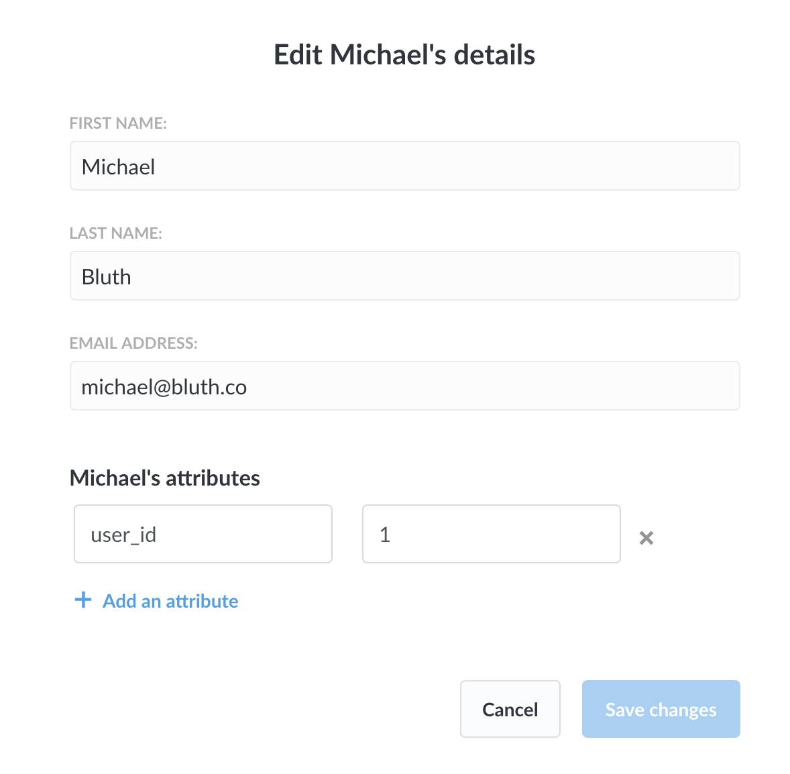
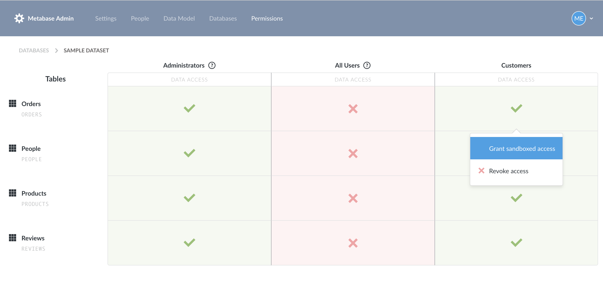
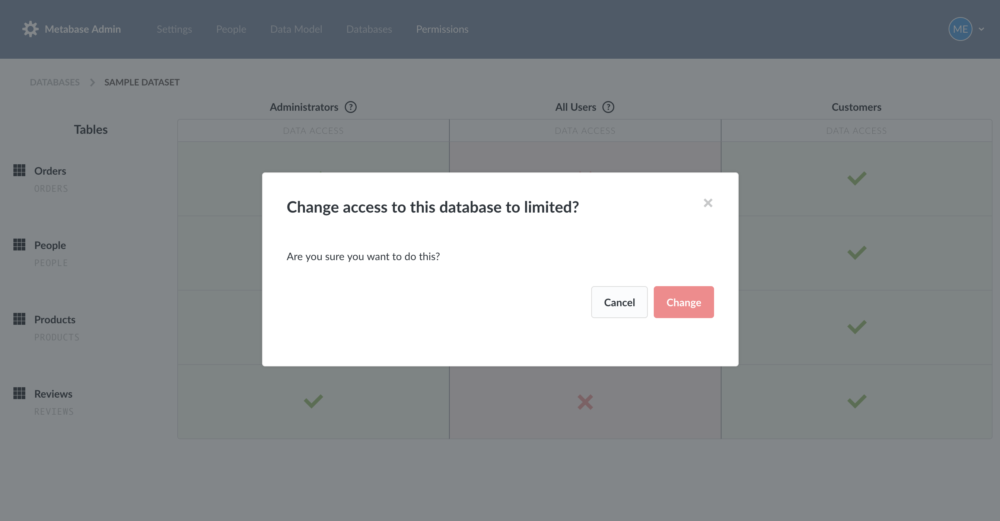
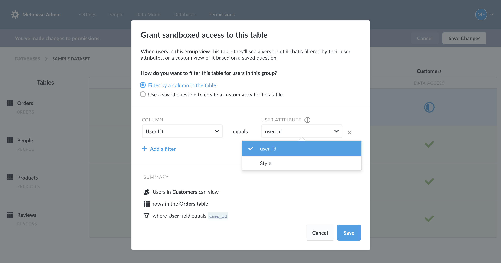
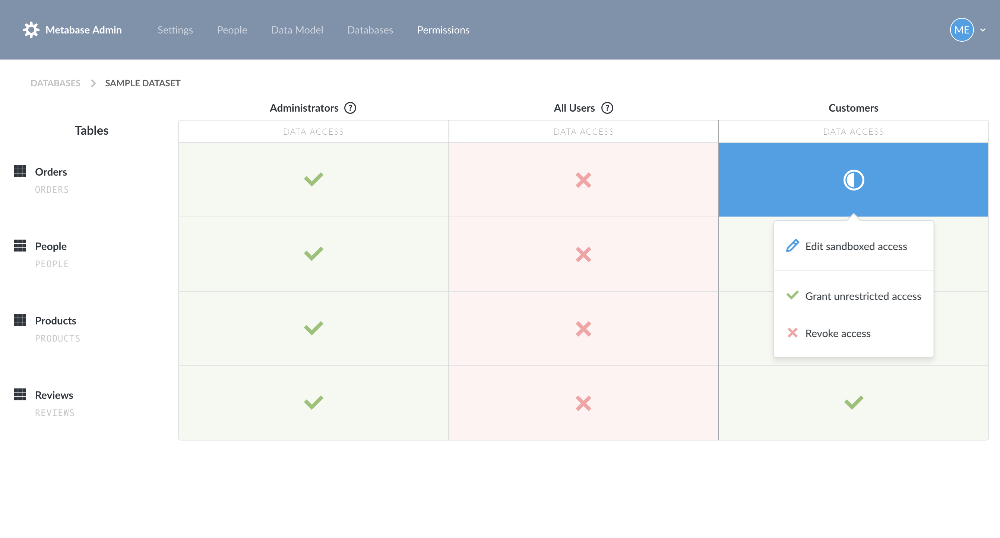
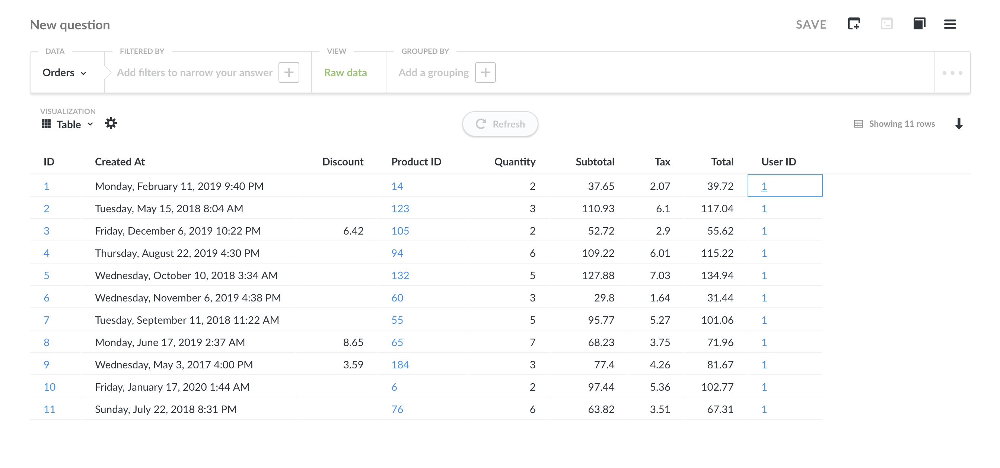
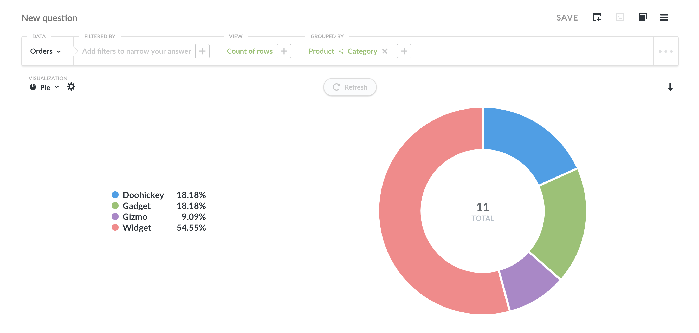

## Sandboxing your data

**This is a paid feature of Metabase.** To find out more, visit the [Metabase Store](https://store.metabase.com/).

Say you have users who you want to be able to log into your Metabase instance, but who should only be able to view data that pertains to them. For example, you might have some customers or partners who you want to let view your Orders table, but you only want them to see their orders. Metabase has a feature called sandboxing that lets you do just that.

The way it works is that you pick a table that you want to sandbox for users in a certain group, then customize how exactly you want to filter that table for those users. For this to work in most cases you’ll first need to add attributes to your users so that Metabase will know how to filter things for them specifically.

### Getting user attributes
There are two ways to add attributes to your users:

1. Get them automatically by connecting to your SAML Single Sign-On (SSO) provider. For instructions on connecting SAML SSO to Metabase, [check out this article](16-authenticating-with-saml.md).
2. You can also add attributes manually to a user by going to the People section of the Admin Panel, and clicking on the “…” menu on the far right of a user’s name in the table you’ll see there. Click on Edit Details from that menu to add and edit a user’s attributes.

Now that your users have attributes, you’ll be able to sandbox tables, and automatically filter them based on these user attributes.

### Filtering a sandboxed table
Metabase gives you two options for filtering a sandboxed table:

#### Option 1: filter using a column in the table
The simplest way to filter a sandboxed table is to pick a column in the sandboxed table and match it up with a user attribute so that any time a user with sandboxed access to this table views it, they’ll only see rows in the table where that column’s value is equal to the value that user has for that attribute.

#### Option 2: create a custom view of the table with a saved question
If you’re trying to do something more custom or complex, Metabase also gives you the option of creating a custom view for a sandboxed table using a saved question. You can also use variables in a saved SQL/native question and map those to user attributes to do even more sophisticated filtering. As an example, you might have columns in your Orders table that you don’t want any of your customers to see, so you could create a SQL-based saved question which only returns the columns you want them to see. That question could also have a variable in its `where` clause that you could map to a user attribute, like `where orders.user_id = {user_id_attr_var}` to additionally filter the question based on each user’s user ID attribute.

#### An example setup
That was a mouthful, so here’s an example. We’ll sandbox our Orders table so that any user in our Customers group will only be able to see rows in the Orders table where the Customer ID column matches the user’s customer_id attribute.

First we’ve made sure our example user has an attribute that we’ll be able to use in our filter:

Then we’ll head over to the Permissions section of the Admin Panel, and we’ll click on View Tables next to the Sample Dataset to see the permissions our user groups have for the tables in this database. We want to give the Customers group sandboxed access to the Orders table, so we’ll click on that box in the permissions grid and choose “Grant sandboxed access:”

Metabase will ask us first if we want to restrict this user group to “limited access” to this database. That just means they won’t have full access to all of the tables in this database, which is exactly what we want.

Next we’ll see a worksheet that will ask us how we want to filter this table for these users. We’ll leave it on the default selection. Below that, there’s an area where we get to add our filters. We want to filter using the User ID column in the Orders table where the column equals each user’s user_id attribute. So we’ll select that column and that user attribute from the dropdown menus. At the bottom of the worksheet, there’s a summary of how things will work.

We’ll click Done, then we’ll click Save Changes at the top of the screen to save the changes we’ve made to our permissions. If we ever want to edit how this table should be filtered for users in this group, we can just click on the blue box and select “Edit sandboxed access.”

To test this out, we’ll open up a new incognito browser window and log in with our test user account. We’ll click on the Sample Dataset on the home page and then pick the Orders table. As you can see here, this user correctly only sees orders where the User ID column is equal to 1, because that’s what this user’s user_id attribute is.

If this user views any charts, dashboards, or even automated x-ray explorations that include this sandboxed Orders data, those will also be correctly filtered to only show the data they’re allowed to see.

Another great thing about sandboxing is that this user can still use all of the easy and powerful exploration and charting features of Metabase to explore this sandboxed data. For example, they can create a chart like this one to see a breakdown of their orders by product type:

