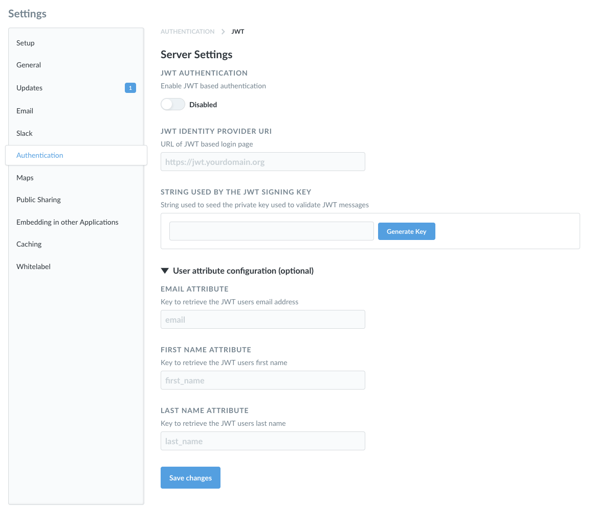

## JWT-based Authentication

**This feature is available in the Enterprise edition of Metabase**

You can connect Metabase to your JWT-based identity provider to allow your Metabase users to authenticate through it.

### Enabling JWT authentication
First, navigate to the Settings section of the Admin area, then click on the Authentication tab. Click the `Configure` button in the JWT section of this page, and you'll see this form:

Click the toggle at the top of the form to enable JWT-based authentication, then fill in the form with the information about your identity provider. **Make sure to turn this on**, otherwise JWT authentication won't work, even if all of your settings are right.

Here's a breakdown of each of the settings:

**Identity Provider URI:** This is where Metabase will redirect login requests. That is, it's where your users go to log in through your identify provider.

**String Used by the JWT Signing Key:** This is a string used to seed the private key that is used to validate JWT messages.

#### User attribute configuration (optional)
These are additional settings you can fill in to pass user attributes to Metabase.

**Email attribute:** the key to retrieve each JWT user's email address.

**First Name attribute:** the key to retrieve each JWT user's first name.

**Last Name attribute:** if you guessed that this is the key to retrieve each JWT user's last name, well then you have been paying attention.

---

## Next: setting data permissions
Find out how to create user groups and define what data they can access in the [next section](05-setting-permissions.md).
