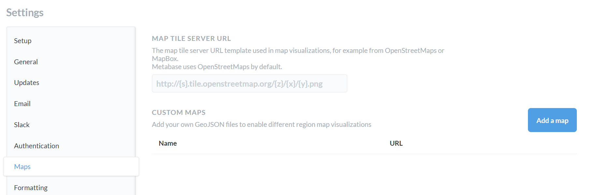

## Custom Maps

By default, Metabase uses OpenStreetMaps for map visualizations, but there are a few customization options.

### Finding Map Settings

To find the map settings:

1. Click the gear icon in the upper right and then select `Admin`
2. Select `Maps` from the navigation on the left.

### Map Tile Server

As mentioned above, Metabase uses the OpenStreetMaps tile server. However, if your organization requires a different look or level of detail in your map visualizations, you can change the map tile server by adding the map tile server URL to the first field on the page.

### Custom Region Maps

If you need a map that focuses on a specific region, you may want to upload a custom GeoJSON map. 

To get started, click the `Add a map` button. A modal will appear, asking for:

 * The name of the map
 * The URL of the GeoJSON file
 * The JSON property that Metabase should use as your region's identifier (a distinct way of identifying this specific region map) 
 * The JSON property that Metabase should use as the display name (how the name of the region map appears in the user interface)

If you do not currently have a GeoJSON file, there are many tools available to create one, such as [MapShaper](https://mapshaper.org/) or [GeoJSON.io](http://geojson.io/). If you're just interested in reading more about GeoJSON, we recommend that you start [here](https://geojson.org/).

---

## Next: editing metadata
Taking just a few minutes to edit and add info to your database’s metadata can greatly enhance your experience with Metabase. Let’s learn how to [edit your metadata](03-metadata-editing.md).
