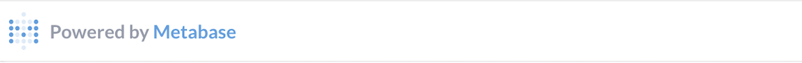

# Customizing embedded charts



Some paid plans give you additional customization options for embedded items.

## Remove the "Powered by Metabase" banner

Charts and dashboards won't show the branded Metabase label at the bottom.

## Fonts

You can set the font for the embedded chart or dashboard. If you've set a custom font for your Metabase, that will be selectable as the "Use instance font".

### Use instance font

If you select "Use instance font", the font for your embedded item will sync with whatever you've set your Metabase font to. So if you change the font for your Metabase (your "instance"), the font used for the embedded item will change as well. There's no need to update the embedding code; the embedded item's font should update automatically (you may need to refresh your browser).

If you want to use a font different from your current intance font, you can select one of the included fonts.

### Changing custom fonts

If you want to use a different custom font, and by custom here we mean a font other than one of the included fonts, you'll need to change the [custom font](./fonts.md#custom-fonts) for your Metabase instance. Changing the instance font will update all embedded items that have their font set to "Use instance font".

For now, you cannot have multiple custom fonts; you can only override your instance font with one of the included fonts.

For more, see [fonts](./fonts.md).

## Disable data download

You can remove the export icon from charts. Note that removing the icon here doesn't totally prevent people from exporting the data; treat it as a deterrent, not a security option. Removing the icon just cleans up the embedded chart a bit, and makes downloading the data a bit of a hassle.

## Embedding reference applications

To see code examples of how to embed Metabase in applications using a number of common frameworks, check out our [reference implementations](https://github.com/metabase/embedding-reference-apps) on Github.

