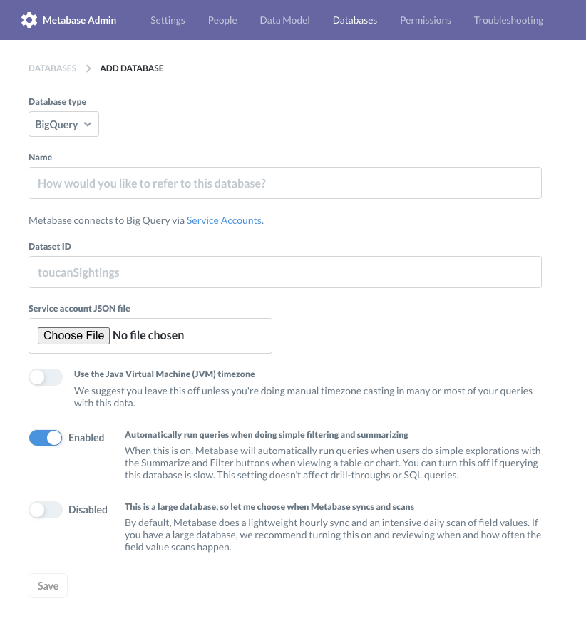
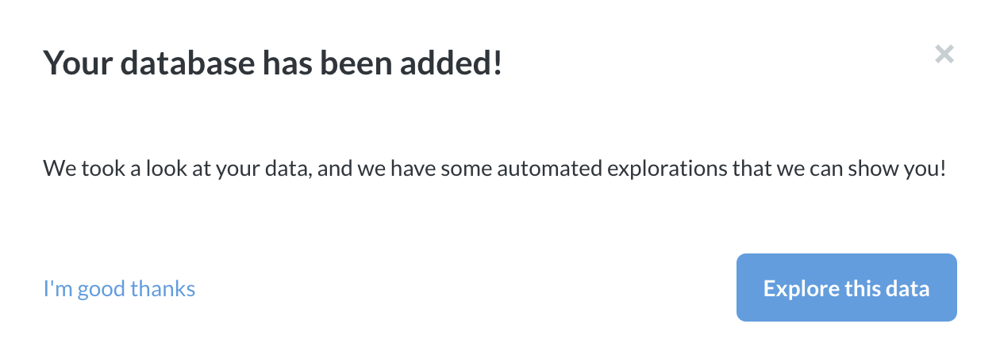

## Working with Google BigQuery in Metabase

This page provides information on how to create and manage a connection to a Google [BigQuery](https://cloud.google.com/bigquery) dataset.

## Prerequisites

You'll need to have a [Google Cloud Platform](https://cloud.google.com/) account with a [project](https://cloud.google.com/storage/docs/projects) you would like to use in Metabase. Consult the Google Cloud Platform documentation for how to [create and manage a project](https://cloud.google.com/resource-manager/docs/creating-managing-projects). This project should have a BigQuery dataset for Metabase to connect to.

## Google Cloud Platform: creating a service account and JSON file

You'll first need a [service account](https://cloud.google.com/iam/docs/service-accounts) JSON file that Metabase can use to access your BigQuery dataset. Service accounts are intended for non-human users (such as applications like Metabase) to authenticate (who am I?) and authorize (what can I do?) their API calls.

To create the service account JSON file, follow Google's documentation on [setting up a service account](https://cloud.google.com/iam/docs/creating-managing-service-accounts) for your BigQuery dataset. Here's the basic flow:

1. **Create service account**. From your Google Cloud Platform project console, open the main sidebar menu on the left, go to the **IAM & Admin** section, and select **Service account**. The console will list existing service accounts, if any. At the top of the screen, click on **+ CREATE SERVICE ACCOUNT**.

2. **Fill out the service account details**. Name the service account, and add a description (the service account ID will populate once you add a name). Then click the **Create** button.

3. **Grant the service account access to this project**. You'll need to add **roles** to the service account so that Metabase will have permission to view and run queries against your dataset. Make sure you add the following roles to the service account:

   - BigQuery Data Viewer
   - BigQuery Metadata Viewer
   - BigQuery Job User (distinct from BigQuery User)

   For more information on **roles** in BigQuery, see [Google Cloud Platform's documentation](https://cloud.google.com/bigquery/docs/access-control).

4. **Create key**. Once you have assigned roles to the service account, click on the **Create Key** button, and select **JSON** for the **key type**. The JSON file will download to your computer.

> **You can only download the key once**. If you delete the key, you'll need to create another service account with the same roles.

## Metabase: adding a BigQuery dataset

Once you have created and downloaded your service account JSON file for your BigQuery dataset, head over to your Metabase instance, click on the **settings** cog, and select **Admin** to bring up Admin mode. In the **Databases** section, click on the **Add database** button in the upper right.

On the **ADD DATABASE** page, select **BigQuery** from the **Database type** dropdown. Metabase will present you with the relevant configuration settings to fill out:



### Settings

#### Name

**Name** is the title of your database in Metabase.

#### Dataset ID

Each BigQuery dataset will have a **Dataset ID**. You can find this ID via the [Google Cloud Console](https://console.cloud.google.com/). If you're not sure where to find the **Dataset ID**, see Google's documentation on [getting information on datasets](https://cloud.google.com/bigquery/docs/dataset-metadata#getting_dataset_information).

> When entering the **Dataset ID**, omit the Project ID prefix. For example, if your ID is `project_name:dataset_id`, only enter `dataset_id`.

#### Service account JSON file

Upload the service account JSON file you created when following the [steps above](#google-cloud-platform-creating-a-service-account-and-json-file). The JSON file contains the credentials your Metabase application will need to read and query your dataset, as defined by the **roles** you added to the service account. If you need to add additional **roles**, you have to create another service account, download the JSON file, and upload the file to Metabase.

#### Use the Java Virtual Machine (JVM) timezone

_Default: Disabled_

We suggest you leave this off unless you're doing manual timezone casting in many or most of your queries with this data.

#### Automatically run queries when doing simple filtering and summarizing.

_Default: Enabled_

When this slider is on, Metabase will automatically run queries when users do simple explorations with the Summarize and Filter buttons when viewing a table or chart. You can turn this off if querying this database is slow. This setting doesn’t affect drill-throughs or SQL queries.

#### This is a large database, so let me choose when Metabase syncs and scans

_Default: Disabled_

By default, Metabase does a lightweight hourly sync and an intensive daily scan of field values. If you have a large database, we recommend turning this on and reviewing when and how often the field value scans happen.

### Save your database configuration

When you're done, click the **Save** button. A modal should pop up, informing you that your database has been added.



You can click on **Explore this data** to see some automatic explorations of your data, or click **I'm good thanks** to stay in the Admin Panel.

Give Metabase some time to sync with your BigQuery dataset, then exit Admin mode, click on **Browse Data**, find your database, and start exploring your data.

## Using Legacy SQL

As of version 0.30.0, Metabase tells BigQuery to interpret SQL queries as [Standard SQL](https://cloud.google.com/bigquery/docs/reference/standard-sql/). If you prefer using [Legacy SQL](https://cloud.google.com/bigquery/docs/reference/legacy-sql) instead, you can tell Metabase to do so by including a `#legacySQL` directive at the beginning of your query, for example:

```sql
#legacySQL
SELECT *
FROM [my_dataset.my_table]
```

## Troubleshooting

If you're having trouble with your BigQuery connection, you can check out this [troubleshooting guide](https://www.metabase.com/docs/latest/troubleshooting-guide/datawarehouse.html), or visit [Metabase's discussion forum](https://discourse.metabase.com/search?q=bigquery) to see if someone has encountered and resolved a similar issue.

## Further reading

- [Managing databases](https://www.metabase.com/docs/latest/administration-guide/01-managing-databases.html).
- [Metadata editing](https://www.metabase.com/docs/latest/administration-guide/03-metadata-editing.html).
- [Creating segments and metrics](https://www.metabase.com/docs/latest/administration-guide/07-segments-and-metrics.html).
- [Setting data access permissions](https://www.metabase.com/docs/latest/administration-guide/05-setting-permissions.html).
