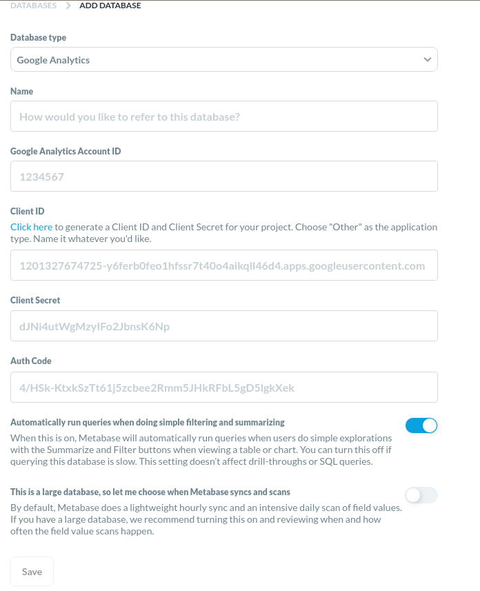

## Working with Google Analytics in Metabase

This page provides information on how to create and manage a connection to a [Google Analytics][google-analytics] dataset.

## Prerequisites

You will need to have a [Google Cloud Platform][google-cloud] account and create the [project][google-cloud-create-project] you would like to use in Metabase. Consult the Google Cloud Platform documentation on how to [create and manage a project][google-cloud-management] if you do not have one.

## Google Cloud Platform: creating OAuth client ID

To get the Client ID and Client Secret you will need, follow Google's Cloud Platform Help on [how to create an OAuth client ID][google-cloud-oauth]. For application type, select "Desktop App" (this avoids a `redirect_uri_mismatch` when requesting Auth Codes).

### Enabling Google Analytics API

To enable the Google Analytics API, go to <https://console.cloud.google.com/apis/api/analytics.googleapis.com/overview> in the Google Cloud Platform console. Double-check that the previously created project is selected and click on "Enable". For further documentation please refer to [Enable and disable APIs][google-enable-disable-apis].

##### Adding the API scopes

Refer to Google's Analytics API documentation to set up the required [scopes][google-oauth-scopes].

## Metabase: adding a Google Analytics Dataset

In your Metabase, click on **Settings** and select "Admin" to bring up the **Admin Panel**. In the **Databases** section, click on the **Add database** button, then select "Google Analytics" from the "Database type" dropdown and fill in the configuration settings:

- **Name** is the title of your database in Metabase.

- To get the **Google Analytics Account ID**, go to [Google Analytics][google-analytics] and click the **Admin** cog.  In the admin tab, go to the **Account Settings** section: you will find the account ID below the "Basic Settings" heading.

- Paste the **Client ID** and **Client Secret** you created when setting up the OAuth client ID above. These credentials must be correctly associated to scopes allowing interaction with the Google Analytics API.

- Once you've provided **Client ID** and **Client Secret** with valid scopes, a **Click here to get an auth code** link will appear over the **Auth Code** text box. Authorize the connection with your Google login credentials to see the Auth Code, then copy and paste the code into this box.

- **Automatically run queries when doing simple filtering and summarizing:** When this setting is enabled (which it is by default), Metabase automatically runs queries when users do simple explorations with the Summarize and Filter buttons when viewing a table or chart. You can turn this off if you find performance is slow. This setting doesn’t affect drill-throughs or SQL queries.

- **This is a large database, so let me choose when Metabase syncs and scans:** When this setting is disabled (which it is by default), Metabase regularly checks the database to update its internal metadata. If you have a large database, we you can turn this on and control when and how often the field value scans happen.

Please see the [database sync and analysis documentation][sync-docs] for more details about the two toggle settings.

## Save your database configuration

When you're done, click the **Save** button. A modal dialog will inform you that your database has been added. You can click on **Explore this data** to see some automatic explorations of your data, or click **I'm good thanks** to stay in the **Admin Panel**.

Give Metabase some time to sync with your Google Analytics dataset, then exit the **Admin Panel**, click on **Browse Data**, find your Google Analytics database, and start exploring. Once Metabase is finished syncing, you will see the names of your Properties & Apps in the data browser.

[google-analytics]: https://cloud.google.com/analytics
[google-cloud]: https://cloud.google.com/
[google-cloud-create-project]: https://cloud.google.com/resource-manager/docs/creating-managing-projects#creating_a_project
[google-cloud-management]: https://cloud.google.com/resource-manager/docs/creating-managing-projects
[google-cloud-oauth]: https://support.google.com/cloud/answer/6158849
[google-enable-disable-apis]: https://support.google.com/googleapi/answer/6158841
[google-oauth-scopes]: https://developers.google.com/identity/protocols/oauth2/scopes
[sync-docs]: ../../administration-guide/01-managing-databases.html#choose-when-metabase-syncs-and-scans
