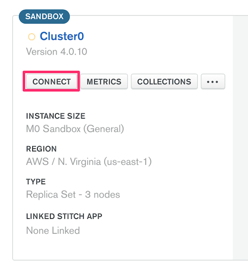

# Working with MongoDB in Metabase

This article covers:

 - Using a connection string.
 - General connectivity concerns.
 - Connecting to a MongoDB Atlas cluster.

## Using a connection string

If you'd prefer to connect to MongoDB using a [connection string](https://docs.mongodb.com/manual/reference/connection-string/),
click on **Paste a connection string**. The Metabase UI will update with a field to paste your connection string, as well as present the following options:

- **Use an SSH tunnel for database connections.** Some database installations can only be accessed by connecting through an SSH bastion host. This option also provides an extra layer of security when a VPN is not available. Enabling this is usually slower than a direct connection.
- **Automatically run queries when doing simple filtering and summarizing.** When this is on, Metabase will automatically run queries when users do simple explorations with the Summarize and Filter buttons when viewing a table or chart. You can turn this off if querying this database is slow. This setting doesn’t affect drill-throughs or SQL queries. 
- **This is a large database, so let me choose when Metabase syncs and scans**. By default, Metabase does a lightweight hourly sync and an intensive daily scan of field values. If you have a large database, we recommend turning this on and reviewing when and how often the field value scans happen.

## General connectivity concerns

 - **Connect using `DNS SRV`**, which is the recommended method for newer Atlas clusters.

 - **Have you checked your cluster host whitelist?** When testing a connection but seeing failure, have you tried setting the IP whitelist to `0.0.0.0/0`?  Whitelisting this address allows connections from any IP addresses. If you know the IP address(es) or CIDR block of clients, use that instead.

 - **Are you using self-signed certificates?** While Metabase doesn't support providing a self-signed cert through the Metabase UI, you can still use the command line to configure this. Just copy the existing store and add the self-signed cert:

    ```bash
    cp /usr/lib/jvm/default-jvm/jre/lib/security/cacerts ./cacerts.jks
    keytool -import -alias cacert -storepass changeit -keystore cacerts.jks -file my-cert.pem
    ```

    Then, start Metabase using the store:

    ```bash
    java -Djavax.net.ssl.trustStore=cacerts.jks -Djavax.net.ssl.trustStorePassword=changeit -jar metabase.jar
    ```

     Additional reference for configuring SSL with MongoDB for self-signed certs:
      - http://mongodb.github.io/mongo-java-driver/3.0/driver/reference/connecting/ssl/

## Connecting to a MongoDB Atlas cluster

 To make sure you are using the correct connection configuration:

  1. Log into your [Atlas cluster](https://cloud.mongodb.com)

  2. Select the cluster you want to connect to, and click **Connect**.

     

  3. Click **Connect Your Application**.

     

  4. Select **Java** and **3.6 or later**.

     

  5. The resulting connection string has the relevant information to provide to Metabase's `Add a Database` form for MongoDB.
 
  6. You will likely want to select the option `Use DNS SRV`, which newer Atlas clusters use by default.
