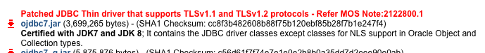

## Working with Oracle in Metabase

Starting in v0.20.0, Metabase provides a driver for connecting to Oracle databases. Under the hood, Metabase uses Oracle's JDBC driver; due to licensing restrictions, we can't
include it as part of Metabase. Luckily, downloading it yourself and making it available to Metabase is straightforward and only takes a few minutes.

### Downloading the Oracle JDBC Driver JAR

You can download the JDBC driver from [Oracle's JDBC driver downloads page](https://www.oracle.com/technetwork/database/features/jdbc/jdbc-ucp-122-3110062.html).
Head to this page, accept the license agreement, and download `ojdbc8.jar`:



Before downloading this JAR you may need to sign up for a free account with Oracle. We recommend downloading version 12.2.0.1 or greater of the Oracle JDBC driver.


### Adding the Oracle JDBC Driver JAR to the Metabase Plugins Directory

Metabase will automatically make the Oracle driver available if it finds the Oracle JDBC driver JAR in the Metabase plugins directory when it starts up.
All you need to do is create the directory, move the JAR you just downloaded into it, and restart Metabase.

By default, the plugins directory is called `plugins`, and lives in the same directory as the Metabase JAR.

For example, if you're running Metabase from a directory called `/app/`, you should move the Oracle JDBC driver JAR to `/app/plugins/`:

```bash
# example directory structure for running Metabase with Oracle support
/app/metabase.jar
/app/plugins/ojdbc8.jar
```

If you're running Metabase from the Mac App, the plugins directory defaults to `~/Library/Application Support/Metabase/Plugins/`:

```bash
# example directory structure for running Metabase Mac App with Oracle support
/Users/camsaul/Library/Application Support/Metabase/Plugins/ojdbc8.jar
```

Finally, you can choose a custom plugins directory if the default doesn't suit your needs by setting the environment variable `MB_PLUGINS_DIR`.
