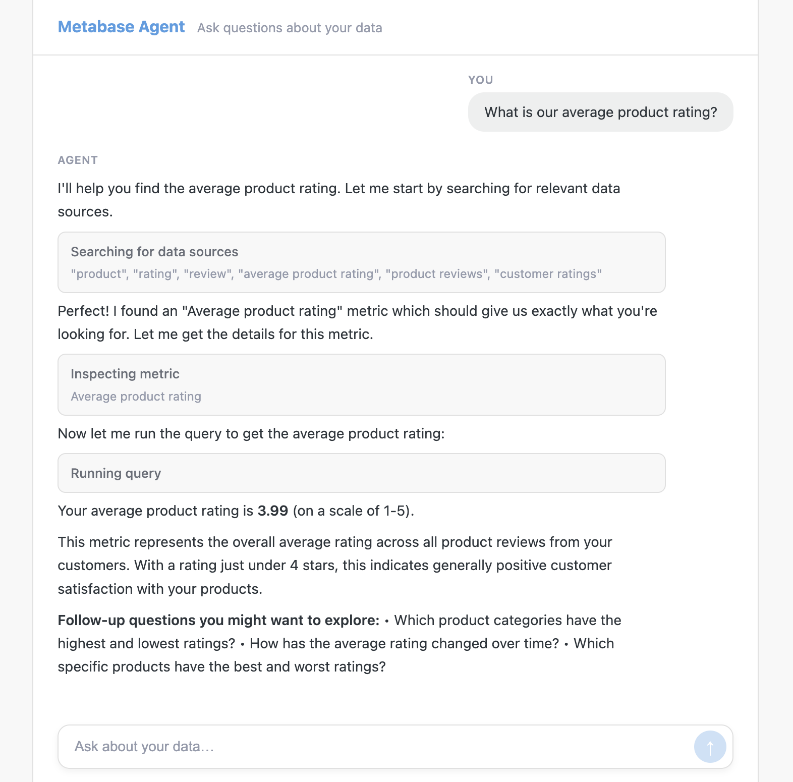

# Agent API

The [Agent API](../api.html#tag/apiagent) is a REST API for building headless, agentic BI applications on top of Metabase's semantic layer, scoped to an authenticated user's permissions.

## Agent API endpoints and reference

Check out the API endpoint docs: [/api/agent](../api.html#tag/apiagent).

You can also point your AI to the [Agent API reference](https://github.com/metabase/metabase/blob/master/src/metabase/agent_api/reference.md) to bootstrap your agent.

## Example application



Check out the [Metabase Agent API demo](https://github.com/metabase/metabase-agent-api-demo) for a working example of an agentic BI app built on the Agent API.

## Why use the Agent API

There are a few advantages to using the agent API over the Metabase API.

- Agent endpoints are explicitly supported for building agentic BI applications.
- The agent API is versioned, so your apps can rely on consistent responses.
- Requests are scoped to the authenticated user's permissions.
- Doesn't require you to work with MBQL, which is Metabase's querying language.

## Supported features

The Agent API supports:

- Searching for tables and metrics
- Inspecting their fields
- Constructing and executing queries

If you want to connect an MCP-compatible AI client (like Claude Desktop) without writing custom code, see the [MCP server](./mcp.md), which builds on this API.

## Row limits and pagination

Queries return a maximum of 200 rows per request. To page through larger result sets, use `POST /api/agent/v1/query`, which returns a `continuation_token` when more rows are available. Pass the token back to get the next page.

## Authentication

The Agent API supports three authentication methods.

### API key

The simplest option. Create an [API key](../people-and-groups/api-keys.md) in **Admin** > **Settings** > **Authentication** > **API keys**, then pass it in each request:

```
X-API-Key: YOUR_API_KEY
```

The key's permissions are determined by the [group](../people-and-groups/managing.md#groups) assigned to that key. Unlike session or JWT authentication, API key requests aren't scoped to an individual user. Anyone using a client app that authenticates with an API key will have the same permissions as that key.

### Session token

Log in with a Metabase username and password to get a session token, then pass it in subsequent requests.

**1. Get a session token:**

```
POST /api/session
Content-Type: application/json

{"username": "analyst@example.com", "password": "your-password"}
```

The response body contains an `id` field -- that's your session token.

**2. Pass the token in each request:**

```
X-Metabase-Session: SESSION_TOKEN
```

### JWT



If you've configured [JWT-based authentication](../people-and-groups/authenticating-with-jwt.md) (**Admin** > **Settings** > **Authentication** > **JWT**), you can pass a signed JWT directly:

```
Authorization: Bearer <jwt>
```

The JWT must be signed with the shared secret configured in Metabase. Claims include:

| Claim      | Type   | Required | Description                                                                                                                  |
| ---------- | ------ | -------- | ---------------------------------------------------------------------------------------------------------------------------- |
| iat        | int    | Yes      | Issued-at time (Unix seconds). JWT must be <180 seconds old.                                                                 |
| email      | string | Yes      | Email matching a Metabase user. The claim name is configurable via the jwt-attribute-email admin setting (default: "email"). |
| first_name | string | No       | User's first name.                                                                                                           |
| last_name  | string | No       | User's last name.                                                                                                            |
| groups     | array  | No       | List of groups for group sync.                                                                                               |

Example JWT payload:

```json
{
  "iat": 1706640000,
  "email": "analyst@example.com"
}
```

You can also exchange a JWT for a session token via `POST /auth/sso/to_session` (note: this endpoint is under `/auth`, not `/api`), then use the `X-Metabase-Session` header as described above.

## Further reading

- [MCP server](./mcp.md)
- [Agent API complete reference](https://github.com/metabase/metabase/blob/master/src/metabase/agent_api/reference.md)
- [Metabase Agent API demo](https://github.com/metabase/metabase-agent-api-demo)
- [Metabase API docs](../api.html)
- [API keys](../people-and-groups/api-keys.md)
- [JWT authentication](../people-and-groups/authenticating-with-jwt.md)
