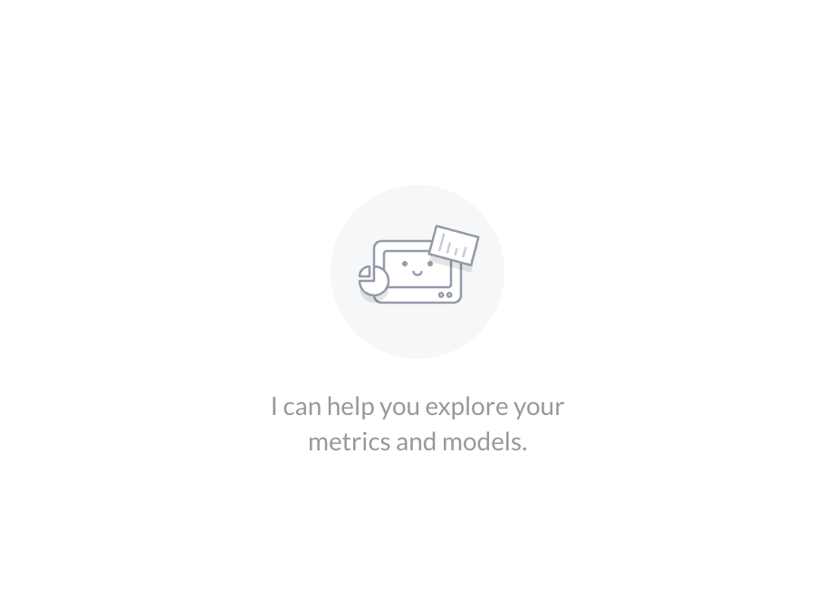

# AI customization



_Admin > AI > Customization_

You can change how Metabot displays itself in Metabase. These are just surface-level customizations; they don't affect [behavior](./system-prompts.md).

## Metabot's name

Rename Metabot. The new name shows up everywhere Metabase refers to Metabot (sidebar, buttons, suggested prompts, empty states).

## Metabot's icon

Upload a custom icon. SVG or PNG with a transparent background gives the cleanest result. Max size is 1MB.

## Show Metabot illustrations

Once you've uploaded a custom icon, this toggle appears and controls whether the default decorative illustrations show in the Metabot chat sidebar and on the AI exploration page.

## Further reading

- [AI settings](./settings.md)
- [AI usage controls](./usage-controls.md)
- [AI system prompts](./system-prompts.md)
- [Metabot](./metabot.md)

