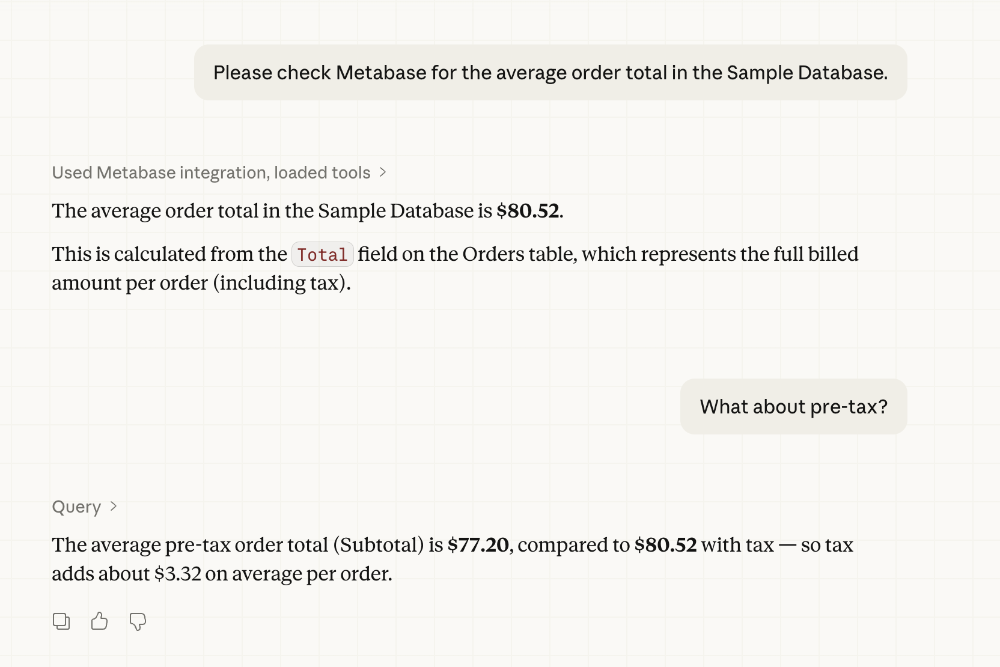

# MCP server



Metabase includes an [MCP (Model Context Protocol)](https://modelcontextprotocol.io/) server (using Streamable HTTP transport) that lets AI clients connect directly to your Metabase, all scoped to the connecting person's permissions.

Before connecting, make sure AI features are enabled in your Metabase. See [AI settings](./settings.md).

## Connect an MCP client

Point your MCP client at Metabase's MCP endpoint at `/api/mcp`:

```
https://{your-metabase.example.com}/api/mcp
```

In Claude Code, for example, you can run `/mcp add metabase https://{your-metabase.example.com}/api/mcp --transport streamable-http` and Claude will handle the OAuth flow for you.

For Claude Desktop, you can create a [custom connector](https://support.claude.com/en/articles/11175166-get-started-with-custom-connectors-using-remote-mcp) by just giving it that URL to your Metabase's mcp endpoint.

## Authentication

MCP clients authenticate with Metabase using OAuth 2.0. Metabase runs its own embedded OAuth server, so you don't need to set up an external OAuth provider.

Your MCP client should try to connect to your Metabase. You'll see a Metabase-branded consent page asking you to approve the connection to your Metabase.

A first-time connection will go something like this:

1. The client discovers Metabase's OAuth endpoints.
2. The client registers itself with Metabase.
3. You're redirected to Metabase to log in (if you aren't already) and approve the connection.
4. The client receives an access token scoped to the permissions you have in Metabase.

Results returned by the MCP server are sent to your MCP client, which may forward them to an AI provider depending on how the client is configured. See [Privacy](./settings.md#privacy).

## Available tools

Some clients (like Claude Desktop) will ask you to approve each tool the first time it's used. The MCP server builds on Metabase's [Agent API](./agent-api.md), and exposes the following tools. If you're building a custom integration and need full control, use the [Agent API](./agent-api.md) directly instead.

- **search**: Find tables and metrics using keyword or natural language search.
- **get_table**: Get details about a table, including its fields, related tables, and metrics.
- **get_table_field_values**: Get sample values and statistics for a field in a table.
- **get_metric**: Get details about a metric, including its queryable dimensions.
- **get_metric_field_values**: Get sample values and statistics for a field in a metric.
- **construct_query**: Construct a query against a table or metric. Returns an opaque query string that can be executed with `execute_query`.
- **execute_query**: Execute a previously constructed query and return the results with column metadata, row count, and execution time.
- **query**: Query a table or metric and return results.

## Further reading

- [Agent API](./agent-api.md)
- [Metabase API docs](../api.html)
- [Model Context Protocol specification](https://modelcontextprotocol.io/)
