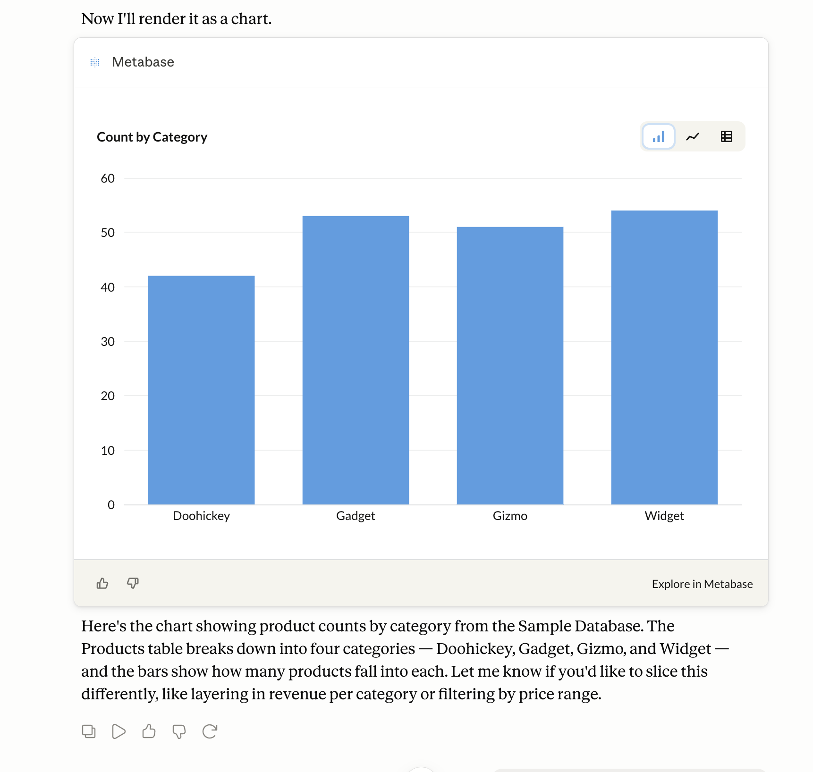
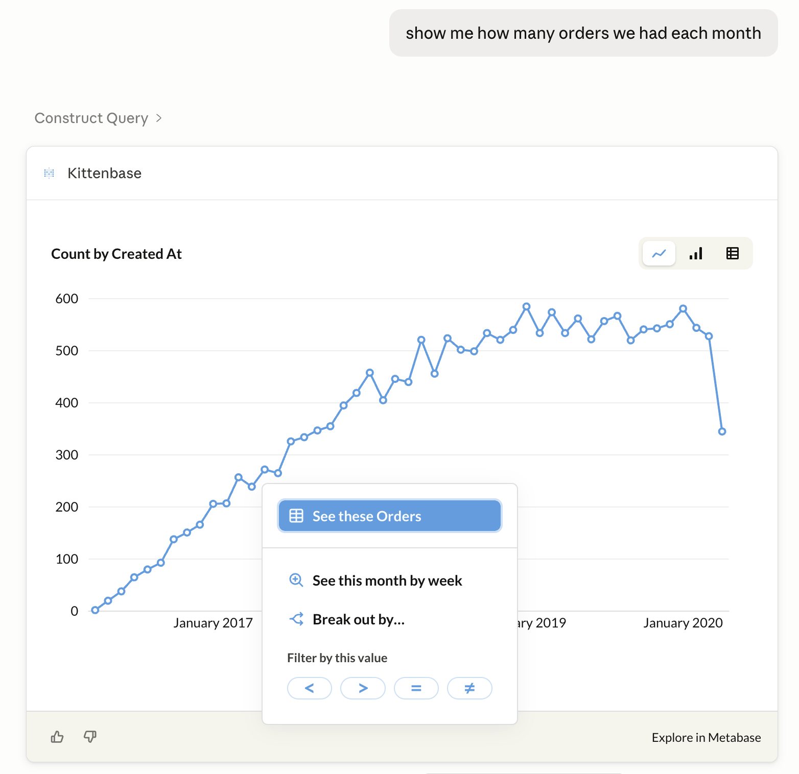

# MCP server


Metabase includes an [MCP (Model Context Protocol)](https://modelcontextprotocol.io/) server that lets AI clients connect directly to your Metabase, all scoped to the connecting person's permissions.

## Connect a client to your Metabase MCP server's URL

Your Metabase's MCP server is served from the `/api/metabase-mcp` endpoint.

If your admin has turned on [your Metabase's MCP server](#enable-mcp-server), all you need to do is point your MCP client at your Metabase's MCP server's URL.

```
https://{your-metabase.example.com}/api/metabase-mcp
```

Replace `{your-metabase.example.com}` with your Metabase's URL. Admins can also find your instance's MCP URL in **Admin > AI > MCP > Settings > MCP server URL**.

Your client will direct you to an authentication page for your Metabase.

Once authenticated, you can approve or block the tools you want your Agent to have access to in your client (not in your Metabase).

### Connecting Claude Code to your Metabase's MCP server

To connect Claude Code:

1. Run a command to add the MCP server.

```
claude mcp add --transport http metabase https://{your-metabase-url}/api/metabase-mcp
```

Replace `{your-metabase-url}` with your Metabase address.

2. Start Claude Code with `claude`.

3. In Claude Code, run `/mcp`.

4. Select the Metabase MCP server.

5. Click **Authenticate**, and authenticate with your Metabase. (You may first need to **Enable** the Metabase MCP server).

Once authenticated, ask your agent about your Metabase. You should see your agent use Metabase tools to interact with your Metabase.

See [Claude Code MCP docs](https://code.claude.com/docs/en/mcp).

### Connect via Claude web

If you use Claude on the web or Claude Desktop, go to [Claude's connector directory](https://claude.ai/directory/connectors/metabase) and enter your [Metabase's MCP URL](#connect-a-client-to-your-metabase-mcp-servers-url).

One of your Metabase admins will still need to have [turned on your Metabase's MCP server](#enable-mcp-server). You'll authenticate against your own Metabase during setup.

## Available tools

Some clients (like Claude Desktop) will ask you to approve each tool the first time it's used. We've grouped the tools below, but your client may simply list the available tools.

### Interactive tools

These render inline visualizations in your AI client, and only work in clients that support inline charts.

- **Render drill through** (`render_drill_through`): Render the chart a person drilled into from an inline visualization.
- **Visualize query** (`visualize_query`): Render a query's results as an inline chart in your AI client.

### Read-only tools

- **Construct query** (`construct_query`): Construct a query against a table or metric. Returns an opaque query handle that can be passed to `execute_query`.
- **Execute query** (`execute_query`): Execute a previously constructed query and return the results with column metadata, row count, and execution time.
- **Query tables and metrics** (`query`): Run a query and return results, paging through large result sets with a continuation token. Accepts a query handle from `construct_query`, a fresh query, or a continuation token. Paging returns up to 200 rows per page and 2,000 rows total.
- **Read resource** (`read_resource`): Read up to five Metabase entities (or lists) per call by `metabase://` URI. List URIs (like a collection's items or a table's fields) return up to 25 items each. Entities available to read include:
  - collection
  - dashboard
  - database
  - metric
  - model
  - question
  - schema
  - table
  - transform
- **Search tables and metrics** (`search`): Find tables and metrics using keyword or natural language search.

### Write/delete tools

- **Create collection** (`create_collection`): Create a new collection, optionally nested under a parent collection.
- **Create dashboard** (`create_dashboard`): Create a new dashboard, optionally populated with saved questions.
- **Create question** (`create_question`): Save a query as a named question.
- **Execute SQL** (`execute_sql`): Execute a raw SQL query against a database. Requires native-query permission on the target database. An admin can disable this tool instance-wide via the `mcp-execute-sql-enabled` setting (enabled by default).
- **Update dashboard** (`update_dashboard`): Update a dashboard's metadata (name, description, collection, archived).
- **Update question** (`update_question`): Update a saved question. Setting `collection_id` moves the question to another collection.

## MCP server settings

_Admin > AI > MCP_

### Enable MCP server

From **Admin > AI**, open the **MCP** tab in the left sidebar, and use the **MCP server** toggle to turn external access to the MCP server on or off.

The MCP server also requires that [AI features](./overview.md) are enabled for your instance. You don't need to configure an AI provider to use the MCP server, but if **AI features** are turned off in **Admin > AI**, the MCP server stays off too.

### Show inline charts in these MCP clients

These toggles control which browser-based clients can display [inline charts](#using-the-mcp-server) generated by Metabase. Switch on any of the supported clients:

- **Claude** (Claude Desktop and Claude on the web)
- **Cursor and VS Code**
- **ChatGPT**

Toggling on a client automatically adds that client's sandbox domains to Metabase's CORS allowlist, which is what lets the client render Metabase's charts in its browser sandbox.

These toggles only control inline charts; they don't gate whether a client can connect. Any MCP client can connect to your MCP server (subject to [authentication](#authentication)), and clients that run outside the browser (like Claude Code on your own machine) don't need a CORS allowlist entry at all.

### Custom inline chart origins

The **Custom inline chart origins** field is for browser-based MCP clients that render [inline charts](#using-the-mcp-server) but aren't in the supported list (like a self-hosted client).



Adding an origin here puts it on Metabase's CORS allowlist, just like toggling on one of the supported clients. Clients that run outside the browser (like Claude Code on your own machine) don't need an entry here.

Add the client's origin to the field. Separate values with a space, for example:

```
https://mcp.internal.example.com https://*.staging.example.com
```

The field accepts wildcards (`*`) for subdomains. Changes take effect in about a minute. Might be a good time to get up and pour yourself a glass of water.

## Authentication

MCP clients authenticate with Metabase using OAuth 2.0. Metabase runs its own embedded OAuth server, so you don't need to set up an external OAuth provider.

Your MCP client should try to connect to your Metabase. You'll see a Metabase-branded consent page asking you to approve the connection to your Metabase.

A first-time connection will go something like this:

1. The client discovers Metabase's OAuth endpoints.
2. The client registers itself with Metabase.
3. You're redirected to Metabase to log in (if you aren't already) and approve the connection.
4. The client receives an access token scoped to the permissions you have in Metabase.

Results returned by the MCP server are sent to your MCP client, which may forward them to an AI provider depending on how the client is configured. See [AI privacy](./privacy.md).

## Authorization logs

To review which clients have connected, go to **Admin > AI > MCP** and open the **Authorizations** tab. The authorization logs are an audit log of MCP and Agent API client registrations and the authorization decisions people have approved or denied.

Each record includes:

- **Client**: the MCP client that registered or requested access (like Claude Code).
- **User**: the person who approved (authenticated) or denied the request (blank for registration events).
- **Redirect URI**: the OAuth callback URL the client registered.
- **Event**: **Registered**, **Approved**, or **Denied**.
- **Date**: when the event happened.

Use the event filter to narrow the list to a single event type.

## With the MCP server, your client provides the AI

MCP server requests are handled by whatever AI client you're using (like a desktop AI app or editor plugin). The MCP server just provides tools (like searching for an entity or running the query) for your AI.

For example, if you ask your AI client to use your Metabase's MCP server "what's our q3 revenue," your client will interact with the MCP server to figure out which tools it needs to field your request. Your AI can decide that it needs to use the tool **construct_query** and **execute_query**, and what those queries might be. Then your client will call those tools for Metabase to run.

You don't need to have an [AI provider](settings.md#choose-ai-provider) configured in Metabase to use your Metabase's MCP server. If you _do_ have an AI provider configured in Metabase to power Metabot, that provider will _not_ be used for MCP server requests. MCP calls by your local client have no effect on token usage for your Metabase's AI connection.

## Using the MCP server

The MCP server will return results as either text or an inline chart, depending on the question you asked.

If you want the MCP server to return an inline chart, ask it to "show" or "visualize" the data:



Inline charts are limited to bar, line, or table charts (which you can toggle between). You can also drill through the charts or change their time granularity. Depending on which client you're using, drilling through will either let you keep exploring the chart right there in your client, or give you a link to continue your exploration in your Metabase.

If your client is connected to other MCP servers, you can ask questions that combine data from multiple sources. For example, you can ask a question about your customers that combines data from Metabase, your CRM, and your support ticket platform (Though maybe you should put all that data into your Metabase).

See [Available tools](#available-tools) for the list of functionality supported by the MCP server.

## Use the MCP server with agent-driven development

You can use the MCP server to help you create Metabase content as serialized YAML files that you can import into your Metabase. Point your agent at the MCP server to give it access to your Metabase's database metadata (table names, fields, and sample values) so it can write questions and dashboards that point at real columns.

See [Agent-driven development](./file-based-development.md).

## Connecting to a local MCP server

Some clients don't allow support connecting to MCP servers running on localhost. For example, Claude Desktop doesn't permit local connections, but Claude Code does.

For containerized setups, like when testing locally, you may need to set the `MB_SITE_URL` environment variable to the URL you point to in order to authenticate your client. For example, if you're playing around with a Metabase on localhost, you should set:

```
MB_SITE_URL: http://localhost:3000
```

Some explanation: OAuth discovery starts with Metabase returning a `WWW-Authenticate` header whose `resource_metadata` URL is built from your **Site URL** setting in **Admin** > **Settings** > **General** (or via the environment variable).

If the site URL doesn't match an address your MCP client can reach, like if you're running Metabase in Docker and the site URL got auto-detected from an internal hostname like `metabase-dev:3000`, the client will register but fail the handshake. Your MCP client will typically report a connection failure rather than prompting you to authenticate (for example, Claude Code shows `✗ Failed to connect` rather than `! Needs authentication`).

## Further reading

- [Agent API](./agent-api.md)
- [File-based development](./file-based-development.md)
- [Metabase API docs](../api.html)
- [Model Context Protocol specification](https://modelcontextprotocol.io/)
