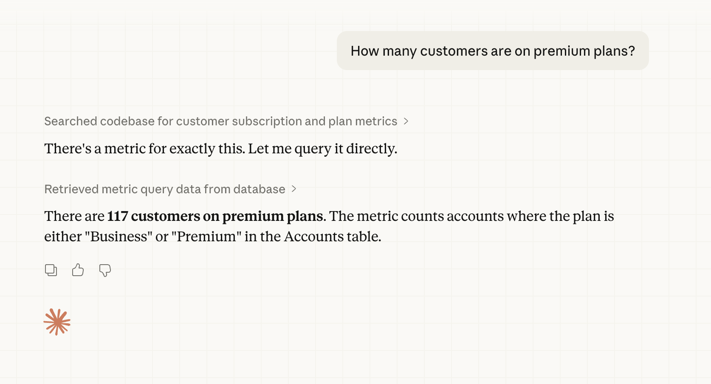
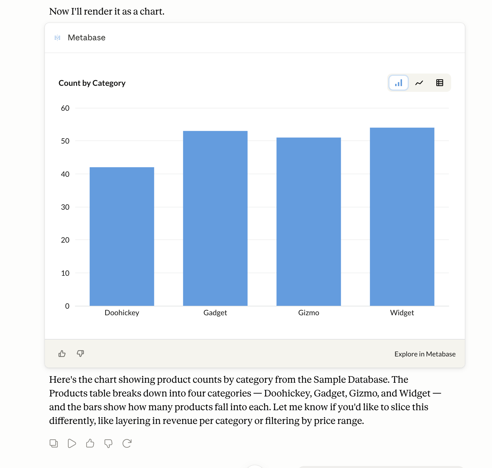
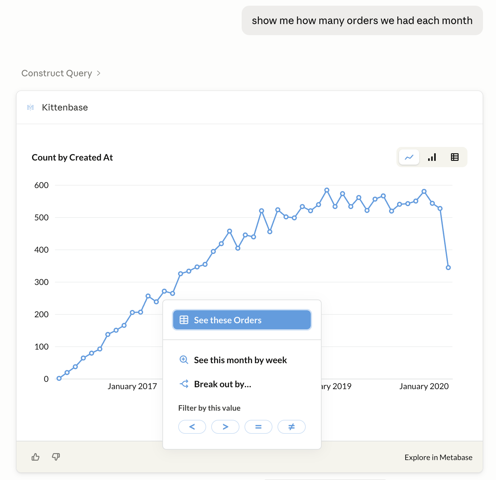

# MCP server



Metabase includes an [MCP (Model Context Protocol)](https://modelcontextprotocol.io/) server that lets AI clients connect directly to your Metabase, all scoped to the connecting person's permissions.

## Connect a client to your Metabase MCP server's URL

Your Metabase's MCP server is served from the `/api/metabase-mcp` endpoint. The older `/api/mcp` path still works for clients that were set up with it, but point new clients at `/api/metabase-mcp`. If you connected a client before Metabase 0.64, that client will ask you to authenticate again after you upgrade.

If your admin has turned on [your Metabase's MCP server](#enable-mcp-server), all you need to do is point your MCP client at your Metabase's MCP server's URL.

```
https://{your-metabase.example.com}/api/metabase-mcp
```

Replace `{your-metabase.example.com}` with your Metabase's URL. Admins can also find your instance's MCP URL in **Admin > AI > MCP > Settings > MCP server URL**.

Your client will direct you to an authentication page for your Metabase.

Once authenticated, you can approve or block the tools you want your Agent to have access to in your client (not in your Metabase). Admins can also [turn tools off for everyone](#turn-off-specific-tools).

### Connecting Claude Code to your Metabase's MCP server

To connect Claude Code:

1. Run a command to add the MCP server.

```
claude mcp add --transport http metabase https://{your-metabase-url}/api/metabase-mcp
```

Replace `{your-metabase-url}` with your Metabase address.

2. Start Claude Code with `claude`.

3. In Claude Code, run `/mcp`.

4. Select the Metabase MCP server.

5. Click **Authenticate**, and authenticate with your Metabase. (You may first need to **Enable** the Metabase MCP server).

If Claude asks you to choose authentication options, see [Choose authentication options in Claude](#choose-authentication-options-in-claude).

Once authenticated, ask your agent about your Metabase. You should see your agent use Metabase tools to interact with your Metabase.

See [Claude Code MCP docs](https://code.claude.com/docs/en/mcp).

### Connect via Claude web

If you use Claude on the web or Claude Desktop, go to [Claude's connector directory](https://claude.ai/directory/connectors/metabase) and enter your [Metabase's MCP URL](#connect-a-client-to-your-metabase-mcp-servers-url).

One of your Metabase admins will still need to have [turned on your Metabase's MCP server](#enable-mcp-server). You'll authenticate against your own Metabase during setup. If Claude asks you to choose authentication options, see [Choose authentication options in Claude](#choose-authentication-options-in-claude).

## Available tools

See [MCP server tools](./mcp-tools.md).

## MCP server settings

_Admin > AI > MCP_

### Enable MCP server

From **Admin > AI**, open the **MCP** tab in the left sidebar, and use the **MCP server** toggle to turn external access to the MCP server on or off.

The MCP server also requires that [AI features](./overview.md) are enabled for your instance. You don't need to configure an AI provider to use the MCP server, but if **AI features** are turned off in **Admin > AI**, the MCP server stays off too.

### Show inline charts in these MCP clients

These toggles control which browser-based clients can display [inline charts](#using-the-mcp-server) generated by Metabase. Switch on any of the supported clients:

- **Claude** (Claude Desktop and Claude on the web)
- **Cursor and VS Code**
- **ChatGPT**

Toggling on a client automatically adds that client's sandbox domains to Metabase's CORS allowlist, which is what lets the client render Metabase's charts in its browser sandbox.

These toggles only control inline charts; they don't gate whether a client can connect. Any MCP client can connect to your MCP server (subject to [authentication](#authentication)), and clients that run outside the browser (like Claude Code on your own machine) don't need a CORS allowlist entry at all.

### Allowed origins for custom MCP clients

The **Allowed origins for custom MCP clients** field is for browser-based MCP clients that render [inline charts](#using-the-mcp-server) but aren't in the supported list (like a self-hosted client).



Adding an origin here puts it on Metabase's CORS allowlist, just like toggling on one of the supported clients. Clients that run outside the browser (like Claude Code on your own machine) don't need an entry here.

Add the client's origin to the field. Separate values with a space, for example:

```
https://mcp.internal.example.com https://*.staging.example.com
```

The field accepts wildcards (`*`) for subdomains. Changes take effect in about a minute. Might be a good time to get up and pour yourself a glass of water.

### Turn off the execute SQL tool

The `execute_sql` tool lets an AI client run raw SQL against a database. People still need [native query permissions](../permissions/data.md) on that database to use it. The tool is on by default. To turn it off, set the `MB_MCP_EXECUTE_SQL_ENABLED` environment variable to `false`.

With the tool off, `execute_sql` still shows up in the client's tool list, but every call to it fails. The switch also stops the MCP server from saving raw SQL anywhere: `question_write` refuses native queries, and `transform_write` refuses SQL transforms. AI clients can still run and save queries built with `execute_query`, which uses Metabase's query builder rather than raw SQL, and they can still run saved SQL questions with `run_saved_question`.

To hide the tool from clients as well, add it to the [disabled tools](#turn-off-specific-tools) list.

### Turn off specific tools

To hide any tool from AI clients, set the `MB_MCP_V2_DISABLED_TOOLS` environment variable to a comma-separated list of tool names from the [MCP server tools](./mcp-tools.md) page, for example:

```
MB_MCP_V2_DISABLED_TOOLS=execute_sql,transform_write,alert_write
```

Disabled tools don't show up in the client's tool list, and Metabase rejects any attempt to call them. Like the other switches here, this applies to everyone who connects.

Disabling `execute_sql` this way only hides the tool. To also stop clients from saving raw SQL as questions or transforms, use the [execute SQL switch](#turn-off-the-execute-sql-tool).

## Authentication

MCP clients authenticate with Metabase using OAuth 2.0. Metabase runs its own embedded OAuth server, so you don't need to set up an external OAuth provider.

Your MCP client should try to connect to your Metabase. You'll see a Metabase-branded consent page asking you to approve the connection to your Metabase.

A first-time connection will go something like this:

1. The client discovers Metabase's OAuth endpoints.
2. The client registers itself with Metabase.
3. You're redirected to Metabase to log in (if you aren't already) and approve the connection.
4. The client receives an access token scoped to the permissions you have in Metabase.

### Choose authentication options in Claude

If Claude asks you to choose authentication options when you add the Metabase connector, keep the detected defaults:

- **Authentication**: **Sign in now**. Metabase's MCP server has no tools that work without an account, so **Sign in when needed** only delays the same sign-in, and **No sign-in** won't connect.
- **OAuth client**: **Register automatically**. Metabase supports dynamic client registration, and it's on by default. Metabase doesn't support **Use Claude's published identity**. Only pick **Use your own OAuth client** if your Metabase admin has turned off dynamic client registration and given you a client ID.
- **Request headers**: leave empty. The OAuth token is all Metabase needs.

### Permission scopes

The consent page lists the permission scopes the client is asking for. Each [tool](./mcp-tools.md) needs one of the first five:

- `agent:content:read`: see your Metabase content and data structure.
- `agent:content:write`: create, edit, and trash Metabase content.
- `agent:query:run`: run queries against your connected databases and see the results.
- `agent:sql:run`: write and run its own raw SQL on your connected databases.
- `agent:delivery:write`: set up scheduled delivery of your data to email addresses and Slack channels it chooses.
- `agent:resource:read`: read the server's own reference material, like the list of fields each tool accepts. No tool needs this scope.

Most clients ask for all of them. A scope never grants more than your Metabase permissions allow: `agent:sql:run` won't let a client run SQL against a database you can't write native queries on. Setting up an alert or subscription needs `agent:delivery:write` plus `agent:query:run`, since the alert or subscription runs a query when it fires.

Results returned by the MCP server are sent to your MCP client, which may forward them to an AI provider depending on how the client is configured. See [AI privacy](./privacy.md).

## Authorization logs

To review which clients have connected, go to **Admin > AI > MCP** and open the **Authorizations** tab. The authorization logs are an audit log of MCP and Agent API client registrations and the authorization decisions people have approved or denied.

Each record includes:

- **Client**: the MCP client that registered or requested access (like Claude Code).
- **User**: the person who approved (authenticated) or denied the request (blank for registration events).
- **Redirect URI**: the OAuth callback URL the client registered.
- **Event**: **Registered**, **Approved**, or **Denied**.
- **Date**: when the event happened.

Use the event filter to narrow the list to a single event type.

## MCP analytics

On [Pro and Enterprise plans](https://www.metabase.com/pricing), admins can see how people use the MCP server. Go to **Monitor > AI auditing > MCP analytics**. The **Usage** tab charts calls over time and errors by type. The **Tool calls** tab lists each call with the tool, client, person, status, duration, and any error message.

MCP calls don't appear in [Usage auditing](./usage-auditing.md), since they don't go through Metabot.

## With the MCP server, your client provides the AI

MCP server requests are handled by whatever AI client you're using (like a desktop AI app or editor plugin). The MCP server just provides tools (like searching for an entity or running the query) for your AI.

For example, if you ask your AI client to use your Metabase's MCP server "what's our q3 revenue," your client will interact with the MCP server to figure out which tools it needs to field your request. Your AI can decide that it needs to use the tools **search** and **execute_query**, and what those queries might be. Then your client will call those tools for Metabase to run.

You don't need to have an [AI provider](settings.md#choose-ai-provider) configured in Metabase to use your Metabase's MCP server. If you _do_ have an AI provider configured in Metabase to power Metabot, that provider will _not_ be used for MCP server requests. MCP calls by your local client have no effect on token usage for your Metabase's AI connection.

## Using the MCP server

The MCP server will return results as either text or an inline chart, depending on the question you asked.

If you want the MCP server to return an inline chart, ask it to "show" or "visualize" the data:



Inline charts are limited to bar, line, or table charts (which you can toggle between). You can also drill through the charts or change their time granularity. Depending on which client you're using, drilling through will either let you keep exploring the chart right there in your client, or give you a link to continue your exploration in your Metabase.

If your client is connected to other MCP servers, you can ask questions that combine data from multiple sources. For example, you can ask a question about your customers that combines data from Metabase, your CRM, and your support ticket platform (Though maybe you should put all that data into your Metabase).

See [Available tools](#available-tools) for the list of functionality supported by the MCP server.

## Use the MCP server with agent-driven development

You can use the MCP server to help you create Metabase content as serialized YAML files that you can import into your Metabase. Point your agent at the MCP server to give it access to your Metabase's database metadata (table names, fields, and sample values) so it can write questions and dashboards that point at real columns.

See [Agent-driven development](./agent-driven-development.md).

## Connecting to a local MCP server

Some clients don't support connecting to MCP servers running on localhost. For example, Claude Desktop doesn't permit local connections, but Claude Code does.

For containerized setups, like when testing locally, you may need to set the `MB_SITE_URL` environment variable to the URL you point to in order to authenticate your client. For example, if you're playing around with a Metabase on localhost, you should set:

```
MB_SITE_URL: http://localhost:3000
```

Some explanation: OAuth discovery starts with Metabase returning a `WWW-Authenticate` header whose `resource_metadata` URL is built from your **Site URL** setting in **Admin** > **Settings** > **General** (or via the environment variable).

If the site URL doesn't match an address your MCP client can reach, like if you're running Metabase in Docker and the site URL got auto-detected from an internal hostname like `metabase-dev:3000`, the client will register but fail the handshake. Your MCP client will typically report a connection failure rather than prompting you to authenticate (for example, Claude Code shows `✗ Failed to connect` rather than `! Needs authentication`).

## Further reading

- [Agent API](./agent-api.md)
- [Agent-driven development](./agent-driven-development.md)
- [Metabase API docs](../api.html)
- [Model Context Protocol specification](https://modelcontextprotocol.io/)
