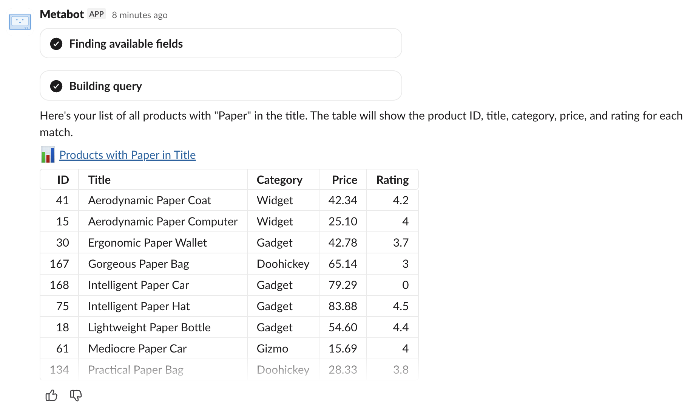

# Metabot in Slack

Chat with [Metabot](./metabot.md) in Slack. Direct message Metabot for private analysis, or mention @Metabot in a channel to collaborate with your team.

## What Metabot can do

From Slack you can ask Metabot to:

- **Find existing content**: Search your Metabase for questions and dashboards. Metabot links you directly to the content in your Metabase.
- **Answer questions**: Create ad-hoc queries from natural language to answer your questions on the spot. You can click the link to save the question in Metabase.
- **Show charts and tables**: Render static visualizations or tabular results in Slack. You can copy table results or download them as TSV.
- **Work with CSVs**: [Upload a CSV](../databases/uploads.md) to Metabase, then ask follow-up questions about the data.
- **Create alerts**: Set up [alerts](../questions/alerts.md) on saved questions that get delivered to the current Slack channel. Metabot can find an answer and set up an alert for it in one go (though the question must already be saved).
- **Create dashboard subscriptions**: Set up recurring [subscriptions](../dashboards/subscriptions.md) that deliver a dashboard's contents to the current Slack channel.

## Set up Metabot in Slack

### 1. Set up Metabot

Make sure [Metabot is set up](./settings.md) on your Metabase.

### 2. Connect Slack to Metabase

This is the basic Slack integration that lets Metabase send alerts and subscriptions to Slack channels. Follow the setup guide in [Set up Slack](../configuring-metabase/slack.md#create-your-slack-app).

### 3. Enable natural language questions

This is the setting that lets people chat with Metabot in Slack.

Follow the steps in [Set up Metabot in Slack](../configuring-metabase/slack.md#set-up-metabot-in-slack) to add your Slack app credentials.

If you already have a Slack integration from before this feature existed, your Slack app will need additional permissions for natural language questions. The UI walks you through upgrading your app's permissions. Your existing alerts and subscriptions will keep working without upgrading; the new permissions are only needed for Metabot.

### 4. Connect your Slack account to Metabase

To chat with Metabot, people will need to link their Slack account to their Metabase account. The first time you message Metabot, it kicks off an OAuth flow that connects the two accounts. This connection lets Metabot use your Metabase permissions, so Metabot will only see data you're allowed to see.

## Chatting with Metabot in Slack

- **Message Metabot directly** for private conversations with your data. No @mention needed.
- **@Metabot in a channel** so your team can see the question and answer. Metabot only responds to messages that @mention it in channels.
- **Add Metabot as an AI app** in Slack's sidebar for quick access.

### Clearing context

Metabot remembers the context of a thread. To clear context and start a fresh conversation, either begin a new direct message or @mention Metabot in a new thread in a channel.

## Alerts and subscriptions

From Slack, Metabot can create [alerts](../questions/alerts.md) and [dashboard subscriptions](../dashboards/subscriptions.md) that deliver to the current Slack channel.

Some caveats:

- For goal-based alerts, the goal line must already be configured and saved on the question. Metabot can't add goal lines.
- Metabot can't modify or delete existing alerts or subscriptions.
- Alerts and subscriptions are delivered to the Slack channel where the conversation takes place. You can't redirect them to a different channel or to email.
- Alerts can only be set on questions, not metrics or ad-hoc queries.

## Notes on privacy

### Answers are visible to everyone in your Slack channel

If you ask Metabot a question in a public channel, _everyone_ in that channel can see the response. So even though Metabot respects your Metabase [permissions](../permissions/introduction.md) (Metabot can only see what you see), be thoughtful about questions that could surface sensitive data to others that may lack your permissions.

### Feedback forms contain your conversation history

When you submit feedback, the form you send may contain sensitive data from your conversation.

## Further reading

- [Metabot](./metabot.md)
- [Metabot AI settings](./settings.md)
- [Set up Slack](../configuring-metabase/slack.md)
