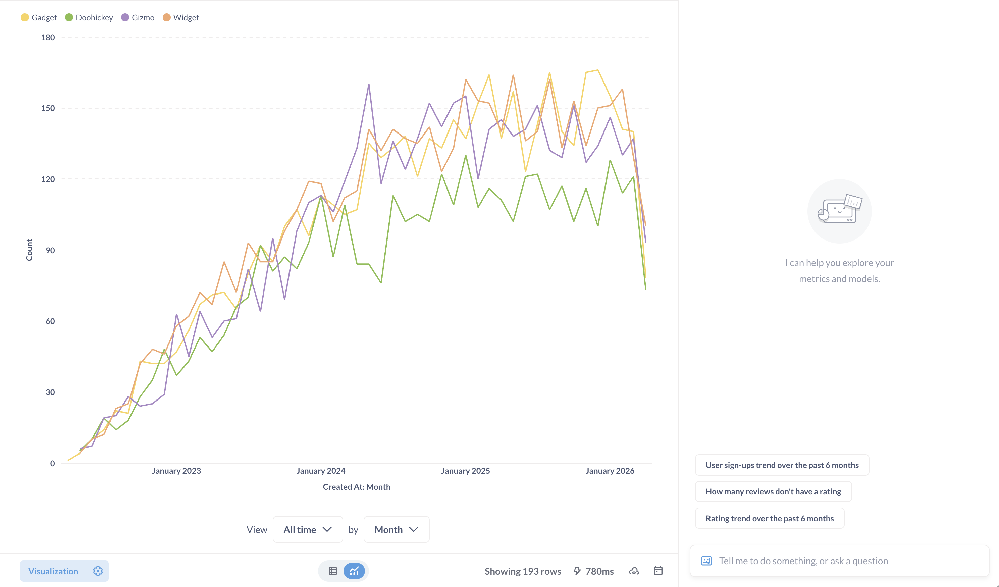
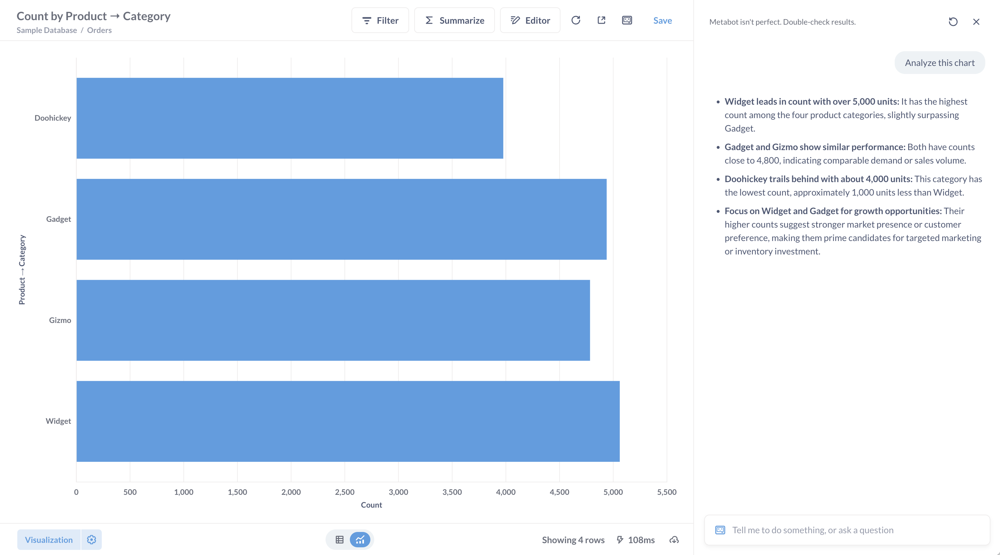
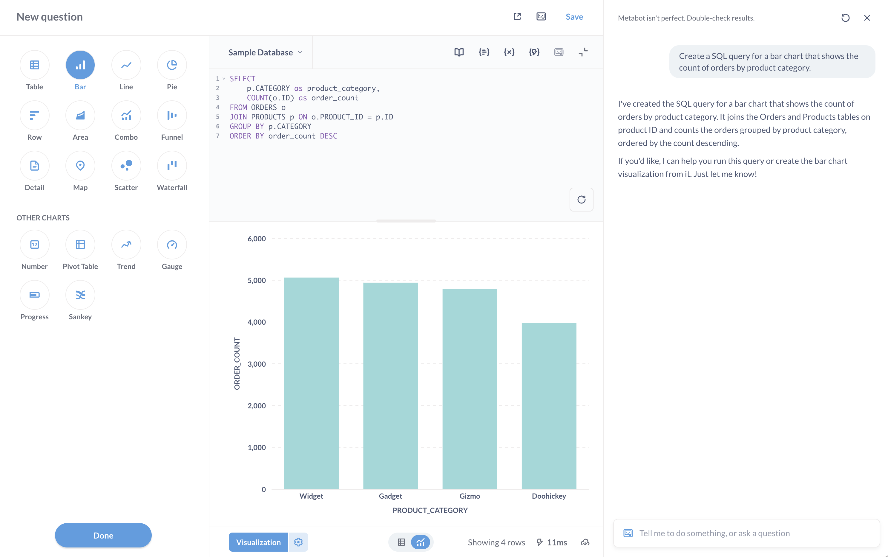
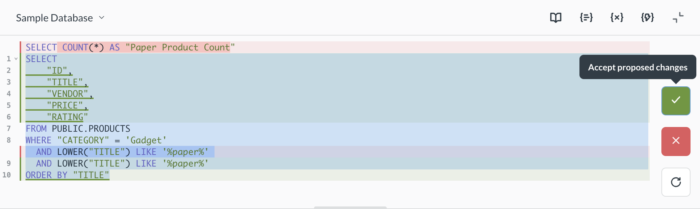
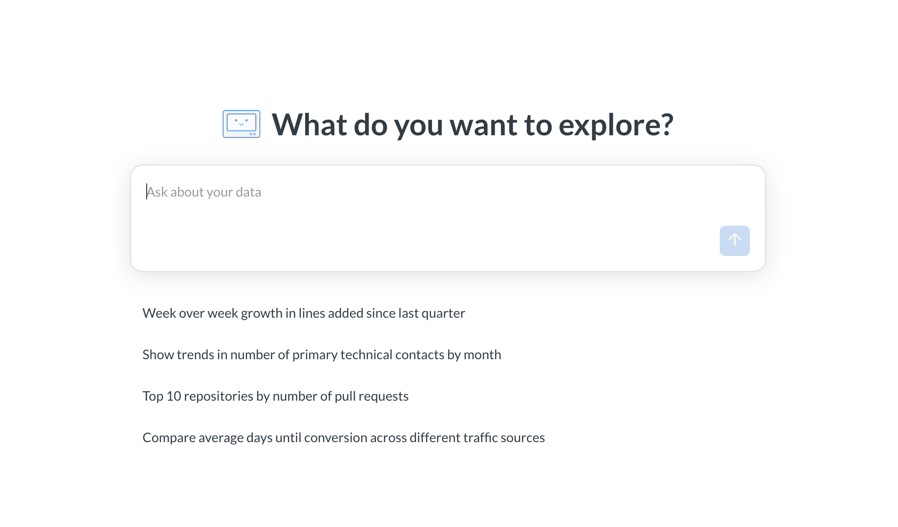

# Metabot - Metabase's AI assistant

> Metabot is only available as an add-on on Metabase Cloud.

Metabot helps you analyze your data by creating charts from natural language, generating SQL queries, fixing query errors, and analyzing existing visualizations.

## Set up Metabot

To set up Metabot, see [Metabot settings](./settings.md).

## What Metabot can do

Metabot can help you to:

- [AI exploration](#ai-exploration).
- [Create a chart using the query builder](#how-metabot-uses-the-query-builder) from a natural language query.
- [Generate SQL in the native editor](../questions/native-editor/writing-sql.md) from natural language. (Currently, only SQL is supported.)
- [Edit SQL directly in the native editor](#inline-sql-editing).
- [Analyze a chart](#analyze-charts-with-metabot).
- [Fix errors in SQL code](#have-metabot-fix-sql-queries).
- Answer questions from our documentation (as in, the literature you're reading right now).

Like with all generative AI, you'll always need to double-check results.

## The Metabot chat sidebar

There are multiple ways to start a chat with Metabot:

- Type cmd+e on Mac, ctrl+e on Windows, to open up the [chat sidebar](#the-metabot-chat-sidebar).
- Click the Metabot icon in top right.

You can chat with Metabot (though predictably, it's only interested in helping you answer questions about your data).

Metabot will keep the context of the current question with each new prompt. Only the current conversation history is saved (you can scroll up to see it). If you start a new chat, Metabase will discard the previous conversation, so be mindful when resetting the conversation.

Some tips:

- Give Metabot as much context as you can. If you know the table or fields you want to query, tell Metabot.
- Whenever you want Metabot to do something completely different, you should reset the conversation, as Metabot might find that irrelevant historical context to be confusing.
- Once Metabot creates a question for you, you can follow up with more questions or take over yourself. You can drill through the chart or step into the editor to tweak the query (both in the query builder and the SQL editor).
- Metabot works best with English prompts. While it might understand other languages, you'll get the most reliable results by asking your questions in English.
- Define domain-specific terms in the [glossary](../exploration-and-organization/data-model-reference.md#glossary) to help Metabot understand your organization's terminology.

### Metabot response menu

Hover over Metabot's response to:

- Copy the response.
- Give thumbs-up/thumbs-down [feedback on responses](#giving-feedback-on-metabot-responses). If you upvote a response, you can optionally add some feedback. If you downvote a response, you can optionally contribute a bug report to help us improve Metabot.
- Re-run the prompt with Metabot. This is useful if you've updated the chart or just want to have Metabot take another pass (since AI responses aren't deterministic, Metabot may give a different response on another run).

## Analyze charts with Metabot

When viewing a question, you can click the Metabot icon in the upper right to analyze a visualization. You can also open the command palette to tell Metabot to analyze the chart.

When viewing a table of results, Metabase won't display the Metabot button, but you can open the chat to ask Metabot to analyze the table, and it will produce an [X-ray](../exploration-and-organization/x-rays.md) of the results.

You can also ask Metabot to tell you about specific tables in your database.

## How Metabot uses the query builder

When you ask Metabot to create a chart from natural language, it first looks for existing questions that might answer your request. If it finds a relevant question, it'll point you to that instead of creating something new. Otherwise, Metabot will use the [query builder](../questions/query-builder/editor.md) to create a new chart for you.

Keep in mind that Metabot is still learning the query builder. Metabot can only handle basic query builder operations, and it lacks access to the library of [custom expressions](../questions/query-builder/expressions-list.md). Metabot is also limited to single-level aggregation and grouping, so if you need more complex analysis, you can take over and refine the query yourself, or switch to the SQL editor.

## Metabot in the native editor

To have Metabot generate SQL for you:

1. Open the [SQL editor](../questions/native-editor/writing-sql.md).
2. Select the database you want to query.
3. Type cmd+e on Mac, ctrl+e on Windows, to open up the [chat sidebar](#the-metabot-chat-sidebar).
4. Ask it to "Write a SQL query that..." and type your prompt.

Metabot will generate the SQL for you, but it won't run the query. This gives you a chance to inspect the code before running it.

If you don't specify a specific table in a natural language question, Metabot will only check the first 100 tables in the currently selected database. If your question pertains to tables other than those first 100 tables, Metabot may hallucinate the tables it needs, and the query will fail.

## Have Metabot fix SQL queries

When you get an error in a SQL query, you can click the **Have Metabot fix it** button, and Metabot will try to correct the query. You can also ask Metabot to fix your SQL in the chat.

## Inline SQL editing

You can ask Metabot to generate or edit code in the SQL editor, without using the [chat sidebar](#the-metabot-chat-sidebar):

1. Open the [SQL editor](../questions/native-editor/writing-sql.md).
2. Press Cmd+shift+i on Mac or Ctrl+shift+i on Windows.
3. Describe the SQL you want to generate or modify.
4. Review the generated code and accept or reject it.

Once you start typing or editing your SQL, you can continue using the keyboard shortcut to refine your code.

## Navigating after Metabot creates a chart

If Metabot creates a query or takes you to a new item but you want to return to the previous screen, you can navigate using your browser's back button.

You can also save any chart that Metabot creates to a dashboard or collection.

## AI exploration

Use **AI exploration** to start a new conversation with Metabot when you don’t already have a chart, question, or query to work from.

Open it from **+ New → AI exploration**, then ask a question or pick one of the suggested prompts.

When answering questions in AI exploration, Metabot searches a limited set of content instead of your entire Metabase. Admins can set a **Collection for natural language querying** to scope AI exploration to a specific collection and its subcollections. You can still refer to content outside that scope by explicitly @-mentioning it in your prompt. See [Metabot AI settings](../ai/settings.md) for more details.

## Giving feedback on Metabot responses

When you hover over Metabot's responses, you'll see options to give feedback.

Thumbs up are just as helpful as thumbs down. If you give a thumbs down, you can optionally provide more details about the issue and set an issue type:

- UI bug
- Took incorrect actions
- Overall refusal
- Did not follow request
- Not factually correct
- Incomplete response
- Other

> When you submit feedback, the form you send may contain sensitive data from your conversation.
