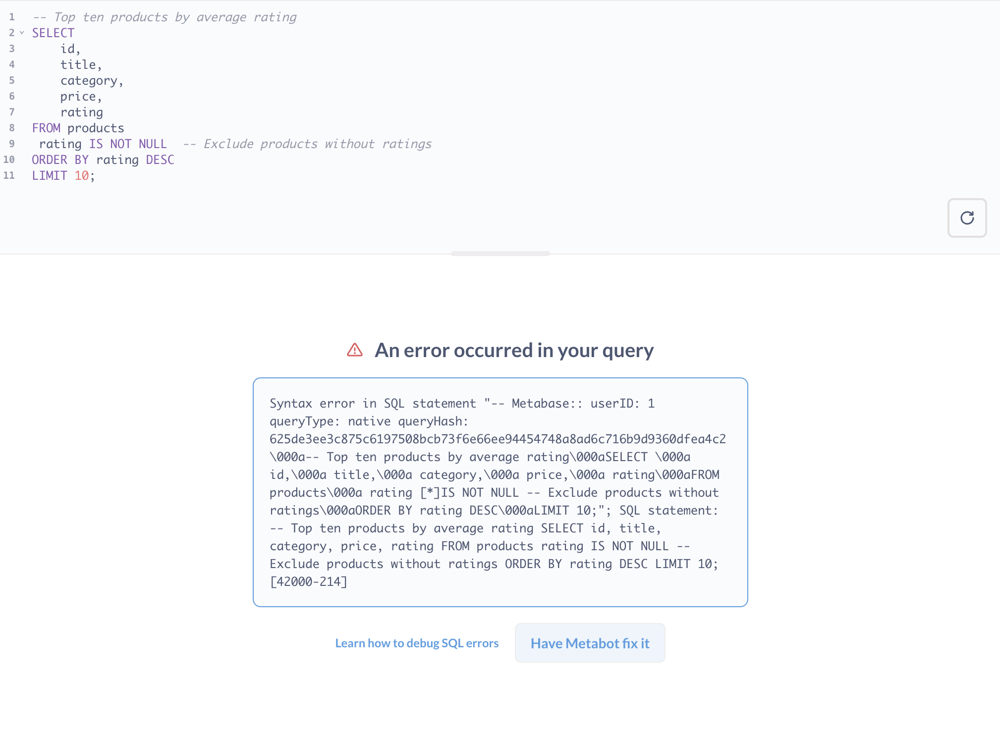

# Metabot - Metabase's AI assistant



> For now, [Metabot](https://www.metabase.com/features/metabot-ai) is only available as an add-on for Pro and Enterprise plans on Metabase Cloud.

Metabot helps you analyze your data. You can ask it to create charts, pull up dashboards, and more.

Once Metabot creates a question for you, you can follow up with more questions or take over yourself. You can drill through the chart or step into the editor to tweak the query (both in the query builder and the SQL editor).

> Like with all generative AI, you'll always need to double-check results.

## What Metabot can do

Metabot can help you to:

- Create a chart using the [query builder](../questions/query-builder/editor.md) from a natural language query.
- Generate SQL in the [native editor](../questions/native-editor/writing-sql.md) from natural language.
- [Analyze and fix errors in SQL code](#have-metabot-fix-sql-queries).
- Navigate to existing [questions](../questions/start.md) and [dashboards](../dashboards/introduction.md).
- Answer questions from our documentation (as in, the literature you're reading right now).

## Metabot in the command palette

To start a chat with Metabot from anywhere in Metabase:

1. Hit cmd+k on Mac or ctrl+k on Windows to open the [command palette](../exploration-and-organization/exploration.md#command-palette). You can also click on the **Ask Metabot or search** box in the upper right.
2. Type your prompt.
3. Select the Metabot option to **Ask me to do something, or ask a question**.

Metabase will open a conversation sidebar and start a chat as it processes your first prompt.

## The Metabot conversation sidebar

You can chat with Metabot (though, predictably, it's only interested in helping you answer questions about your data).

Metabot will keep the context of the current question with each new prompt. Only the current conversation history is saved (you can scroll up to see it).

If you start a new chat, Metabase will discard the previous conversation, so be mindful when resetting the conversation.

### Metabot response menu

Hover over Metabot's response to:

- Copy the response.
- Give thumbs-up/thumbs-down feedback on responses.
- Re-run the prompt with Metabot. This is useful if you've updated the chart or just want to have Metabot take another pass (since AI responses aren't deterministic, Metabot may give a different response on another run).

## Analyze charts with Metabot

When viewing a question, you can click the Metabot icon in the upper right to analyze a visualization. You can also open the command palette to tell Metabot to analyze the chart.

When viewing a table of results, Metabase won't display the Metabot button, but you can use the command palette to tell Metabot to analyze the table, and it will produce an [X-ray](../exploration-and-organization/x-rays.md) of the results.

## Metabot in the native editor

You can type a question for Metabot in the native editor itself or in the Metabot sidebar.

To have Metabot generate SQL for you:

1. Type a natural language query in the SQL editor.
2. Highlight the text.
3. Click the Metabot button at the top right of the editor.

Metabot will generate the SQL for you, but it won't run the query. This gives you a chance to inspect the code before running it. The native editor is designed to be read-only (so don't worry about Metabot dropping any tables), but you should still check the query to make sure it targets the data you want.

If you don't specify a specific table in a natural language question, Metabot will only check the first 100 tables in the currently selected database. If your question pertains to tables other than those first 100 tables, Metabot may hallucinate the tables it needs, and the query will fail.

## Have Metabot fix SQL queries

When you get an error in a SQL query, you can click the **Have Metabot fix it** button, and Metabot will try to correct the query.

## Navigating after Metabot creates a chart

If Metabot creates a query or takes you to a new item but you want to return to the previous screen, you can navigate using your browser's back button.

You can also save any chart that Metabot creates to a dashboard or collection.

## Meet Metabot

Here's Metabot in its own words:

"I'm Metabot, your friendly data generalist here to help you explore and analyze data using Metabase. I can help you find existing dashboards and questions, dig into data sources and metrics, and create queries or charts to answer your questions. If you want to understand trends, get insights, or just pull some numbers, I'm your go-to. Just let me know what data you want to explore or what questions you have!"
